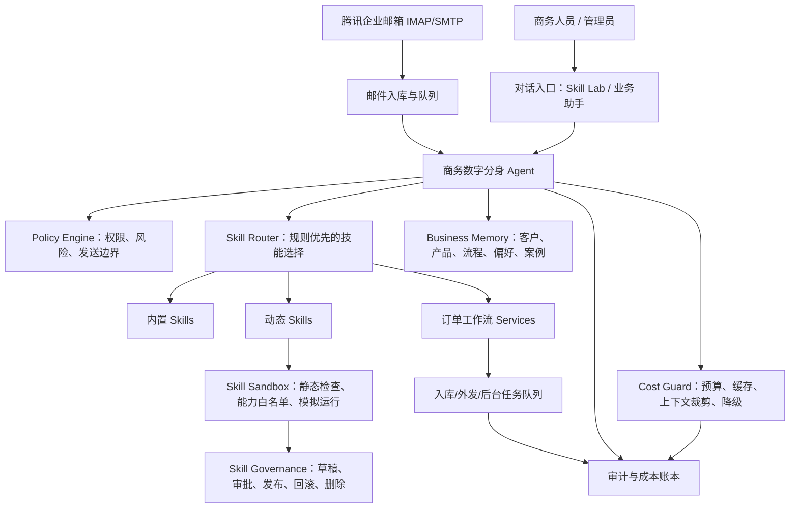
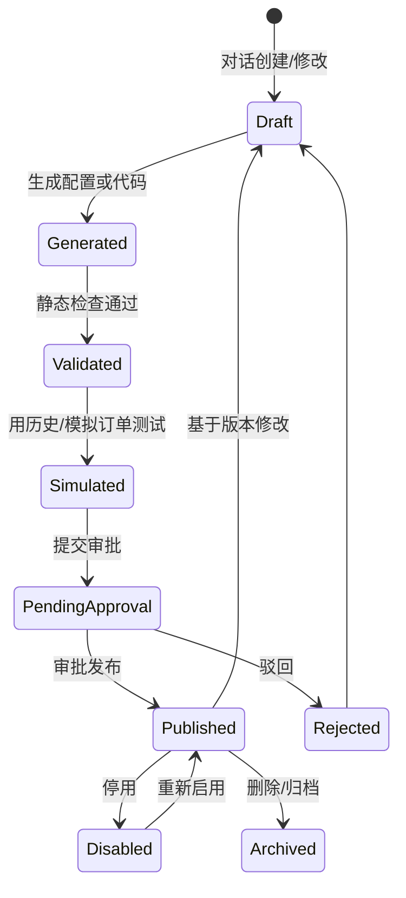

# 商务部数字分身 Agent + Skill 架构设计

文档版本：v0.1  
创建日期：2026-05-13  
适用范围：技能实验室深化、订单排产业务智能化、低成本运行架构

## 1. 目标

本次架构升级的目标是把系统从“邮件订单流程自动化工具”升级为“商务部人员的数字分身”：商务人员通过自然语言向系统描述业务规则、操作偏好和异常处理经验，系统将其沉淀为可审核、可测试、可回滚的 Skill，并由 Agent 在订单排产链路中按权限和成本预算调用。

核心目标：

1. 商务人员可以通过对话创建、修改、停用、删除 Skill，但所有上线动作必须可审计、可模拟、可回滚。
2. Agent 能代表商务人员处理订单排产业务中的识别、核对、追问、汇总、路由、催办和复盘，但不越权自动承诺交期、不越权自动发送高风险邮件。
3. 系统运行时优先使用规则、缓存、索引和结构化数据，仅在必要时调用 LLM，并对每次模型调用设置预算、降级和审计。
4. 架构保持模块化单体可落地，先复用当前 FastAPI、SQLAlchemy、邮件队列、模型 Provider 和静态管理台，后续再拆独立 worker 或服务。

## 2. 当前状态证据

当前代码中已经具备 Agent + Skill 的雏形：

| 能力 | 当前实现 | 主要位置 | 判断 |
| --- | --- | --- | --- |
| Skill 基类 | `BaseSkill`、`SkillResult`、`input_schema` | `backend/app/services/skills/base.py` | 已有可复用接口 |
| Skill 注册表 | 内置/动态技能注册、列表、热加载 | `backend/app/services/skills/registry.py` | 已支持动态加载 |
| 动态 Skill 生成 | LLM 根据需求生成 Python 代码并写入 `dynamic` 目录 | `backend/app/services/skills/factory.py` | 已实现基础能力，但缺少治理 |
| Skill 执行器 | 根据名称执行 Skill 并做 Pydantic 参数校验 | `backend/app/services/skills/executor.py` | 已有执行入口 |
| 邮件 Skill | 收邮件、发高优先级邮件、发自动流转邮件 | `backend/app/services/skills/mail_skills.py` | 已有内置业务技能样例 |
| Skill Lab UI | 列表、生成、启停、删除 | `backend/app/static/index.html`、`backend/app/static/app.js` | 已有实验室雏形 |
| 模型调用记录 | `ModelCallLog` 记录任务类型、输入摘要、输出、耗时、状态 | `backend/app/models.py` | 可扩展为成本账本 |
| 维护闭环 | 自维护会话、动作、交接包和验证 | `MaintenanceSession`、`MaintenanceAction` | 可复用为 Skill 审批治理 |

当前主要缺口：

1. Skill 直接以 Python 代码落盘和热加载，缺少版本、审批、沙箱、权限、回滚和模拟测试。
2. Agent 还不是订单业务的统一编排层，现有工作流主要由固定 service 驱动。
3. LLM 调用缺少任务级预算、缓存命中、上下文裁剪、模型分层和“规则优先”策略。
4. 商务人员的经验、偏好、客户上下文、产品别名和历史决策尚未形成可检索记忆。
5. Skill Lab 更像开发者工具，还没有面向商务人员的“用自然语言教小J做事”的闭环。

## 3. 总体架构

推荐采用“Agent 编排 + Skill 能力 + Memory 业务记忆 + Governance 治理 + Cost Guard 成本防线”的五层架构。



### 3.1 Agent 层

Agent 是商务部数字分身的运行时大脑，但不直接写数据库、不直接发邮件、不直接执行任意代码。Agent 只做四件事：

1. 识别当前意图：新订单、补充信息、生产疑问、排产确认、变更取消、规则维护、状态查询。
2. 组装最小上下文：只拿当前任务、相关邮件、命中规则、必要证据和少量历史案例。
3. 选择并调用 Skill：优先调用确定性 Skill；只有低置信、文本理解或生成任务才调用 LLM Skill。
4. 输出可执行动作：生成草稿、创建异常、补字段、建议路由、发起审批、写审计。

Agent 不应该直接成为“万能聊天机器人”。在订单排产业务里，Agent 的正确形态是“受控编排器”，所有能改变业务状态的动作都必须落到 Skill 或现有 service，并经过 Policy Engine。

### 3.2 Skill 层

Skill 是系统可学习、可组合、可审计的最小能力单元。建议把 Skill 分为三类：

| 类型 | 示例 | 是否允许商务人员创建 | 运行边界 |
| --- | --- | --- | --- |
| 内置 Skill | 收邮件、生成任务单、发送队列、查询任务链路 | 否 | 由代码维护 |
| 配置型 Skill | 客户别名归一、产品路由、初审规则、催办策略、邮件话术模板 | 是 | 不生成 Python，只生成 JSON 配置 |
| 代码型 Skill | 特殊报表、复杂校验、跨表统计、批处理工具 | 受限 | 必须审批、静态检查、模拟通过后发布 |

优先让商务人员创建“配置型 Skill”，因为它最省 token、最安全、最容易回滚。代码型 Skill 只作为少数复杂场景的增强。

### 3.3 Memory 层

商务数字分身必须沉淀四类业务记忆：

| 记忆类型 | 作用 | 数据来源 | 低成本使用方式 |
| --- | --- | --- | --- |
| 订单事实记忆 | 当前订单、字段、证据、状态 | 邮件、附件、任务表 | 结构化 SQL 查询，不走 LLM |
| 业务规则记忆 | 初审规则、路由规则、发送策略、风险词 | 流程管理、Skill Lab | 规则引擎优先 |
| 人员偏好记忆 | 商务负责人的措辞、审批习惯、升级边界 | 人工确认、历史编辑 diff | 小摘要和模板变量，不塞全量历史 |
| 案例经验记忆 | 典型异常、客户特殊要求、历史处理结果 | 异常队列、审计、人工复盘 | 关键词/结构化索引召回 Top-K |

Memory 不是把所有历史邮件塞进 prompt，而是把历史沉淀为“可查询的业务资产”。Agent 每次只取能改变判断的少量证据。

## 4. 业务侧数字分身能力地图

围绕订单排产业务，Agent + Skill 应覆盖以下能力。

| 场景 | 数字分身行为 | 默认自动化等级 | 需要人工确认 |
| --- | --- | --- | --- |
| 新订单识别 | 判断是否目标订单，抽字段，保留证据 | 自动 | 低置信、风险命中 |
| 订单初审 | 检查客户、产品、数量、交期、附件、风险词 | 自动 | 初审失败或冲突 |
| 生产路由 | 根据产品、仓库、区域、工艺选择生产收件人 | 自动建议 | 路由冲突、未命中 |
| 任务单下达 | 按模板生成生产任务单，标注来源证据；低风险任务单自动发送 | 自动生成并发送 | 未满足自动发送准入条件 |
| 销售追问 | 缺字段时生成追问清单 | 自动生成并可自动发低风险回执 | 高风险客户或特殊单 |
| 生产疑问 | 归纳生产问题，转销售并跟踪轮次 | 自动 | 答复不完整、超过轮次 |
| 销售答复合并 | 判断答复是否补齐，更新任务单版本 | 自动生成新版草稿 | 字段冲突 |
| 排产确认 | 识别确认排产，关闭任务，通知相关方 | 自动或半自动 | 异常语义、非生产发件人 |
| 变更取消 | 识别并关联原任务，生成差异 | 半自动 | 已排产、取消、重大变更 |
| 状态查询 | 回复订单状态、待补充事项、待生产反馈 | 自动 | 查询对象不明确 |
| 周报复盘 | 总结订单质量、异常原因、响应时长 | 自动 | 正式外发 |
| 规则学习 | 从人工处理中建议新 Skill 或规则 | 自动建议 | 发布必须审批 |

## 5. Skill Lab 深化设计

### 5.1 从“生成代码”改为“技能生命周期”

Skill Lab 的核心流程应从当前的“生成并加载”升级为：



当前 `generate -> save_and_load` 应调整为 `generate -> draft -> validate -> simulate -> approve -> publish`。生产环境不建议允许 LLM 生成代码后立即热加载。

### 5.2 对话式创建 Skill

商务人员输入需求时，Agent 先不直接写代码，而是生成 Skill 规格：

```json
{
  "skill_name": "customer_delivery_date_check",
  "skill_type": "config_rule",
  "business_goal": "检查重点客户订单是否填写期望交期",
  "trigger": {
    "mail_classification": "SalesOrderRequirement",
    "customer_tags": ["重点客户"]
  },
  "inputs": ["customer_name", "expected_delivery_date", "source_mail_id"],
  "outputs": ["review_result", "missing_fields", "message_draft"],
  "risk_level": "Low",
  "requires_approval_before_action": false,
  "test_cases": [
    {
      "name": "重点客户缺交期",
      "input": {"customer_name": "示例客户", "expected_delivery_date": ""},
      "expected": {"review_result": "NeedSupplement"}
    }
  ]
}
```

只有当配置型 Skill 无法满足时，才进入代码型 Skill 生成。

### 5.3 Skill 修改与删除

修改不是覆盖原文件，而是创建新版本：

1. `v1` 保持可回滚。
2. `v2` 通过模拟后发布。
3. 发布时记录变更 diff、审批人、影响范围。
4. 回滚只切换 active version，不删除历史。

删除也不建议物理删除。业务删除应改为 `Archived`，并保留：

1. 原始需求。
2. 生成规格。
3. 代码或配置快照。
4. 发布历史。
5. 最近一次执行记录。

物理删除只给系统管理员，用于清理未发布草稿或测试技能。

### 5.4 Skill 执行权限

每个 Skill 必须声明 capability：

| capability | 含义 | 默认限制 |
| --- | --- | --- |
| `read_order` | 读取订单、任务、邮件摘要 | 允许 |
| `read_attachment_text` | 读取附件解析文本 | 需要业务理由 |
| `write_draft` | 创建草稿、建议、异常 | 允许 |
| `update_workflow` | 修改任务状态、补字段 | 需要审批或角色权限 |
| `enqueue_mail` | 创建外发邮件 | 需要策略校验 |
| `send_mail` | 实际发送邮件 | 禁止动态 Skill 直接调用 |
| `manage_skill` | 创建/修改/停用 Skill | 管理员或商务负责人 |
| `call_llm` | 调用模型 | 受预算控制 |
| `filesystem` | 文件系统访问 | 默认禁止 |
| `network` | 网络访问 | 默认禁止 |

## 6. 数据模型影响

建议新增以下表。短期可先用 JSON 字段和 SQLite/PostgreSQL 兼容列实现，后续生产化再加索引和迁移。

| 表 | 作用 | 关键字段 |
| --- | --- | --- |
| `agent_sessions` | 对话会话 | `id`、`actor`、`channel`、`goal`、`status`、`created_at` |
| `agent_messages` | 对话消息和压缩摘要 | `session_id`、`role`、`content_summary`、`object_refs_json` |
| `skill_definitions` | Skill 主档 | `skill_code`、`skill_name`、`skill_type`、`owner_role`、`status` |
| `skill_versions` | Skill 版本 | `definition_id`、`version_no`、`spec_json`、`code_ref`、`capabilities_json`、`risk_level`、`status` |
| `skill_test_cases` | 模拟测试用例 | `skill_version_id`、`input_json`、`expected_json`、`last_result_json` |
| `skill_run_logs` | Skill 执行记录 | `skill_version_id`、`related_object_type`、`related_object_id`、`status`、`cost_json` |
| `agent_action_plans` | Agent 计划和动作 | `session_id`、`plan_json`、`policy_result_json`、`status` |
| `business_memory_items` | 业务记忆 | `memory_type`、`key`、`summary`、`payload_json`、`source_ref_json`、`status` |
| `cost_budget_policies` | 成本预算 | `scope_type`、`scope_key`、`daily_limit`、`monthly_limit`、`fallback_strategy` |
| `model_response_cache` | 模型响应缓存 | `task_type`、`input_hash`、`output_json`、`expires_at` |

现有 `ModelCallLog` 可扩展：

1. 增加 `input_hash`，用于去重和缓存。
2. 增加 `prompt_tokens`、`completion_tokens`、`estimated_cost`。
3. 增加 `cache_hit`、`budget_scope`、`fallback_used`。

## 7. API 影响

建议新增 API，不破坏现有 `/api/skills/list`、`/api/skills/generate`、`toggle`、`delete`，而是在新接口上实现治理闭环。

| API | 方法 | 用途 |
| --- | --- | --- |
| `/api/agent/chat` | `POST` | 商务人员与数字分身对话，返回计划、问题或草稿 |
| `/api/agent/sessions` | `GET` | 查看对话历史和摘要 |
| `/api/skills/drafts` | `POST` | 从自然语言生成 Skill 规格草稿 |
| `/api/skills/{code}/versions` | `GET` | 查看版本历史 |
| `/api/skills/{code}/versions/{version}/validate` | `POST` | 静态检查和能力检查 |
| `/api/skills/{code}/versions/{version}/simulate` | `POST` | 用模拟邮件或历史任务测试 |
| `/api/skills/{code}/versions/{version}/approve` | `POST` | 审批发布 |
| `/api/skills/{code}/versions/{version}/rollback` | `POST` | 回滚到指定版本 |
| `/api/skills/{code}/archive` | `POST` | 归档 Skill |
| `/api/cost/budgets` | `GET/PUT` | 管理模型调用预算 |
| `/api/cost/usage` | `GET` | 查看按任务、Skill、模型的成本 |
| `/api/memory/items` | `GET/POST` | 管理业务记忆条目 |

## 8. 低 token 成本策略

系统要极致节俭，核心原则是“不该问模型的事情绝不问模型”。

### 8.1 调用分层

| 层级 | 处理方式 | LLM 调用 |
| --- | --- | --- |
| L0 | SQL 查询、正则、枚举、哈希去重、状态机 | 不调用 |
| L1 | 规则引擎、流程 JSON、配置型 Skill | 不调用 |
| L2 | 小模型分类、短文本归纳、模板变量填充 | 仅必要时调用 |
| L3 | 大模型复杂推理、代码型 Skill 生成、疑难异常分析 | 人工触发或预算允许时调用 |

### 8.2 上下文裁剪

每次 Agent 调用模型前必须构造 Context Pack，而不是塞全量邮件：

```json
{
  "task": {"task_no": "PT-xxxx", "status": "TaskIssued"},
  "mail": {"subject": "...", "latest_body_excerpt": "..."},
  "known_fields": {"customer": "...", "product": "...", "quantity": "..."},
  "missing_fields": ["expected_delivery_date"],
  "evidence": [{"field": "product", "text": "原文短证据"}],
  "rules_hit": ["required_delivery_date"],
  "allowed_actions": ["write_draft", "create_exception"]
}
```

默认只传：

1. 最新邮件正文摘要，不传完整线程。
2. 附件解析后的命中片段，不传完整附件文本。
3. Top 3 相关历史案例。
4. 已结构化字段和缺失字段。
5. 当前允许动作。

### 8.3 缓存和复用

1. 对分类、抽取、摘要类任务计算 `input_hash`，相同输入直接复用结果。
2. 对产品别名、客户别名、路由命中使用本地表缓存。
3. 对邮件线程持续维护滚动摘要，每次新邮件只摘要增量。
4. 对 Skill 生成先生成规格，规格确认后再生成代码，避免反复让模型重写大段代码。
5. 对常见追问和通知使用模板变量，不调用模型写作。

### 8.4 预算和降级

预算维度：

1. 全局每日预算。
2. 单订单预算。
3. 单 Skill 预算。
4. 单用户预算。
5. 单任务类型预算。

降级策略：

| 触发条件 | 降级动作 |
| --- | --- |
| 预算用尽 | 关闭 LLM 兜底，转规则和人工异常 |
| 模型超时 | 使用规则结果，标记低置信 |
| 附件过长 | 只取命中片段和表头字段 |
| 多轮对话过长 | 压缩为事实摘要，丢弃寒暄 |
| 重复请求 | 命中缓存，不再调用 |

### 8.5 成本可观测

工作台应展示：

1. 今日模型调用次数。
2. 今日预估 token 和费用。
3. 缓存命中率。
4. 规则直接处理率。
5. 按业务场景拆分成本：分类、抽取、Skill 生成、异常分析、邮件润色。
6. 高成本订单 Top 10。

目标指标：

| 指标 | 建议目标 |
| --- | --- |
| 规则和缓存直接处理率 | 大于 80% |
| 新订单平均 LLM 调用 | 小于 1 次 |
| 生产确认识别 LLM 调用 | 默认 0 次 |
| 状态查询 LLM 调用 | 默认 0 次 |
| Skill 创建 LLM 调用 | 先规格 1 次，确认后代码 1 次 |

## 9. 安全与治理

### 9.1 代码型 Skill 安全线

现有 `validate_code` 已禁止部分危险 import，但生产级还需要补充：

1. AST 检查禁止 `eval`、`exec`、`compile`、`open`、`__import__`、`globals`、`locals`。
2. 禁止直接 import `os`、`sys`、`subprocess`、`socket`、`requests`、`shutil`、`pathlib`。
3. 禁止动态属性访问绕过能力限制。
4. 代码型 Skill 只能调用注入的 capability API，例如 `ctx.orders.read()`、`ctx.drafts.write()`。
5. 动态 Skill 不允许直接调用 SMTP 发送函数，只能创建外发草稿或队列任务，并由 Policy Engine 判断。
6. 生产环境默认不允许“生成后立即发布”。

### 9.2 业务安全线

以下动作必须人工确认：

1. 未满足自动发送准入条件的生产任务单下达。
2. 已排产订单变更或取消。
3. 更改生产路由或默认抄送策略。
4. 删除或归档已发布 Skill。
5. 发布中高风险代码型 Skill。
6. 修改涉及价格、付款、合同、法务承诺的 Skill。

### 9.3 审计要求

每次 Agent 和 Skill 关键动作必须记录：

1. 谁触发。
2. 用了哪个 Skill 和版本。
3. 读取了哪些业务对象。
4. 计划执行什么动作。
5. Policy Engine 是否允许。
6. 是否调用模型、是否命中缓存、预估成本。
7. 最终写入了哪些对象。

## 10. UI 改造建议

当前 Skill Lab 可保留左右布局，但需要从“生成代码预览”升级为“技能治理工作台”。

建议增加五个区域：

| 区域 | 功能 |
| --- | --- |
| 对话教学区 | 商务人员用自然语言描述新规则、新流程、新话术 |
| 技能规格区 | 展示触发条件、输入输出、权限、风险等级、测试用例 |
| 模拟测试区 | 选择历史订单或粘贴模拟邮件，查看命中和输出 |
| 发布审批区 | 展示 diff、风险、成本预估，提交审批或发布 |
| 成本监控区 | 展示 Skill 最近调用、缓存命中、token 估算和失败率 |

Skill 列表建议展示：

1. 类型：内置、配置型、代码型。
2. 状态：草稿、待审批、已发布、已停用、已归档。
3. 版本：当前发布版本和最近草稿版本。
4. 风险等级。
5. 今日调用次数、失败次数、模型调用次数。
6. 最近一次执行时间。

## 11. 队列和后台处理

新增后台任务类型：

| job_type | 用途 |
| --- | --- |
| `AgentMessageProcess` | 处理对话入口，生成计划或追问 |
| `SkillValidate` | 静态检查、权限检查、规格校验 |
| `SkillSimulate` | 用样本运行 Skill 并记录结果 |
| `SkillPublish` | 发布版本、刷新注册表 |
| `MemoryBuild` | 从人工处理和审计中沉淀业务记忆 |
| `ModelCacheWarmup` | 对高频规则预计算摘要或分类 |
| `CostDailyRollup` | 汇总每日模型调用成本 |

这些任务都可以先落在当前 `ProcessingJob` 表和现有 worker 模式中，不需要立即引入 Celery。

## 12. 分阶段落地计划

### P0：把 Skill Lab 从热加载工具变成受控实验室

1. 新增 Skill 定义、版本、测试、运行日志表。
2. `/api/skills/generate` 改为生成草稿，不直接发布。
3. 增加静态校验、模拟测试、审批发布、回滚接口。
4. 动态 Skill 删除改为归档。
5. 前端展示 Skill 状态、版本、风险和测试结果。

验收：

1. 商务人员能用自然语言创建一个“配置型初审规则 Skill”草稿。
2. 草稿通过模拟订单测试后才能发布。
3. 发布后新订单能命中该 Skill。
4. 可以一键回滚到上一版本。
5. 未审批 Skill 不会参与真实订单流程。

### P1：引入 Agent 编排和业务记忆

1. 新增 `/api/agent/chat`，支持订单状态查询、规则创建、异常分析。
2. 构建 Context Pack 生成器。
3. 建立 Business Memory 表，先沉淀客户别名、产品别名、常见异常处理。
4. Agent 只输出动作计划，由现有 service/Skill 执行。
5. 工作台增加“数字分身建议”卡片。

验收：

1. 商务人员问“这个订单卡在哪里”，系统不调用或少调用模型即可返回任务状态、待处理人、最近邮件和建议动作。
2. 商务人员说“以后某客户缺交期必须追问”，系统能生成配置型 Skill 草稿。
3. Agent 的每次建议都有来源证据。

### P2：极致节俭运行

1. 为 ModelCallLog 增加 token、费用、缓存字段。
2. 增加模型响应缓存。
3. 增加任务类型预算和单订单预算。
4. 实现规则优先、缓存优先、小模型优先。
5. 工作台展示成本和缓存命中率。

验收：

1. 状态查询、生产确认、常见补字段不调用 LLM。
2. 重复邮件分类和抽取命中缓存。
3. 超预算后系统自动降级到规则和人工异常。

### P3：数字分身规模化

1. 支持不同商务人员的偏好 Profile。
2. 支持按客户、产品线、渠道分配不同 Skill 集。
3. 从人工编辑 diff 自动建议规则。
4. 建立 Skill 质量评分：准确率、人工改动率、失败率、成本。
5. 支持企业微信/钉钉作为提醒入口，但仍以邮件和后台为业务闭环。

## 13. 验证计划

| 类型 | 验证内容 |
| --- | --- |
| 单元测试 | Skill 规格校验、能力权限、成本预算、缓存命中 |
| 集成测试 | 草稿生成、模拟、审批、发布、回滚、归档 |
| 工作流测试 | 新订单命中配置型 Skill 后进入初审或追问 |
| 安全测试 | 动态代码禁止危险 import、文件、网络、直接发信 |
| 成本测试 | 同一邮件重复处理只调用一次模型或命中缓存 |
| 回归测试 | 现有邮件入库、任务单、外发队列、周报不受影响 |

## 14. 风险与缓解

| 风险 | 影响 | 缓解 |
| --- | --- | --- |
| LLM 生成危险或错误代码 | 破坏数据、误发邮件 | 默认配置型 Skill；代码型 Skill 必须审批、沙箱和能力白名单 |
| 商务人员误配置规则 | 正常订单被拦截或误路由 | 草稿模拟、影响范围预览、审批、回滚 |
| Token 成本失控 | 运行费用不可控 | 预算、缓存、上下文裁剪、规则优先、超预算降级 |
| Agent 幻觉 | 错误承诺或错误建议 | 只允许引用系统事实和证据；不能无证据补全 |
| 历史邮件太多 | prompt 膨胀、响应慢 | 结构化索引、滚动摘要、Top-K 召回 |
| 动态 Skill 与内置流程冲突 | 状态错乱 | Policy Engine 统一动作边界；高风险状态变更人工确认 |

## 15. 关键设计决策

1. Skill Lab 的默认产物应从 Python 代码改为 Skill 规格和配置型规则。
2. Agent 不直接执行业务副作用，只生成计划并调用受控 Skill。
3. 生产环境不允许 LLM 生成代码后立即热加载。
4. 成本控制是一等能力，和审计、权限同级。
5. 数字分身的“像商务人员”来自业务记忆、规则和历史偏好，不来自每次塞入大量聊天记录。
6. 当前模块化单体可以承载 P0-P2，不需要为了 Agent + Skill 立即拆微服务。

## 16. 下一步建议

建议第一步先做 P0，不急于做复杂 Agent：

1. 新增 Skill 定义/版本/测试/运行日志模型。
2. 把当前 `/api/skills/generate` 改造成草稿生成。
3. 增加 `validate`、`simulate`、`approve`、`rollback`。
4. 动态 Skill 默认不允许直接发信。
5. 在 Skill Lab UI 中展示规格、测试和发布状态。

这样能把“可学习”能力先变得安全可信，再逐步把 Agent 接入真实订单排产链路。
