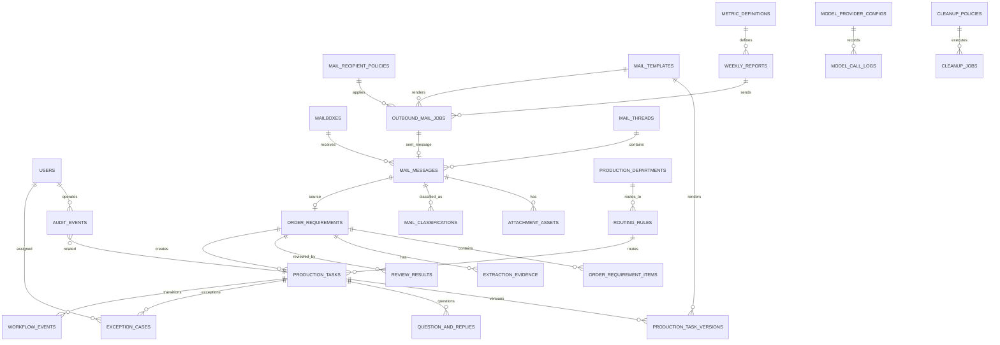
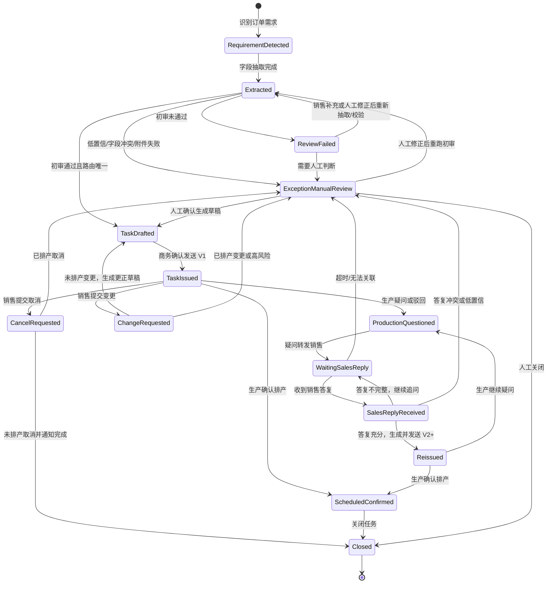
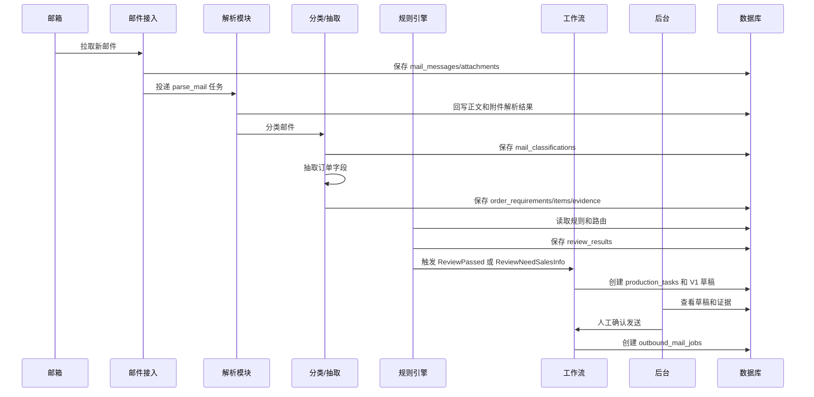
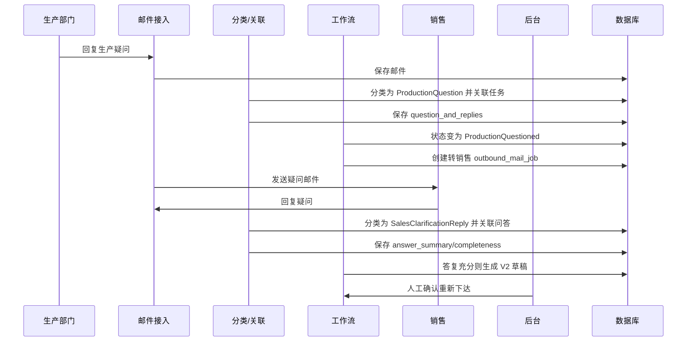

# 商务生产任务单智能体数据库与工作流设计

文档版本：v0.3
创建日期：2026-04-21  
最近更新：2026-04-25
依据文档：[production-order-agent-prd-review-v0.2.md](./production-order-agent-prd-review-v0.2.md)、[technical-solution.md](./technical-solution.md)  
适用范围：内测基线、生产试运行、数据与工作流演进

## 0. 当前数据与工作流基线

当前实现已经覆盖邮件、任务、流程、规则、异常、外发队列、附件、审计和周报等核心数据对象。原设计中 PostgreSQL、对象存储和完整迁移体系仍作为生产化目标保留；当前内测版本以本地数据库和本地文件为主。

### 0.1 当前核心数据对象

| 数据对象 | 当前职责 |
| --- | --- |
| 邮件记录 | 保存入库邮件、发件人、收件人、正文、分类、关联任务、附件引用；支持按系统邮件 ID 检索 |
| 附件记录 | 保存邮件附件和解析状态；清空附件时会解除字段证据的附件引用 |
| 生产任务 | 保存任务号、客户、产品、销售、交期、状态、创建时间、来源邮件和工作流历史 |
| 任务版本 | 保存生产任务单版本、模板渲染内容和重新下达记录 |
| 生产问答 | 保存生产侧疑问、销售侧答复、问答轮次和是否达到上限 |
| 流程规则 | 保存内置流程、自定义流程、流程版本、启停状态、路由、必填字段、邮件模板和规则列表 |
| 初审规则 | 保存系统内置只读规则和自定义规则；批量导入规则按自定义规则处理 |
| 异常记录 | 保存初审失败、路由缺失、解析失败、发送失败、人工处理原因和处理状态 |
| 外发队列 | 保存待发、已发、失败、取消邮件；支持按当前筛选条件批量取消 Pending |
| 审计事件 | 保存配置变更、任务关闭、清空操作、规则变更等关键动作 |
| 周报记录 | 保存周报周期、预览内容、收件人和外发队列引用 |

### 0.2 当前工作流规则

1. `bot_enabled=false` 是默认状态；未启动时只允许配置和人工查看，不进行自动消费。
2. 邮件入库后先分类并尝试关联任务；无法关联时保留邮件记录，可通过邮件 ID 回查。
3. 销售订单需求进入初审前先做重复提交检查；同一销售一天内重复提交同一需求，直接通知销售已提交。
4. 初审规则按系统内置规则、流程必填字段、自定义规则和生产路由配置共同判断。
5. 初审通过但生产路由未配置时不创建任务，写入异常并提示 `route_is_configured=False`。
6. 任务创建后立即生成任务号，销售侧确认邮件必须包含任务号。
7. 生产侧疑问触发问答流程；达到配置轮次上限后关闭自动问答并通知销售侧和生产侧。
8. 销售撤回、生产终止、人工关闭都会将任务置为关闭态，并向销售侧和生产侧发送通知。
9. 外发邮件先入队，发送器消费后回写状态；Pending 可被管理员批量取消。
10. 管理员清空任务、异常、运维、附件等列表时必须输入管理员密码，并写入审计。

### 0.3 状态与事件补充

| 场景 | 状态变化 | 必须记录 |
| --- | --- | --- |
| 初审通过并命中路由 | `RequirementDetected -> TaskDrafted/TaskIssued` | 来源邮件、任务号、流程版本、规则命中、路由 |
| 初审失败 | `RequirementDetected -> ReviewFailed` | 未通过字段、规则名称、回复销售内容 |
| 路由未配置 | `RequirementDetected -> ExceptionManualReview` | `route_is_configured=False`、流程信息、销售邮件 |
| 重复提交 | 不创建新任务 | 原任务号、重复销售、重复时间窗口、回复邮件 |
| 生产提问 | `TaskIssued -> ProductionQuestioned -> WaitingSalesReply` | 问题内容、轮次、生产邮件 |
| 销售答复充分 | `WaitingSalesReply -> Reissued/TaskIssued` | 答复邮件、字段更新、新版本 |
| 达到问答上限 | `WaitingSalesReply -> ExceptionManualReview` 或保持待人工 | 上限轮次、超限提示、通知记录 |
| 销售撤回 | `TaskIssued/WaitingSalesReply -> Closed` | 撤回邮件、任务号、通知销售和生产 |
| 手动关闭 | `任意未终态 -> Closed` | 操作人、原因、通知销售和生产 |
| 生产确认排产 | `TaskIssued/Reissued -> ScheduledConfirmed -> Closed` | 生产确认邮件、关闭时间 |

## 1. 设计目标

数据库和工作流设计需要支撑以下核心诉求：

1. 保留原始邮件、附件、解析结果、字段证据和生成邮件内容，保证全链路可追溯。
2. 支撑销售订单需求、生产任务单、任务版本、生产疑问、销售答复、排产确认、变更/取消的状态闭环。
3. 支撑人工确认、人工修改、人工异常处理和审计。
4. 支撑邮件幂等、任务单幂等、失败重试和重复下达拦截。
5. 支撑周报统计口径固化和历史报告复盘。
6. 支撑后续 V1 自动发送、SLA 催办、复杂路由和多系统集成扩展。
7. 支撑有效邮件默认永久保留，并提供管理员可审计的数据清理能力。

## 2. 设计原则

1. PostgreSQL 作为主数据库，强事务记录业务状态和审计。
2. 原始邮件、附件和报告文件存对象存储，数据库只保存元数据和 `storage_ref`。
3. 结构化字段优先使用明确列，变化较快的抽取结果、规则命中、指标明细使用 `jsonb`。
4. 所有业务状态变更必须写入 `workflow_events` 和 `audit_events`。
5. 外发邮件必须先创建 `outbound_mail_jobs`，再由 worker 发送，避免接口超时造成状态不一致。
6. 任务单发送、邮件收取、周报生成必须具备业务幂等键。
7. 历史任务必须能追溯当时使用的规则版本、模板版本和指标版本。

## 3. 命名与字段约定

| 约定 | 说明 |
| --- | --- |
| 主键 | 使用 UUID，字段名统一为 `id` |
| 时间字段 | 使用 `timestamptz`，统一保存 UTC，展示按本地时区转换 |
| 软删除 | 配置类表使用 `deleted_at`，业务事实表原则上不删除 |
| JSON 字段 | 使用 `jsonb`，字段名以复数或 `_json` 表达内容 |
| 金额字段 | MVP 暂无金额审批；后续如需要，使用整数分单位保存 |
| 枚举 | 业务状态可用 PostgreSQL enum 或 varchar + check；MVP 推荐 varchar 便于迁移 |
| 审计 | 所有人工和系统关键动作写 `audit_events` |
| 幂等 | 所有外部输入和外发任务保存唯一幂等键 |

## 4. 核心 ERD

## 5. 枚举设计

### 5.1 邮件分类 `mail_classification_type`

| 值 | 说明 |
| --- | --- |
| `SalesOrderRequirement` | 销售提交新生产订单需求 |
| `ProductionQuestion` | 生产部门疑问、驳回或补充要求 |
| `SalesClarificationReply` | 销售答复生产疑问 |
| `ProductionScheduleConfirmation` | 生产部门确认排产 |
| `OrderChangeRequest` | 销售提交订单变更 |
| `OrderCancelRequest` | 销售提交订单取消 |
| `NonTarget` | 非目标邮件 |
| `Unknown` | 无法判断 |

### 5.2 任务状态 `production_task_status`

| 值 | 说明 |
| --- | --- |
| `RequirementDetected` | 已识别订单需求 |
| `Extracted` | 已完成字段抽取 |
| `ReviewFailed` | 初审未通过 |
| `TaskDrafted` | 已生成任务单草稿 |
| `TaskIssued` | 已下达生产 |
| `ProductionQuestioned` | 生产有疑问或驳回 |
| `WaitingSalesReply` | 等待销售答复 |
| `SalesReplyReceived` | 已收到销售答复 |
| `Reissued` | 已重新下达 |
| `ChangeRequested` | 订单变更处理中 |
| `CancelRequested` | 订单取消处理中 |
| `ScheduledConfirmed` | 已确认排产 |
| `ExceptionManualReview` | 人工异常处理 |
| `Closed` | 已关闭 |

### 5.3 初审结果 `review_decision`

| 值 | 说明 |
| --- | --- |
| `PASS` | 初审通过 |
| `NEED_SALES_INFO` | 需要销售补充 |
| `NEED_MANUAL_REVIEW` | 需要人工审核 |
| `REJECTED` | 拒绝处理 |

### 5.4 外发邮件状态 `outbound_mail_status`

| 值 | 说明 |
| --- | --- |
| `Draft` | 草稿 |
| `Pending` | 待发送 |
| `Sending` | 发送中 |
| `Sent` | 已发送 |
| `FailedRetryable` | 可重试失败 |
| `FailedFinal` | 最终失败 |
| `Cancelled` | 已取消 |

### 5.5 异常状态 `exception_status`

| 值 | 说明 |
| --- | --- |
| `Open` | 待处理 |
| `InProgress` | 处理中 |
| `Resolved` | 已解决 |
| `Closed` | 已关闭 |

## 6. 表结构设计

### 6.1 用户与权限

#### users

| 字段 | 类型 | 约束 | 说明 |
| --- | --- | --- | --- |
| id | uuid | PK | 用户 ID |
| email | varchar(255) | unique, not null | 登录邮箱 |
| display_name | varchar(128) | not null | 显示名 |
| role | varchar(64) | not null | `Admin`、`BusinessOwner`、`BusinessOperator`、`Readonly` |
| status | varchar(32) | not null | `Active`、`Disabled` |
| password_hash | varchar(255) | nullable | 本地登录时使用；SSO 可为空 |
| created_at | timestamptz | not null | 创建时间 |
| updated_at | timestamptz | not null | 更新时间 |
| deleted_at | timestamptz | nullable | 软删除时间 |

索引：

1. `uq_users_email` unique (`email`)
2. `idx_users_role_status` (`role`, `status`)

### 6.2 邮箱与邮件

#### mailboxes

| 字段 | 类型 | 约束 | 说明 |
| --- | --- | --- | --- |
| id | uuid | PK | 邮箱配置 ID |
| name | varchar(128) | not null | 配置名称 |
| email_address | varchar(255) | not null | 邮箱地址 |
| protocol | varchar(32) | not null | MVP 使用 `TENCENT_EXMAIL_IMAP_SMTP`；后续可扩展 `EXCHANGE`、`M365_GRAPH` |
| inbound_config | jsonb | not null | 收件配置，敏感值加密或引用密钥 |
| outbound_config | jsonb | not null | 发件配置，敏感值加密或引用密钥 |
| poll_interval_seconds | integer | not null | 轮询间隔 |
| last_sync_cursor | text | nullable | 上次同步游标 |
| status | varchar(32) | not null | `Active`、`Disabled` |
| created_at | timestamptz | not null | 创建时间 |
| updated_at | timestamptz | not null | 更新时间 |

默认配置：

1. 默认协议：`TENCENT_EXMAIL_IMAP_SMTP`。
2. 默认发件账号：`bot.market@jimuyida.com`。
3. 默认显示名：`商务部小J`。
4. 默认签名：`商务部小J智能体`。
5. 邮箱密码只保存密钥引用或加密密文，不写入种子数据、代码或文档。

#### mail_threads

| 字段 | 类型 | 约束 | 说明 |
| --- | --- | --- | --- |
| id | uuid | PK | 邮件线程 ID |
| thread_key | varchar(255) | unique, not null | 系统线程键 |
| normalized_subject | text | nullable | 规范化主题 |
| related_task_id | uuid | FK nullable | 关联生产任务 |
| created_at | timestamptz | not null | 创建时间 |
| updated_at | timestamptz | not null | 更新时间 |

#### mail_messages

| 字段 | 类型 | 约束 | 说明 |
| --- | --- | --- | --- |
| id | uuid | PK | 系统邮件 ID |
| mailbox_id | uuid | FK not null | 来源/发件邮箱 |
| thread_id | uuid | FK nullable | 邮件线程 |
| direction | varchar(16) | not null | `Inbound`、`Outbound` |
| message_id | text | nullable | 邮件 Message-ID |
| in_reply_to | text | nullable | In-Reply-To |
| references_header | text | nullable | References |
| from_address | varchar(255) | not null | 发件人 |
| to_addresses | jsonb | not null | 收件人列表 |
| cc_addresses | jsonb | nullable | 抄送人列表 |
| bcc_addresses | jsonb | nullable | 密送人列表 |
| subject | text | not null | 邮件主题 |
| body_text | text | nullable | 清洗文本 |
| body_html | text | nullable | HTML 正文 |
| latest_body_text | text | nullable | 最新回复正文 |
| raw_storage_ref | text | nullable | 原始 eml 存储引用 |
| received_at | timestamptz | nullable | 收件时间 |
| sent_at | timestamptz | nullable | 发件时间 |
| classification | varchar(64) | nullable | 最新分类结果 |
| classification_confidence | numeric(5,4) | nullable | 最新分类置信度 |
| related_task_id | uuid | FK nullable | 关联任务 |
| related_requirement_id | uuid | FK nullable | 关联订单需求 |
| dedupe_key | varchar(512) | unique, not null | 收件或发件幂等键 |
| processing_status | varchar(32) | not null | `New`、`Parsed`、`Classified`、`Processed`、`Failed` |
| created_at | timestamptz | not null | 创建时间 |
| updated_at | timestamptz | not null | 更新时间 |

索引：

1. `uq_mail_messages_dedupe_key` unique (`dedupe_key`)
2. `idx_mail_messages_message_id` (`message_id`)
3. `idx_mail_messages_thread_id` (`thread_id`)
4. `idx_mail_messages_related_task` (`related_task_id`)
5. `idx_mail_messages_received_at` (`received_at`)
6. `idx_mail_messages_classification` (`classification`, `classification_confidence`)

#### attachment_assets

| 字段 | 类型 | 约束 | 说明 |
| --- | --- | --- | --- |
| id | uuid | PK | 附件 ID |
| mail_id | uuid | FK not null | 所属邮件 |
| parent_attachment_id | uuid | FK nullable | ZIP 解包出的子附件关联原 ZIP |
| file_name | text | not null | 附件名 |
| content_type | varchar(128) | nullable | MIME 类型 |
| file_ext | varchar(32) | nullable | 扩展名 |
| file_size | bigint | not null | 文件大小 |
| file_hash | varchar(128) | not null | 文件哈希 |
| storage_ref | text | not null | 对象存储引用 |
| parse_status | varchar(32) | not null | `Pending`、`Parsed`、`Failed`、`Skipped` |
| ocr_status | varchar(32) | nullable | `NotRequired`、`Pending`、`Done`、`Failed` |
| virus_scan_status | varchar(32) | nullable | `NotRequired`、`Pending`、`Clean`、`Risk`、`Failed`；MVP 默认 `NotRequired` |
| extracted_text | text | nullable | 解析文本 |
| extracted_summary | text | nullable | 提取摘要 |
| parse_error | text | nullable | 解析错误 |
| archive_path | text | nullable | ZIP 内部路径 |
| archive_depth | integer | nullable | ZIP 解包层级 |
| created_at | timestamptz | not null | 创建时间 |
| updated_at | timestamptz | not null | 更新时间 |

索引：

1. `idx_attachment_assets_mail_id` (`mail_id`)
2. `idx_attachment_assets_file_hash` (`file_hash`)
3. `idx_attachment_assets_parse_status` (`parse_status`)
4. `idx_attachment_assets_parent` (`parent_attachment_id`)

ZIP 附件约束：

1. 最大 ZIP 文件大小默认 100MB。
2. 最大解压层级默认 1 级。
3. ZIP 内文件类型不限，但只解析系统支持的 Word、Excel、PDF 等格式。
4. MVP 不做病毒扫描，也不执行任何 ZIP 内文件。

#### mail_classifications

| 字段 | 类型 | 约束 | 说明 |
| --- | --- | --- | --- |
| id | uuid | PK | 分类记录 ID |
| mail_id | uuid | FK not null | 邮件 ID |
| classification | varchar(64) | not null | 分类类型 |
| confidence | numeric(5,4) | not null | 置信度 |
| evidence_snippets | jsonb | nullable | 证据句 |
| candidate_task_ids | jsonb | nullable | 候选任务 |
| model_name | varchar(128) | nullable | 模型名 |
| prompt_version | varchar(64) | nullable | 提示词版本 |
| raw_output | jsonb | nullable | 原始结构化输出 |
| created_at | timestamptz | not null | 创建时间 |

### 6.3 模型配置与调用日志

#### model_provider_configs

| 字段 | 类型 | 约束 | 说明 |
| --- | --- | --- | --- |
| id | uuid | PK | 模型配置 ID |
| provider_code | varchar(64) | not null | Provider 编码，例如 `openai_compatible` |
| provider_name | varchar(128) | not null | Provider 名称 |
| base_url | text | not null | API 地址 |
| model_name | varchar(128) | not null | 模型名称 |
| task_type | varchar(64) | not null | `MailClassification`、`FieldExtraction`、`QuestionSummary`、`AnswerCompleteness` |
| credential_ref | text | not null | 密钥引用或加密密文引用 |
| request_timeout_ms | integer | not null | 请求超时 |
| max_retries | integer | not null | 最大重试次数 |
| rate_limit_config | jsonb | nullable | 并发、QPS、额度限制 |
| data_policy | jsonb | nullable | 脱敏、是否允许发送附件文本等策略 |
| status | varchar(32) | not null | `Active`、`Disabled` |
| priority | integer | not null | 同任务类型下的优先级 |
| created_by | uuid | FK nullable | 创建人 |
| created_at | timestamptz | not null | 创建时间 |
| updated_at | timestamptz | not null | 更新时间 |
| deleted_at | timestamptz | nullable | 软删除 |

索引：

1. `idx_model_provider_configs_task_status` (`task_type`, `status`, `priority`)

默认模型配置：

| 字段 | 默认值 |
| --- | --- |
| provider_code | `openai` |
| provider_name | `Dify deepseekV3` |
| base_url | `http://192.168.10.55:5000/v1` |
| model_name | `DeepSeek-V3` |
| credential_ref | 后台密钥配置引用，不保存明文 API Key |

#### model_call_logs

| 字段 | 类型 | 约束 | 说明 |
| --- | --- | --- | --- |
| id | uuid | PK | 模型调用日志 ID |
| provider_config_id | uuid | FK not null | 使用的模型配置 |
| task_type | varchar(64) | not null | 调用任务类型 |
| related_object_type | varchar(64) | nullable | 关联对象类型 |
| related_object_id | uuid | nullable | 关联对象 ID |
| prompt_version | varchar(64) | nullable | 提示词版本 |
| input_summary | jsonb | nullable | 输入摘要或对象引用，默认不保存完整敏感原文 |
| output_json | jsonb | nullable | 模型结构化输出 |
| latency_ms | integer | nullable | 耗时 |
| token_usage | jsonb | nullable | token 或费用估算 |
| status | varchar(32) | not null | `Success`、`Failed`、`Timeout` |
| error_message | text | nullable | 错误信息 |
| created_at | timestamptz | not null | 创建时间 |

索引：

1. `idx_model_call_logs_provider_created` (`provider_config_id`, `created_at`)
2. `idx_model_call_logs_related_object` (`related_object_type`, `related_object_id`)

### 6.4 订单需求与抽取证据

#### order_requirements

| 字段 | 类型 | 约束 | 说明 |
| --- | --- | --- | --- |
| id | uuid | PK | 订单需求 ID |
| source_mail_id | uuid | FK not null | 来源销售邮件 |
| internal_order_no | varchar(64) | unique, not null | 系统内部订单号 |
| external_order_no | varchar(128) | nullable | 销售提供订单号 |
| customer_name | varchar(255) | nullable | 客户名称 |
| salesperson_name | varchar(128) | nullable | 销售人员 |
| salesperson_email | varchar(255) | nullable | 销售邮箱 |
| expected_delivery_date | date | nullable | 期望交期 |
| delivery_location | text | nullable | 交付地点 |
| packaging_requirement | text | nullable | 包装要求 |
| quality_requirement | text | nullable | 质量要求 |
| special_requirement | text | nullable | 特殊工艺要求 |
| priority | varchar(32) | nullable | `Normal`、`Urgent`、`Critical` |
| remark | text | nullable | 备注 |
| extraction_confidence | numeric(5,4) | nullable | 整体抽取置信度 |
| missing_fields | jsonb | nullable | 缺失字段 |
| risk_flags | jsonb | nullable | 风险标签 |
| status | varchar(32) | not null | `Extracted`、`ReviewFailed`、`TaskCreated`、`Cancelled` |
| current_task_id | uuid | FK nullable | 当前生产任务 |
| created_at | timestamptz | not null | 创建时间 |
| updated_at | timestamptz | not null | 更新时间 |

索引：

1. `uq_order_requirements_internal_order_no` unique (`internal_order_no`)
2. `idx_order_requirements_external_order_no` (`external_order_no`)
3. `idx_order_requirements_customer` (`customer_name`)
4. `idx_order_requirements_salesperson_email` (`salesperson_email`)
5. `idx_order_requirements_status` (`status`)

#### order_requirement_items

| 字段 | 类型 | 约束 | 说明 |
| --- | --- | --- | --- |
| id | uuid | PK | 产品明细 ID |
| requirement_id | uuid | FK not null | 订单需求 |
| line_no | integer | not null | 行号 |
| product_name | varchar(255) | nullable | 产品名称 |
| product_model | varchar(255) | nullable | 型号/规格 |
| drawing_no | varchar(128) | nullable | 图纸编号 |
| quantity | numeric(18,4) | nullable | 数量 |
| unit | varchar(32) | nullable | 单位 |
| material | varchar(255) | nullable | 材质 |
| color | varchar(128) | nullable | 颜色 |
| item_requirements | text | nullable | 行级特殊要求 |
| confidence | numeric(5,4) | nullable | 行级置信度 |
| created_at | timestamptz | not null | 创建时间 |
| updated_at | timestamptz | not null | 更新时间 |

索引：

1. `idx_order_requirement_items_requirement_id` (`requirement_id`)
2. `idx_order_requirement_items_product` (`product_name`, `product_model`)

#### extraction_evidence

| 字段 | 类型 | 约束 | 说明 |
| --- | --- | --- | --- |
| id | uuid | PK | 证据 ID |
| requirement_id | uuid | FK not null | 订单需求 |
| item_id | uuid | FK nullable | 产品明细，行级字段时使用 |
| field_name | varchar(128) | not null | 字段名 |
| field_value | text | nullable | 字段值 |
| source_type | varchar(64) | not null | `MailBody`、`Attachment`、`TableCell`、`PdfPage` |
| source_mail_id | uuid | FK nullable | 来源邮件 |
| source_attachment_id | uuid | FK nullable | 来源附件 |
| source_ref | jsonb | nullable | 页码、单元格、段落等定位 |
| evidence_text | text | nullable | 证据原文 |
| confidence | numeric(5,4) | nullable | 字段置信度 |
| parser_version | varchar(64) | nullable | 解析器版本 |
| created_at | timestamptz | not null | 创建时间 |

索引：

1. `idx_extraction_evidence_requirement_field` (`requirement_id`, `field_name`)
2. `idx_extraction_evidence_attachment` (`source_attachment_id`)

### 6.5 初审、路由与模板

#### review_results

| 字段 | 类型 | 约束 | 说明 |
| --- | --- | --- | --- |
| id | uuid | PK | 初审记录 ID |
| requirement_id | uuid | FK not null | 订单需求 |
| decision | varchar(64) | not null | 初审结果 |
| rule_version | varchar(64) | not null | 规则版本 |
| matched_rules | jsonb | nullable | 命中规则明细 |
| missing_fields | jsonb | nullable | 缺失字段 |
| risk_flags | jsonb | nullable | 风险标签 |
| route_result | jsonb | nullable | 路由结果快照 |
| reviewer_type | varchar(32) | not null | `System`、`Human` |
| reviewer_id | uuid | FK nullable | 人工审核人 |
| comment | text | nullable | 备注 |
| created_at | timestamptz | not null | 创建时间 |

#### routing_rules

| 字段 | 类型 | 约束 | 说明 |
| --- | --- | --- | --- |
| id | uuid | PK | 路由规则 ID |
| rule_name | varchar(128) | not null | 规则名称 |
| match_conditions | jsonb | not null | 客户、产品、工艺、区域等条件 |
| target_mail_to | jsonb | not null | 主送邮箱列表 |
| target_mail_cc | jsonb | nullable | 抄送邮箱列表 |
| escalation_contacts | jsonb | nullable | 升级负责人 |
| template_id | uuid | FK nullable | 默认模板 |
| sla_policy_id | uuid | FK nullable | 默认 SLA |
| priority | integer | not null | 优先级 |
| status | varchar(32) | not null | `Active`、`Disabled`、`Gray` |
| version | varchar(64) | not null | 版本 |
| effective_at | timestamptz | nullable | 生效时间 |
| created_by | uuid | FK nullable | 创建人 |
| created_at | timestamptz | not null | 创建时间 |
| updated_at | timestamptz | not null | 更新时间 |
| deleted_at | timestamptz | nullable | 软删除 |

索引：

1. `idx_routing_rules_status_priority` (`status`, `priority`)
2. `idx_routing_rules_version` (`version`)

#### mail_templates

| 字段 | 类型 | 约束 | 说明 |
| --- | --- | --- | --- |
| id | uuid | PK | 模板 ID |
| template_code | varchar(64) | not null | 模板编码 |
| template_name | varchar(128) | not null | 模板名称 |
| template_type | varchar(64) | not null | `TaskIssue`、`QuestionToSales`、`NeedSalesInfo`、`WeeklyReport` |
| subject_template | text | not null | 主题模板 |
| body_template | text | not null | 正文模板 |
| uploaded_asset_ref | text | nullable | 后台上传的模板文件引用 |
| variables_schema | jsonb | nullable | 变量定义 |
| status | varchar(32) | not null | `Active`、`Disabled` |
| version | varchar(64) | not null | 版本 |
| created_by | uuid | FK nullable | 创建人 |
| created_at | timestamptz | not null | 创建时间 |
| updated_at | timestamptz | not null | 更新时间 |
| deleted_at | timestamptz | nullable | 软删除 |

唯一约束：

1. `uq_mail_templates_code_version` unique (`template_code`, `version`)

#### mail_recipient_policies

| 字段 | 类型 | 约束 | 说明 |
| --- | --- | --- | --- |
| id | uuid | PK | 收件人策略 ID |
| policy_code | varchar(64) | unique, not null | 策略编码 |
| policy_name | varchar(128) | not null | 策略名称 |
| trigger_event | varchar(64) | not null | `ProductionConfirmed`、`ProductionRejected`、`TaskIssued` 等 |
| to_rules | jsonb | nullable | 主送规则 |
| cc_rules | jsonb | nullable | 抄送规则 |
| bcc_rules | jsonb | nullable | 密送规则 |
| status | varchar(32) | not null | `Active`、`Disabled` |
| version | varchar(64) | not null | 版本 |
| created_by | uuid | FK nullable | 创建人 |
| created_at | timestamptz | not null | 创建时间 |
| updated_at | timestamptz | not null | 更新时间 |

默认策略：

1. `ProductionConfirmed`：生产部已确认邮件默认抄送 CEO `dingyong@jimuyida.com`、销售发起人和 `jinlei@jimuyida.com`。
2. `ProductionRejected`：生产部驳回邮件默认抄送 `jinlei@jimuyida.com`。
3. 销售发起人默认取订单需求邮件发件人。

#### production_departments

| 字段 | 类型 | 约束 | 说明 |
| --- | --- | --- | --- |
| id | uuid | PK | 生产部门 ID |
| department_code | varchar(64) | unique, not null | 部门编码 |
| department_name | varchar(128) | not null | 部门名称 |
| mail_to | jsonb | not null | 生产部门主送邮箱 |
| mail_cc | jsonb | nullable | 默认抄送邮箱 |
| status | varchar(32) | not null | `Active`、`Disabled` |
| created_by | uuid | FK nullable | 创建人 |
| created_at | timestamptz | not null | 创建时间 |
| updated_at | timestamptz | not null | 更新时间 |

说明：

1. 生产部门邮箱由后台配置。
2. 路由规则可以引用生产部门，也可以保存路由结果快照，保证历史任务可追溯。

### 6.6 生产任务与版本

#### production_tasks

| 字段 | 类型 | 约束 | 说明 |
| --- | --- | --- | --- |
| id | uuid | PK | 生产任务 ID |
| task_no | varchar(64) | unique, not null | 任务单编号 |
| requirement_id | uuid | FK not null | 订单需求 |
| current_version_id | uuid | FK nullable | 当前版本 |
| current_version_no | integer | not null | 当前版本号 |
| status | varchar(64) | not null | 当前状态 |
| production_department | varchar(128) | nullable | 生产部门 |
| routing_rule_id | uuid | FK nullable | 命中路由规则 |
| target_mail_to | jsonb | nullable | 当前主送 |
| target_mail_cc | jsonb | nullable | 当前抄送 |
| issued_mail_id | uuid | FK nullable | 最近一次下达邮件 |
| issued_at | timestamptz | nullable | 最近一次下达时间 |
| confirmed_mail_id | uuid | FK nullable | 确认排产邮件 |
| confirmed_at | timestamptz | nullable | 确认排产时间 |
| current_owner_type | varchar(32) | not null | `System`、`Business`、`Sales`、`Production` |
| current_owner_ref | varchar(255) | nullable | 当前责任方 |
| sla_due_at | timestamptz | nullable | SLA 截止时间 |
| manual_takeover | boolean | not null | 是否人工接管 |
| closed_reason | varchar(128) | nullable | 关闭原因 |
| closed_at | timestamptz | nullable | 关闭时间 |
| created_at | timestamptz | not null | 创建时间 |
| updated_at | timestamptz | not null | 更新时间 |

索引：

1. `uq_production_tasks_task_no` unique (`task_no`)
2. `idx_production_tasks_requirement_id` (`requirement_id`)
3. `idx_production_tasks_status` (`status`)
4. `idx_production_tasks_owner_due` (`current_owner_type`, `sla_due_at`)
5. `idx_production_tasks_issued_at` (`issued_at`)
6. `idx_production_tasks_confirmed_at` (`confirmed_at`)

#### production_task_versions

| 字段 | 类型 | 约束 | 说明 |
| --- | --- | --- | --- |
| id | uuid | PK | 版本 ID |
| task_id | uuid | FK not null | 生产任务 |
| version_no | integer | not null | 版本号 |
| version_label | varchar(16) | not null | `V1`、`V2` |
| change_reason | text | nullable | 变更原因 |
| changed_fields | jsonb | nullable | 字段差异 |
| source_question_reply_id | uuid | FK nullable | 来源问答 |
| template_id | uuid | FK nullable | 使用模板 |
| template_version | varchar(64) | nullable | 模板版本 |
| generated_mail_subject | text | not null | 生成主题 |
| generated_mail_body | text | not null | 生成正文 |
| attachment_ids | jsonb | nullable | 转发附件 |
| render_context | jsonb | nullable | 渲染上下文快照 |
| status | varchar(32) | not null | `Draft`、`PendingApproval`、`Sent`、`Cancelled` |
| sent_mail_id | uuid | FK nullable | 发送邮件 |
| approved_by | uuid | FK nullable | 确认人 |
| approved_at | timestamptz | nullable | 确认时间 |
| created_by_type | varchar(32) | not null | `System`、`Human` |
| created_by | uuid | FK nullable | 创建人 |
| created_at | timestamptz | not null | 创建时间 |

唯一约束：

1. `uq_task_versions_task_version` unique (`task_id`, `version_no`)

索引：

1. `idx_task_versions_task_id` (`task_id`)
2. `idx_task_versions_status` (`status`)

### 6.7 问答、变更与异常

#### question_and_replies

| 字段 | 类型 | 约束 | 说明 |
| --- | --- | --- | --- |
| id | uuid | PK | 问答 ID |
| task_id | uuid | FK not null | 生产任务 |
| question_mail_id | uuid | FK not null | 生产疑问邮件 |
| question_items | jsonb | not null | 结构化问题点 |
| question_summary | text | nullable | 问题摘要 |
| forwarded_mail_id | uuid | FK nullable | 转发销售邮件 |
| sales_reply_mail_id | uuid | FK nullable | 销售答复邮件 |
| answer_summary | text | nullable | 答复摘要 |
| answer_coverage | jsonb | nullable | 问题覆盖情况 |
| completeness | varchar(32) | nullable | `Complete`、`Partial`、`Conflict`、`Ambiguous` |
| status | varchar(32) | not null | `Open`、`Forwarded`、`WaitingSalesReply`、`Answered`、`NeedFollowUp`、`Closed` |
| created_at | timestamptz | not null | 创建时间 |
| updated_at | timestamptz | not null | 更新时间 |
| closed_at | timestamptz | nullable | 关闭时间 |

索引：

1. `idx_question_replies_task_id` (`task_id`)
2. `idx_question_replies_status` (`status`)

#### change_requests

| 字段 | 类型 | 约束 | 说明 |
| --- | --- | --- | --- |
| id | uuid | PK | 变更/取消请求 ID |
| request_type | varchar(32) | not null | `Change`、`Cancel` |
| source_mail_id | uuid | FK not null | 来源邮件 |
| requirement_id | uuid | FK nullable | 关联订单需求 |
| task_id | uuid | FK nullable | 关联任务 |
| match_confidence | numeric(5,4) | nullable | 关联置信度 |
| changed_fields | jsonb | nullable | 变更差异 |
| reason | text | nullable | 变更或取消原因 |
| decision | varchar(64) | nullable | `DraftCorrection`、`ManualReview`、`Rejected`、`Closed` |
| status | varchar(32) | not null | `Open`、`Processing`、`Resolved`、`Closed` |
| created_at | timestamptz | not null | 创建时间 |
| updated_at | timestamptz | not null | 更新时间 |

#### exception_cases

| 字段 | 类型 | 约束 | 说明 |
| --- | --- | --- | --- |
| id | uuid | PK | 异常工单 ID |
| related_object_type | varchar(64) | not null | `MailMessage`、`OrderRequirement`、`ProductionTask`、`OutboundMailJob` |
| related_object_id | uuid | not null | 关联对象 ID |
| related_task_id | uuid | FK nullable | 关联任务 |
| exception_type | varchar(64) | not null | `LowConfidence`、`MissingField`、`RouteConflict`、`SendFailed` 等 |
| severity | varchar(32) | not null | `Low`、`Medium`、`High`、`Critical` |
| exception_detail | jsonb | not null | 异常详情 |
| assigned_to | uuid | FK nullable | 当前处理人 |
| status | varchar(32) | not null | `Open`、`InProgress`、`Resolved`、`Closed` |
| resolution | text | nullable | 处理说明 |
| created_at | timestamptz | not null | 创建时间 |
| resolved_at | timestamptz | nullable | 解决时间 |
| closed_at | timestamptz | nullable | 关闭时间 |

索引：

1. `idx_exception_cases_status` (`status`)
2. `idx_exception_cases_related_task` (`related_task_id`)
3. `idx_exception_cases_type` (`exception_type`)
4. `idx_exception_cases_assigned_to` (`assigned_to`)

### 6.8 外发邮件

#### outbound_mail_jobs

| 字段 | 类型 | 约束 | 说明 |
| --- | --- | --- | --- |
| id | uuid | PK | 外发任务 ID |
| mailbox_id | uuid | FK not null | 发件邮箱 |
| related_task_id | uuid | FK nullable | 关联任务 |
| related_version_id | uuid | FK nullable | 关联任务版本 |
| related_report_id | uuid | FK nullable | 关联周报 |
| template_id | uuid | FK nullable | 模板 |
| mail_type | varchar(64) | not null | `TaskIssue`、`QuestionToSales`、`NeedSalesInfo`、`WeeklyReport` |
| to_addresses | jsonb | not null | 收件人 |
| cc_addresses | jsonb | nullable | 抄送人 |
| subject | text | not null | 主题 |
| body_text | text | not null | 正文 |
| body_html | text | nullable | HTML 正文 |
| attachment_ids | jsonb | nullable | 附件列表 |
| idempotency_key | varchar(512) | unique, not null | 业务幂等键 |
| status | varchar(32) | not null | 外发状态 |
| attempt_count | integer | not null | 尝试次数 |
| max_attempts | integer | not null | 最大尝试次数 |
| next_retry_at | timestamptz | nullable | 下次重试时间 |
| sent_mail_id | uuid | FK nullable | 发送后邮件记录 |
| provider_message_id | text | nullable | 邮件服务回执 |
| error_message | text | nullable | 错误信息 |
| created_by_type | varchar(32) | not null | `System`、`Human` |
| created_by | uuid | FK nullable | 创建人 |
| created_at | timestamptz | not null | 创建时间 |
| updated_at | timestamptz | not null | 更新时间 |
| sent_at | timestamptz | nullable | 发送成功时间 |

索引：

1. `uq_outbound_mail_jobs_idempotency` unique (`idempotency_key`)
2. `idx_outbound_mail_jobs_status_retry` (`status`, `next_retry_at`)
3. `idx_outbound_mail_jobs_related_task` (`related_task_id`)

### 6.9 周报与指标

#### metric_definitions

| 字段 | 类型 | 约束 | 说明 |
| --- | --- | --- | --- |
| id | uuid | PK | 指标定义 ID |
| metric_code | varchar(64) | not null | 指标编码 |
| metric_name | varchar(128) | not null | 指标名称 |
| definition | text | not null | 口径定义 |
| aggregation_logic | text | not null | 聚合逻辑 |
| dimension_scope | jsonb | nullable | 适用维度 |
| version | varchar(64) | not null | 版本 |
| status | varchar(32) | not null | `Active`、`Disabled` |
| effective_at | timestamptz | not null | 生效时间 |
| created_at | timestamptz | not null | 创建时间 |

唯一约束：

1. `uq_metric_definitions_code_version` unique (`metric_code`, `version`)

#### weekly_reports

| 字段 | 类型 | 约束 | 说明 |
| --- | --- | --- | --- |
| id | uuid | PK | 周报 ID |
| report_type | varchar(64) | not null | `WeeklyProductionTask` |
| period_start | date | not null | 统计开始日期 |
| period_end | date | not null | 统计结束日期 |
| metric_version | varchar(64) | not null | 指标版本 |
| metrics | jsonb | not null | 汇总指标 |
| dimension_metrics | jsonb | nullable | 销售、客户、产品等维度 |
| highlights | text | nullable | 重点摘要 |
| risk_items | jsonb | nullable | 风险订单 |
| detail_query | jsonb | nullable | 明细查询条件或快照引用 |
| detail_storage_ref | text | nullable | 明细附件存储引用 |
| pdf_storage_ref | text | nullable | PDF 报告存储引用 |
| recipients | jsonb | not null | 收件人 |
| status | varchar(32) | not null | `Draft`、`Generated`、`Sent`、`Failed` |
| outbound_job_id | uuid | FK nullable | 发送任务 |
| generated_at | timestamptz | not null | 生成时间 |
| sent_at | timestamptz | nullable | 发送时间 |
| idempotency_key | varchar(512) | unique, not null | 报告幂等键 |

索引：

1. `uq_weekly_reports_idempotency` unique (`idempotency_key`)
2. `idx_weekly_reports_period` (`period_start`, `period_end`)

### 6.10 数据清理

#### cleanup_policies

| 字段 | 类型 | 约束 | 说明 |
| --- | --- | --- | --- |
| id | uuid | PK | 清理策略 ID |
| policy_name | varchar(128) | not null | 策略名称 |
| target_object_type | varchar(64) | not null | `MailMessage`、`AttachmentAsset`、`Log`、`TempFile` 等 |
| filter_conditions | jsonb | not null | 清理条件 |
| retention_mode | varchar(32) | not null | `Permanent`、`AfterDays`、`ManualOnly` |
| retention_days | integer | nullable | 保留天数，永久保留时为空 |
| allow_effective_mail_cleanup | boolean | not null | 是否允许清理有效邮件 |
| require_second_confirm | boolean | not null | 是否需要二次确认 |
| status | varchar(32) | not null | `Active`、`Disabled` |
| created_by | uuid | FK nullable | 创建人 |
| created_at | timestamptz | not null | 创建时间 |
| updated_at | timestamptz | not null | 更新时间 |

#### cleanup_jobs

| 字段 | 类型 | 约束 | 说明 |
| --- | --- | --- | --- |
| id | uuid | PK | 清理作业 ID |
| policy_id | uuid | FK not null | 清理策略 |
| mode | varchar(32) | not null | `Preview`、`Execute` |
| status | varchar(32) | not null | `Pending`、`Running`、`Completed`、`Failed`、`Cancelled` |
| preview_result | jsonb | nullable | 影响对象数量、大小、样例 |
| affected_counts | jsonb | nullable | 实际清理数量 |
| error_message | text | nullable | 错误信息 |
| requested_by | uuid | FK not null | 发起人 |
| confirmed_by | uuid | FK nullable | 二次确认人 |
| started_at | timestamptz | nullable | 开始时间 |
| finished_at | timestamptz | nullable | 结束时间 |
| created_at | timestamptz | not null | 创建时间 |

索引：

1. `idx_cleanup_jobs_policy_status` (`policy_id`, `status`)
2. `idx_cleanup_jobs_created_at` (`created_at`)

有效邮件默认使用 `Permanent` 或 `ManualOnly` 策略，不得被定时任务自动清理。

默认清理和留存配置：

1. 有效邮件和有效附件默认永久保留。
2. 默认存储预算为 10G，预算阈值可后台配置。
3. 非目标邮件、临时文件默认保留 1 个月后允许进入清理预览。
4. 清理策略可以调整，但必须保留预览、二次确认和审计。

#### backup_policies

| 字段 | 类型 | 约束 | 说明 |
| --- | --- | --- | --- |
| id | uuid | PK | 备份策略 ID |
| policy_name | varchar(128) | not null | 策略名称 |
| target_scope | jsonb | not null | 数据库、对象存储、配置等范围 |
| backup_type | varchar(32) | not null | `Incremental`、`Full` |
| schedule_rule | varchar(128) | not null | 调度规则描述 |
| retention_policy | jsonb | nullable | 备份保留策略 |
| status | varchar(32) | not null | `Active`、`Disabled` |
| created_at | timestamptz | not null | 创建时间 |
| updated_at | timestamptz | not null | 更新时间 |

默认备份策略：

1. 每周增量备份。
2. 每半年全量备份。
3. 备份目标覆盖 PostgreSQL 和对象存储。

### 6.11 工作流与审计

#### workflow_events

| 字段 | 类型 | 约束 | 说明 |
| --- | --- | --- | --- |
| id | uuid | PK | 工作流事件 ID |
| task_id | uuid | FK not null | 生产任务 |
| event_type | varchar(64) | not null | 事件类型 |
| from_status | varchar(64) | nullable | 前状态 |
| to_status | varchar(64) | not null | 后状态 |
| trigger_object_type | varchar(64) | nullable | 触发对象类型 |
| trigger_object_id | uuid | nullable | 触发对象 ID |
| actor_type | varchar(32) | not null | `System`、`Human` |
| actor_id | uuid | FK nullable | 操作者 |
| reason | text | nullable | 原因 |
| metadata | jsonb | nullable | 扩展信息 |
| created_at | timestamptz | not null | 发生时间 |

索引：

1. `idx_workflow_events_task_created` (`task_id`, `created_at`)
2. `idx_workflow_events_to_status` (`to_status`)

#### audit_events

| 字段 | 类型 | 约束 | 说明 |
| --- | --- | --- | --- |
| id | uuid | PK | 审计事件 ID |
| event_type | varchar(64) | not null | 自动发送、人工修改、规则命中等 |
| operator_type | varchar(32) | not null | `System`、`Human` |
| operator_id | uuid | FK nullable | 操作者 |
| related_object_type | varchar(64) | not null | 关联对象类型 |
| related_object_id | uuid | not null | 关联对象 ID |
| related_task_id | uuid | FK nullable | 关联任务 |
| before_value | jsonb | nullable | 变更前值 |
| after_value | jsonb | nullable | 变更后值 |
| trigger_reason | text | nullable | 触发原因 |
| request_id | varchar(128) | nullable | 请求 ID |
| created_at | timestamptz | not null | 发生时间 |

索引：

1. `idx_audit_events_related_object` (`related_object_type`, `related_object_id`)
2. `idx_audit_events_related_task` (`related_task_id`)
3. `idx_audit_events_created_at` (`created_at`)

## 7. 工作流状态机

### 7.1 主流程状态图

### 7.2 状态流转表

| 当前状态 | 事件 | 条件 | 下一状态 | 动作 |
| --- | --- | --- | --- | --- |
| `RequirementDetected` | `ExtractionCompleted` | 抽取成功 | `Extracted` | 保存字段、证据、置信度 |
| `RequirementDetected` | `ExtractionFailed` | 解析失败 | `ExceptionManualReview` | 创建异常工单 |
| `Extracted` | `ReviewPassed` | 初审通过、路由唯一 | `TaskDrafted` | 生成 V1 草稿 |
| `Extracted` | `ReviewNeedSalesInfo` | 缺必填字段 | `ReviewFailed` | 生成补充请求 |
| `Extracted` | `ReviewNeedManual` | 风险、冲突、低置信 | `ExceptionManualReview` | 创建异常工单 |
| `TaskDrafted` | `HumanApprovedSend` | 商务确认 | `TaskIssued` | 创建外发邮件任务 |
| `TaskIssued` | `ProductionQuestionReceived` | 关联成功 | `ProductionQuestioned` | 创建问答记录 |
| `TaskIssued` | `ProductionConfirmed` | 明确确认排产 | `ScheduledConfirmed` | 记录确认邮件和时间 |
| `ProductionQuestioned` | `ForwardedToSales` | 销售可确定 | `WaitingSalesReply` | 发送疑问邮件 |
| `WaitingSalesReply` | `SalesReplyReceived` | 答复关联成功 | `SalesReplyReceived` | 记录答复 |
| `SalesReplyReceived` | `AnswerComplete` | 覆盖全部问题 | `Reissued` | 更新字段，生成 V2+ |
| `SalesReplyReceived` | `AnswerIncomplete` | 部分覆盖 | `WaitingSalesReply` | 追问或等待补充 |
| `SalesReplyReceived` | `AnswerConflict` | 冲突/含糊 | `ExceptionManualReview` | 创建异常工单 |
| `Reissued` | `ProductionConfirmed` | 明确确认排产 | `ScheduledConfirmed` | 记录确认 |
| `ScheduledConfirmed` | `CloseTask` | 无未处理异常 | `Closed` | 关闭任务 |
| 任意非关闭状态 | `ManualTakeover` | 人工接管 | `ExceptionManualReview` | 暂停自动动作 |
| 任意非关闭状态 | `OrderChangeReceived` | 销售提交变更 | `ChangeRequested` | 记录变更请求 |
| 任意非关闭状态 | `OrderCancelReceived` | 销售提交取消 | `CancelRequested` | 记录取消请求 |

### 7.3 工作流实现要求

1. 所有状态变更统一通过 `WorkflowService.transition(task_id, event, context)`。
2. `WorkflowService` 负责检查当前状态和事件是否合法。
3. 状态变更、业务副作用和 `workflow_events` 写入必须在同一数据库事务内完成。
4. 外发邮件这类外部副作用不在事务内直接发送，只创建 `outbound_mail_jobs`。
5. worker 发送成功后，再回写邮件状态并触发后续状态更新。
6. 人工接管会将 `manual_takeover` 置为 true，后续自动发送和自动追问必须检查该字段。

## 8. 关键流程设计

### 8.1 新订单邮件处理流程

### 8.2 生产疑问和销售答复流程

### 8.3 订单变更/取消流程

| 场景 | 数据记录 | 工作流动作 |
| --- | --- | --- |
| 已生成草稿但未发送的变更 | 写入 `change_requests`，更新草稿或生成新草稿 | 回到 `TaskDrafted` |
| 已下达但未确认排产的变更 | 写入 `change_requests`，生成更正通知或 V2 草稿 | `ChangeRequested` -> `TaskDrafted` |
| 已确认排产后的变更 | 写入 `change_requests` 和 `exception_cases` | `ChangeRequested` -> `ExceptionManualReview` |
| 未排产取消 | 写入取消请求，生成取消通知 | `CancelRequested` -> `Closed` |
| 已排产取消 | 写入取消请求和异常工单 | `CancelRequested` -> `ExceptionManualReview` |

### 8.4 周报生成流程

1. 定时任务按配置触发 `generate_weekly_report`。
2. 计算报告周期和幂等键。
3. 读取 `metric_definitions` 当前生效版本。
4. 按 PRD 10.9.1 查询任务、版本、问答、异常和状态事件。
5. 生成汇总指标、维度指标、风险订单、PDF 报告和可选明细附件。
6. 创建 `weekly_reports`。
7. 创建周报 `outbound_mail_jobs`。
8. 发送成功后回写 `weekly_reports.status = Sent`。

周报一致性校验：

1. 新增订单需求数等于明细唯一 `order_requirement_id` 数。
2. 下达生产任务单数等于明细唯一 `task_id` 且版本为 V1 的发送记录数。
3. 重新下达次数等于统计周期内 V2+ 版本发送记录数。
4. 人工异常处理中等于报表生成时点 `exception_cases.status in (Open, InProgress)` 且任务状态为 `ExceptionManualReview` 的数量。

## 9. 幂等设计

| 场景 | 幂等键 | 唯一约束位置 | 处理方式 |
| --- | --- | --- | --- |
| 收取邮件 | `mailbox_id + message_id`，无 Message-ID 时用 `mailbox_id + provider_uid` | `mail_messages.dedupe_key` | 已存在则跳过 |
| 保存附件 | `mail_id + file_hash + file_name` | 可建组合唯一索引 | 已存在则复用 |
| 创建任务单版本 | `task_id + version_no` | `production_task_versions` | 已存在则返回现有版本 |
| 外发任务单 | `task_id + version_no + template_id + recipient_hash` | `outbound_mail_jobs.idempotency_key` | 已发送则不再发送 |
| 转销售疑问 | `question_reply_id + template_id + recipient_hash` | `outbound_mail_jobs.idempotency_key` | 防止重复转发 |
| 周报 | `report_type + period_start + period_end + metric_version` | `weekly_reports.idempotency_key` | 已生成则返回已有报告 |

## 10. 事务边界

### 10.1 新订单入库

同一事务内：

1. 写 `mail_messages`。
2. 写 `attachment_assets` 元数据。
3. 写 `audit_events`。

对象存储写入应先完成或使用临时状态；数据库事务提交后再投递解析任务。

### 10.2 初审通过生成任务单

同一事务内：

1. 写 `review_results`。
2. 创建或更新 `production_tasks`。
3. 创建 `production_task_versions` 草稿。
4. 写 `workflow_events`。
5. 写 `audit_events`。

### 10.3 人工确认发送

同一事务内：

1. 检查版本状态为 `Draft` 或 `PendingApproval`。
2. 更新版本确认人和状态。
3. 创建 `outbound_mail_jobs`。
4. 更新任务状态为 `TaskIssued` 或 `Reissued`。
5. 写 `workflow_events` 和 `audit_events`。

事务外：

1. worker 发送邮件。
2. 发送成功后创建方向为 `Outbound` 的 `mail_messages`。
3. 回写 `outbound_mail_jobs.sent_mail_id` 和任务 `issued_mail_id`。

## 11. 周报统计 SQL 口径草案

以下为逻辑口径，实际 SQL 可根据表结构优化。

| 指标 | 查询逻辑 |
| --- | --- |
| 新增订单需求数 | `order_requirements.created_at between period_start and period_end` 的唯一数量 |
| 下达生产任务单数 | `production_task_versions.version_no = 1 and status = 'Sent' and sent_at in period` 的唯一 `task_id` 数 |
| 重新下达次数 | `production_task_versions.version_no > 1 and status = 'Sent' and sent_at in period` 的记录数 |
| 生产疑问/驳回数 | `question_and_replies.created_at in period` 的唯一 `task_id` 数 |
| 当前待销售答复数 | 报表生成时点 `production_tasks.status = 'WaitingSalesReply'` |
| 当前待生产确认数 | 报表生成时点 `production_tasks.status in ('TaskIssued','Reissued')` |
| 人工异常处理中 | 报表生成时点 `production_tasks.status = 'ExceptionManualReview'` |
| 平均下达耗时 | `min(V1 sent_at) - source_mail.received_at` 平均值 |
| 平均答复耗时 | `sales_reply_mail.received_at - question_mail.received_at` 平均值 |

## 12. 数据保留、归档与清理

MVP 默认策略：

1. 有效邮件、有效附件、订单需求、生产任务、任务版本、周报、审计和状态事件默认永久保留，默认存储预算 10G。
2. 默认每周增量备份、半年全量备份，覆盖 PostgreSQL 和对象存储。
3. 非目标邮件、临时文件默认保留 1 个月后可通过管理员配置清理策略处理。
4. 解析失败且已人工关闭的无效邮件、重复附件可通过管理员配置清理策略处理。
5. 清理功能必须先执行 `Preview` 模式，展示影响对象数量、对象类型、存储大小和样例。
6. 清理有效邮件或关联任务的数据必须二次确认，并写入 `audit_events`。
7. 对象存储清理和数据库元数据清理必须在同一个清理作业中记录，任一侧失败都要生成异常工单。
8. 日志类数据可按 90 天热存储、1 年冷存储规划，但不得影响业务审计链路。

## 13. 数据迁移建议

初始迁移顺序：

1. 用户、邮箱、模型配置、模板、收件人策略、路由、指标定义、清理策略、备份策略等配置表。
2. 邮件、附件、分类、模型调用日志表。
3. 订单需求、产品明细、证据表。
4. 初审、生产任务、任务版本、问答、变更、异常表。
5. 外发邮件、周报、清理作业、工作流事件、审计事件表。
6. 索引和唯一约束。
7. 默认模板、默认模型配置、默认收件人策略、默认指标定义、默认清理策略、默认备份策略和演示路由规则种子数据。

## 14. MVP 必需索引清单

1. `mail_messages.dedupe_key` unique。
2. `mail_messages.message_id`。
3. `mail_messages.thread_id`。
4. `mail_messages.related_task_id`。
5. `attachment_assets.mail_id`。
6. `attachment_assets.parent_attachment_id`。
7. `model_provider_configs.task_type, status, priority`。
8. `model_call_logs.related_object_type, related_object_id`。
9. `mail_recipient_policies.policy_code` unique。
10. `production_departments.department_code` unique。
11. `order_requirements.internal_order_no` unique。
12. `order_requirements.external_order_no`。
13. `production_tasks.task_no` unique。
14. `production_tasks.status`。
15. `production_tasks.current_owner_type, sla_due_at`。
16. `production_task_versions.task_id, version_no` unique。
17. `question_and_replies.task_id, status`。
18. `exception_cases.status, assigned_to`。
19. `outbound_mail_jobs.idempotency_key` unique。
20. `outbound_mail_jobs.status, next_retry_at`。
21. `weekly_reports.idempotency_key` unique。
22. `cleanup_jobs.policy_id, status`。
23. `workflow_events.task_id, created_at`。
24. `audit_events.related_object_type, related_object_id`。

## 15. 后续扩展点

1. `customer_master`、`product_master`、`salesperson_master`：对接主数据后加入归一化和校验。
2. `sla_policies` 和 `notification_jobs`：支持催办和升级。
3. `auto_send_policies`：支持 V1 自动发送白名单和灰度。
4. `ocr_jobs`：支持扫描 PDF 和图片 OCR。
5. `external_system_links`：关联 ERP、CRM、MES、OA 单据。
6. `model_feedback_samples`：沉淀人工纠正样本，用于模型评估和提示词优化。
7. `sso_provider_configs`：后续正式对接钉钉和企业微信。
