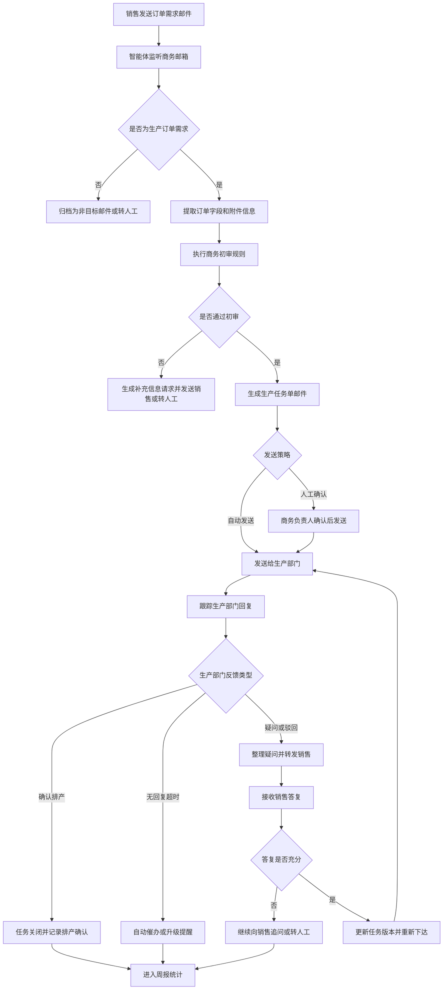

# 商务生产任务单智能体 PRD

文档版本：v0.3
创建日期：2026-04-21  
最近更新：2026-04-25
适用阶段：内测基线、生产试运行、后续迭代规划
产品名称：商务部小J智能体

## 0. 当前基线状态

本节基于当前代码和已完成联调结果更新，作为后续需求验收和迭代排期的基线。原始 PRD 规划内容从第 1 章开始保留，用于追溯需求来源。

### 0.1 已实现能力

| 模块 | 当前状态 |
| --- | --- |
| 系统启停 | 系统默认停用；启动前校验 Dify API、Bot 邮箱账号密码、生产部门邮箱路由，缺失项会明确提示 |
| 邮件接入 | 支持腾讯企业邮箱 IMAP/SMTP 收发、邮件入库、附件保存、外发队列、发送状态追踪 |
| 发件身份 | Bot 发件身份统一为“商务部小J”，默认账号为 `bot.market@jimuyida.com` |
| 邮件入库 | 支持按邮件 ID、主题、发件人、分类、任务号搜索；点击邮件记录可查看发件人、收件人、抄送、正文和附件 |
| 流程管理 | 流程列表为一级导航；内置默认下单流程在列表中展示；支持启用、停用、查看、编辑、删除和批量导入 |
| 流程规则导入 | 支持上传流程文档并由 LLM 生成流程草稿；支持 JSON 预览、邮件预览、对已有流程进行 LLM 编辑；新增和导入均做查重 |
| 初审规则 | 支持系统内置只读通用规则、自定义规则、规则启停、删除、查重；批量导入产生的规则为自定义规则 |
| 初审逻辑 | 支持必填字段、关键词、查重、路由配置校验和自定义规则；同一销售一天内重复提交同一需求会明确回复“已提交，请勿重复提交” |
| 任务创建 | 初审通过且生产路由已配置才创建任务；初审通过但 `route_is_configured=False` 时不创建任务，并在异常中明确提示 |
| 任务处理 | 任务列表显示创建时间；支持查看工作流、手动关闭单条任务，关闭后通知销售侧和生产侧 |
| 撤回与关闭 | 销售可在生产未确认排单前按任务号撤回需求；撤回后关闭任务并通知销售侧和生产侧 |
| 生产问答 | 支持生产侧提问、销售侧回复、多轮答疑；流程可配置允许问答轮次，默认 3 轮 |
| 外发队列 | 支持查看外发队列、批量取消 Pending 邮件；周报和任务邮件均进入统一队列 |
| 异常与运维 | 异常、运维日志、任务列表均支持管理员密码确认后的清空操作；关键动作写审计 |
| 周报 | 支持商务生产任务单周报生成、预览、收件人配置和外发 |
| 界面调整 | 隐藏模拟订单和模板入口；生产邮箱入口前置；任务筛选、初审规则、流程编辑等页面完成紧凑化调整 |

### 0.2 当前明确业务规则

1. 系统未启动时，不自动消费邮件、不自动创建任务、不自动外发业务邮件。
2. 启动系统必须满足：Dify API 已配置、Bot 邮箱已配置、Bot 邮箱密码已配置、至少一个生产部门邮箱路由处于启用状态。
3. 销售订单邮件只有通过初审且命中有效生产路由时，才会创建生产任务。
4. 初审通过后，AI 回复销售侧邮件必须带上任务号。
5. 同一销售在一天内重复提交同一需求时，不重复创建任务，并回复销售侧说明已提交。
6. 生产路由未配置时，即使初审通过，也不创建任务，并进入异常队列提示路由未配置。
7. 手动关闭、销售撤回、生产终止等关闭动作必须通知销售侧和生产侧。
8. 流程编辑、删除、收件人修改必须在流程停用状态下执行；内置流程只读。
9. 系统内置通用规则只能查看，不能删除；自定义规则可启用、停用和删除。
10. 批量导入流程时，重复流程和重复规则只保留一份。

### 0.3 当前待完善范围

| 优先级 | 待完善项 | 说明 |
| --- | --- | --- |
| P0 | 真实邮箱回归自动化 | 当前已有真实邮箱联调报告，后续需要沉淀为低频率、可重复、可清理的自动化测试脚本 |
| P0 | 外发队列吞吐与可观测性 | Pending 长时间未消费需要进一步区分测试遗留、停机状态、队列调度和发送失败 |
| P0 | 任务全链路追踪 | 邮件、任务、异常、外发、审计之间的互跳和搜索需要继续增强 |
| P1 | 规则版本差异与回滚 | 流程和规则已经版本化展示，仍需补充版本 diff、回滚和审批 |
| P1 | 部署级持久化方案 | 当前以内测本地数据库和文件存储为主，正式生产建议迁移到 PostgreSQL 和对象存储 |
| P1 | 权限分级 | 当前管理员能力较集中，后续应拆分商务管理员、只读审计、运维管理员等权限 |

## 1. 背景

当前生产订单需求主要通过邮件在销售、商务、生产部门之间流转。商务人员承担邮件识别、订单信息初审、生产任务单整理、疑问转发、答复跟进、重新下达、过程统计和周报发送等工作。该流程高度依赖人工阅读邮件和跨部门追踪，容易出现响应延迟、信息遗漏、版本混乱、追溯困难和统计口径不一致。

本产品拟开发一个智能体软件，接入企业邮件系统，替代或辅助商务人员完成生产任务单相关邮件流程。系统应能够自动识别销售订单需求邮件，提取关键信息，按规则初审，生成并发送生产任务单邮件，跟踪生产部门反馈，将疑问转发给销售，收集答复后重新下达任务单，并定期生成统计分析报告发送给财务、CEO、销售总监等相关人员。

## 2. 产品目标

1. 将商务人员在生产任务单邮件流程中的重复性操作自动化，包括识别、提取、初审、邮件撰写、转发、催办、状态跟踪和周报。
2. 保证订单需求、生产任务单、生产疑问、销售答复之间有清晰的关联关系和版本记录。
3. 降低因人工遗漏、复制粘贴错误、邮件线程混乱导致的生产排产风险。
4. 提供可审计、可追溯、可统计的业务数据沉淀。
5. MVP 阶段支持“规则命中且风险可控时自动发送”，高风险和异常场景保留人工确认。

## 3. 成功指标

| 指标 | 目标值 |
| --- | --- |
| 订单需求邮件识别准确率 | MVP 阶段不低于 90%，稳定期不低于 95% |
| 关键字段提取准确率 | MVP 阶段不低于 90%，稳定期不低于 96% |
| 初审可自动通过比例 | MVP 阶段不低于 60%，稳定期不低于 80% |
| 生产任务单生成耗时 | 从收到销售邮件到生成任务单草稿不超过 2 分钟 |
| 疑问转发及时性 | 生产疑问邮件收到后 5 分钟内转发或进入异常队列 |
| 周报生成耗时 | 每周自动生成并发送，不需要人工整理基础数据 |
| 人工介入率 | 稳定期低于 20%，高风险和低置信场景除外 |

## 4. 目标用户与干系人

| 角色 | 主要诉求 |
| --- | --- |
| 销售人员 | 通过邮件提交订单需求、回答生产疑问、查看处理状态 |
| 商务负责人 | 监管系统自动处理结果、处理异常、维护规则和模板 |
| 生产部门 | 收到结构清晰、信息完整、版本明确的生产任务单 |
| 财务 | 获取订单下达、驳回、待处理和异常统计，用于经营分析 |
| CEO | 获取整体订单流转效率、风险订单、部门响应情况 |
| 销售总监 | 获取销售提交质量、订单进展、疑问响应及时性 |
| IT/管理员 | 管理账号权限、邮件接入、系统配置、安全审计和日志 |

## 5. 业务范围

### 5.1 范围内

1. 邮件收取、发送、转发、回复和邮件线程追踪。
2. 自动识别销售发送的产品生产订单需求邮件。
3. 从邮件正文和附件中提取生产订单相关字段。
4. 根据配置规则完成商务初审。
5. 生成生产任务单邮件草稿或自动发送正式生产任务单。
6. 接收并识别生产部门对任务单的疑问、驳回、补充要求或确认排产。
7. 自动将生产疑问整理后转发给对应销售人员。
8. 接收销售答复并判断是否足以重新下达生产任务单。
9. 生成新版本生产任务单并发送给生产部门。
10. 跟踪订单任务单状态，直到生产部门确认排产或进入人工异常处理。
11. 每周自动生成统计分析报告，并发送给配置的收件人。
12. 提供后台管理界面，用于查看任务、异常、日志、模板、规则和统计。

### 5.2 范围外

1. 不在 MVP 阶段直接替代 ERP、MES 或生产排程系统。
2. 不在 MVP 阶段自动做价格审批、信用审批、合同审批或财务结算。
3. 不自动承诺交期，除非已接入可靠的产能和排程数据源。
4. 不对法律、合规、质量事故等高风险事项做无人值守决策。
5. 不改变公司现有邮件审批制度，系统仅在授权范围内代发或辅助发送邮件。

## 6. 关键假设

1. 销售、商务、生产、财务、CEO、销售总监等角色均有企业邮箱账号。
2. 销售订单需求大多数通过固定或半固定格式邮件发送，但允许存在自然语言描述和附件。
3. 生产任务单邮件存在可标准化的模板。
4. 商务初审规则可以被配置为字段完整性、格式、业务一致性、附件完整性和异常关键词等规则。
5. 第一阶段采用“低风险自动发送 + 高风险人工确认”模式，自动发送必须满足准入矩阵。
6. 所有自动处理动作必须记录审计日志，便于追责和复盘。

## 7. 业务术语

| 术语 | 定义 |
| --- | --- |
| 订单需求邮件 | 销售人员发送给商务人员，描述客户产品生产需求的邮件 |
| 生产任务单 | 商务向生产部门下达的标准化生产需求邮件或附件 |
| 初审 | 商务规则检查，包括字段完整性、业务合理性、附件完整性和风险识别 |
| 驳回 | 生产部门认为任务单信息不足、存在冲突或无法排产而退回 |
| 疑问邮件 | 生产部门就订单或任务单提出问题的邮件 |
| 销售答复 | 销售人员对生产疑问的解释、补充或修正 |
| 任务版本 | 同一订单因补充信息或修改后重新下达形成的版本 |
| 确认排产 | 生产部门明确接受任务单并进入排产或生产流程 |

## 8. 目标流程



## 9. 状态机

| 状态 | 说明 | 进入条件 | 退出条件 |
| --- | --- | --- | --- |
| NewEmailReceived | 收到新邮件 | 邮件系统推送或轮询发现新邮件 | 完成分类 |
| NonTargetEmail | 非目标邮件 | 判断不是订单需求、疑问或相关答复 | 归档或转人工 |
| RequirementDetected | 已识别订单需求 | 邮件被判断为销售生产订单需求 | 完成字段提取 |
| Extracted | 已提取信息 | 提取正文和附件字段 | 完成初审 |
| ReviewFailed | 初审未通过 | 必填字段缺失、格式错误、风险规则命中 | 销售补充或人工处理 |
| TaskDrafted | 已生成任务单草稿 | 初审通过 | 人工确认或自动发送 |
| TaskIssued | 已下达生产 | 任务单邮件发送成功 | 收到生产回复 |
| ProductionQuestioned | 生产有疑问 | 生产回复疑问或驳回 | 已转发销售 |
| WaitingSalesReply | 等待销售答复 | 已向销售发送疑问 | 收到销售答复或超时 |
| SalesReplyReceived | 已收到销售答复 | 销售回复疑问邮件 | 判断答复充分性 |
| Reissued | 已重新下达 | 销售答复充分并生成新版本 | 等待生产确认 |
| ScheduledConfirmed | 已确认排产 | 生产明确确认安排生产 | 关闭任务 |
| ExceptionManualReview | 人工异常处理 | 低置信度、高风险、超时或系统错误 | 人工处理后恢复或关闭 |
| Closed | 已关闭 | 确认排产、取消订单或人工关闭 | 进入历史和统计 |

## 10. 功能需求

### 10.1 邮件接入

#### 功能描述

系统需要接入企业邮箱，自动监听指定邮箱或共享邮箱中的新邮件，并支持发送、转发、回复和抄送。

#### 需求列表

| 编号 | 需求 | 优先级 |
| --- | --- | --- |
| F-001 | 支持 IMAP/SMTP、Exchange、Microsoft 365 或企业邮箱 API 接入，具体协议按客户现有邮箱确认 | P0 |
| F-002 | 支持配置监听邮箱、发件邮箱、默认抄送人、部门邮箱和邮件文件夹规则 | P0 |
| F-003 | 支持按邮件 Message-ID、In-Reply-To、References、主题和正文特征建立线程关系 | P0 |
| F-004 | 支持解析邮件正文、HTML、纯文本、附件、转发链和历史回复 | P0 |
| F-005 | 支持邮件发送失败重试和失败告警 | P0 |
| F-006 | 支持邮件黑白名单，避免误处理无关邮件 | P1 |

### 10.2 邮件智能分类

#### 功能描述

系统需要识别邮件属于订单需求、生产疑问、销售答复、生产确认、取消订单、非目标邮件等类型。

#### 分类类型

| 类型 | 示例 |
| --- | --- |
| SalesOrderRequirement | 销售提交新生产订单需求 |
| ProductionQuestion | 生产部门提出疑问、补充要求或驳回 |
| SalesClarificationReply | 销售对疑问的答复 |
| ProductionScheduleConfirmation | 生产部门确认安排生产 |
| OrderChangeRequest | 销售变更数量、规格、交期、包装等 |
| OrderCancelRequest | 销售取消订单 |
| NonTarget | 与生产任务单无关 |

#### 需求列表

| 编号 | 需求 | 优先级 |
| --- | --- | --- |
| F-007 | 对新邮件进行意图分类并输出置信度 | P0 |
| F-008 | 分类结果低于置信阈值时进入人工异常队列 | P0 |
| F-009 | 支持用户纠正分类结果，并沉淀为后续优化样本 | P1 |
| F-010 | 支持同一邮件包含多个意图时拆分处理，例如订单变更并附带疑问答复 | P1 |

### 10.3 订单信息提取

#### 功能描述

从销售订单需求邮件和附件中提取生产任务单所需字段，并保留字段来源。

#### 建议字段

| 字段 | 是否必填 | 说明 |
| --- | --- | --- |
| 订单编号 | 条件必填 | 若销售未提供，系统生成内部跟踪编号 |
| 客户名称 | 必填 | 最终客户或经销商名称 |
| 销售人员 | 必填 | 发件人或邮件签名识别 |
| 产品名称 | 必填 | 产品标准名称 |
| 产品型号/规格 | 必填 | 型号、规格、版本、图纸编号等 |
| 数量 | 必填 | 生产数量及单位 |
| 期望交期 | 必填 | 客户期望交付日期 |
| 交付地点 | 条件必填 | 发货地址或仓库 |
| 包装要求 | 条件必填 | 特殊包装、标签、唛头等 |
| 质量要求 | 条件必填 | 检验标准、认证、测试项目 |
| 特殊工艺要求 | 条件必填 | 颜色、材质、配方、工艺、定制要求 |
| 附件清单 | 条件必填 | 图纸、BOM、合同、客户确认文件等 |
| 优先级 | 可选 | 普通、加急、特急 |
| 备注 | 可选 | 其他补充说明 |

#### 需求列表

| 编号 | 需求 | 优先级 |
| --- | --- | --- |
| F-011 | 支持从正文、表格、Excel、Word、PDF 和图片附件中提取字段 | P0/P1 |
| F-012 | 每个字段需记录来源位置，例如正文段落、附件名、表格单元格或页码 | P0 |
| F-013 | 提取结果需包含置信度和缺失字段清单 | P0 |
| F-014 | 支持同一邮件中多个产品或多个订单拆分为多个生产任务 | P1 |
| F-015 | 支持标准产品名称、客户名称、销售人员名称的别名归一化 | P1 |

### 10.4 商务初审

#### 功能描述

系统根据可配置规则对订单需求进行初审，决定是否可以生成生产任务单、需要向销售补充信息，或需要人工介入。

#### 初审规则类型

1. 必填字段完整性规则。
2. 数量、日期、单位、邮箱、客户名称等格式规则。
3. 交期合理性规则，例如期望交期早于当前日期或短于最短生产周期。
4. 附件完整性规则，例如定制产品必须有图纸或确认文件。
5. 风险关键词规则，例如“客户未确认”“价格待定”“先生产后补合同”。
6. 变更冲突规则，例如同一订单在短时间内多次变更数量或规格。
7. 黑名单或高风险客户规则，如果未来接入客户信用数据。

#### 需求列表

| 编号 | 需求 | 优先级 |
| --- | --- | --- |
| F-016 | 支持配置必填字段和条件必填字段 | P0 |
| F-017 | 初审结果分为通过、需销售补充、需人工审核、拒绝处理 | P0 |
| F-018 | 初审失败时自动生成问题清单和补充信息邮件 | P0 |
| F-019 | 支持商务负责人手动修改提取字段和初审结果 | P0 |
| F-020 | 支持规则版本管理，保证历史任务可追溯当时使用的规则 | P1 |

### 10.5 生产任务单生成与发送

#### 功能描述

系统根据通过初审的订单需求生成标准化生产任务单邮件，并按发送策略发给生产部门。

#### 任务单内容

1. 任务单编号。
2. 关联订单编号和原始邮件链接。
3. 客户名称和销售人员。
4. 产品名称、型号、规格、数量、单位。
5. 期望交期和优先级。
6. 生产要求、包装要求、质量要求和特殊说明。
7. 附件清单和附件转发。
8. 版本号和本次下达原因。
9. 需要生产部门确认的事项。

#### 需求列表

| 编号 | 需求 | 优先级 |
| --- | --- | --- |
| F-021 | 支持按模板生成生产任务单邮件主题和正文 | P0 |
| F-022 | 支持将原销售附件按规则转发给生产部门 | P0 |
| F-023 | 支持生成任务单版本号，例如 V1、V2、V3 | P0 |
| F-024 | 支持发送前人工预览、编辑和确认 | P0 |
| F-025 | 支持在规则命中且置信度足够时自动发送 | P0 |
| F-026 | 支持生产部门回复时自动识别关联任务单 | P0 |

### 10.6 生产疑问处理

#### 功能描述

生产部门如对任务单有疑问，系统需识别疑问内容，关联对应任务单，并自动转发给销售人员。

#### 需求列表

| 编号 | 需求 | 优先级 |
| --- | --- | --- |
| F-027 | 自动识别生产部门疑问、驳回和补充信息请求 | P0 |
| F-028 | 将疑问按问题点结构化，例如规格疑问、交期疑问、附件缺失、工艺不清 | P0 |
| F-029 | 自动生成发给销售的疑问邮件，保留原始生产邮件上下文 | P0 |
| F-030 | 支持多个问题点分别跟踪处理状态 | P1 |
| F-031 | 若无法确定对应销售或任务单，进入人工异常队列 | P0 |

### 10.7 销售答复处理与重新下达

#### 功能描述

系统接收销售答复后，判断是否回答了生产疑问，更新任务单信息，并重新发送给生产部门。

#### 需求列表

| 编号 | 需求 | 优先级 |
| --- | --- | --- |
| F-032 | 自动识别销售答复是否对应某个生产疑问 | P0 |
| F-033 | 判断答复是否完整覆盖所有未解决问题点 | P0 |
| F-034 | 根据答复内容更新结构化订单字段和任务版本 | P0 |
| F-035 | 重新生成生产任务单邮件并标明变更点 | P0 |
| F-036 | 若销售答复含糊、冲突或缺失，自动继续追问或转人工 | P0 |
| F-037 | 支持多轮疑问和多次重新下达，直到生产确认排产 | P0 |

### 10.8 超时、催办与升级

#### 功能描述

系统需要对生产和销售的关键响应设置 SLA，自动催办并在超时后升级。

#### 需求列表

| 编号 | 需求 | 优先级 |
| --- | --- | --- |
| F-038 | 支持配置销售答复 SLA、生产确认 SLA 和异常处理 SLA | P1 |
| F-039 | 超时后自动发送催办邮件 | P1 |
| F-040 | 多次催办无响应时升级抄送销售总监、生产负责人或商务负责人 | P1 |
| F-041 | 周报中统计超时次数、超时订单和责任角色 | P1 |

### 10.9 周报统计与分析

#### 功能描述

商务部门每周需要统计生产任务单下达、驳回、疑问、重新下达、确认排产等情况，并发送给财务、CEO、销售总监等账户。

#### 统计维度

1. 本周新增销售订单需求数。
2. 本周生成生产任务单数。
3. 本周已确认排产数。
4. 本周被生产驳回或提出疑问数。
5. 本周重新下达次数。
6. 当前待销售答复数。
7. 当前待生产确认数。
8. 当前人工异常处理数。
9. 平均从销售提交到生产下达耗时。
10. 平均从生产疑问到销售答复耗时。
11. 按销售人员统计提交量、驳回量、补充次数、超时次数。
12. 按客户、产品、订单优先级统计。
13. 主要驳回原因 Top N。
14. 风险订单列表和建议关注事项。

#### 需求列表

| 编号 | 需求 | 优先级 |
| --- | --- | --- |
| F-042 | 每周按配置时间自动生成统计报告 | P0 |
| F-043 | 报告支持邮件正文摘要和附件明细表 | P0 |
| F-044 | 支持配置报告收件人、抄送人和发送时间 | P0 |
| F-045 | 支持按时间范围手动生成报告 | P1 |
| F-046 | 支持导出 Excel、PDF 或 HTML 报告 | P1 |
| F-047 | 报告中的数据需可追溯到原始邮件和任务单 | P0 |

### 10.10 后台管理

#### 功能描述

后台用于商务负责人和管理员查看、修改、确认、追踪和配置。

#### 页面列表

| 页面 | 功能 |
| --- | --- |
| 工作台 | 展示待确认、待补充、待生产确认、异常、超时任务 |
| 任务详情 | 展示原始邮件、提取字段、初审结果、任务单版本、往来邮件 |
| 邮件队列 | 查看系统已收取、已发送、失败和待处理邮件 |
| 异常队列 | 处理低置信度、无法关联、发送失败、规则冲突等问题 |
| 模板管理 | 管理生产任务单、疑问转发、催办、周报模板 |
| 规则管理 | 配置初审规则、SLA、收件人、部门映射、关键词 |
| 统计报表 | 查看周报、趋势、明细和导出 |
| 审计日志 | 查看所有自动和人工操作记录 |

#### 需求列表

| 编号 | 需求 | 优先级 |
| --- | --- | --- |
| F-048 | 支持任务列表筛选、搜索、排序和状态批量处理 | P0 |
| F-049 | 支持人工修改提取字段并重新生成任务单 | P0 |
| F-050 | 支持人工接管某个任务，暂停自动发送 | P0 |
| F-051 | 支持模板变量预览和测试发送 | P1 |
| F-052 | 支持规则启停、灰度和版本回滚 | P1 |

## 11. 非功能需求

### 11.1 安全与权限

1. 使用企业账号登录，支持 SSO 或管理员创建账号。
2. 角色权限至少包括管理员、商务负责人、商务操作员、只读查看者。
3. 邮件账号凭证加密存储，不允许明文保存。
4. 所有邮件正文、附件和提取字段均按公司数据安全要求存储。
5. 支持敏感信息脱敏展示，例如客户价格、联系人电话等。
6. 支持操作审计，记录操作者、时间、动作、前后值、关联任务。
7. 系统自动发送邮件必须可追溯到规则、模型结果和触发条件。

### 11.2 准确性与可解释性

1. 分类、提取、初审、答复充分性判断均需输出置信度。
2. 关键字段必须展示来源证据，便于人工核对。
3. 低置信度和高风险任务不得无人值守自动发送。
4. 模型不得编造邮件中不存在的信息，缺失字段必须标记为缺失。
5. 人工修改结果应成为后续优化样本。

### 11.3 性能

| 场景 | 要求 |
| --- | --- |
| 新邮件发现 | 常规情况下 1 分钟内发现 |
| 邮件分类 | 单封邮件 10 秒内完成 |
| 字段提取 | 普通正文邮件 30 秒内完成，含复杂附件 2 分钟内完成 |
| 任务单生成 | 初审通过后 30 秒内生成草稿 |
| 周报生成 | 5000 条任务以内 5 分钟内完成 |

### 11.4 可靠性

1. 邮件收取和发送需要幂等处理，避免重复下达任务单。
2. 系统重启后可以从上次处理位置继续。
3. 外部邮箱服务不可用时，需要重试并告警。
4. 所有关键操作需要事务或补偿机制。
5. 附件处理失败不应导致整个系统阻塞，应进入异常队列。

### 11.5 合规与留存

1. 原始邮件、附件、提取结果、任务版本和报告至少按公司要求保留。
2. 支持按订单、客户、销售、日期检索历史记录。
3. 支持数据导出，以满足审计、财务核对和管理复盘。

## 12. 数据对象设计

### 12.1 MailMessage

| 字段 | 说明 |
| --- | --- |
| id | 系统邮件 ID |
| message_id | 邮件 Message-ID |
| thread_id | 系统线程 ID |
| mailbox | 来源邮箱 |
| from | 发件人 |
| to | 收件人 |
| cc | 抄送人 |
| subject | 主题 |
| body_text | 正文文本 |
| body_html | 正文 HTML |
| received_at | 收件时间 |
| sent_at | 发送时间 |
| attachments | 附件列表 |
| classification | 分类结果 |
| confidence | 分类置信度 |
| related_task_id | 关联任务 ID |
| raw_source_ref | 原始邮件存储引用 |

### 12.2 OrderRequirement

| 字段 | 说明 |
| --- | --- |
| id | 订单需求 ID |
| source_mail_id | 来源邮件 ID |
| internal_order_no | 系统内部订单号 |
| external_order_no | 销售提供订单号 |
| customer_name | 客户名称 |
| salesperson | 销售人员 |
| product_items | 产品明细 |
| expected_delivery_date | 期望交期 |
| delivery_location | 交付地点 |
| packaging_requirement | 包装要求 |
| quality_requirement | 质量要求 |
| special_requirement | 特殊要求 |
| priority | 优先级 |
| extraction_confidence | 提取置信度 |
| missing_fields | 缺失字段 |
| risk_flags | 风险标签 |
| status | 状态 |

### 12.3 ProductionTask

| 字段 | 说明 |
| --- | --- |
| id | 生产任务 ID |
| task_no | 生产任务单编号 |
| requirement_id | 关联订单需求 |
| version | 当前版本 |
| status | 当前状态 |
| production_department | 生产部门 |
| issued_mail_id | 最近一次下达邮件 ID |
| issued_at | 最近一次下达时间 |
| confirmed_at | 生产确认排产时间 |
| current_owner | 当前责任方 |
| sla_due_at | 当前 SLA 截止时间 |

### 12.4 ProductionTaskVersion

| 字段 | 说明 |
| --- | --- |
| id | 版本 ID |
| task_id | 生产任务 ID |
| version_no | 版本号 |
| change_reason | 变更原因 |
| changed_fields | 变更字段 |
| generated_mail_subject | 邮件主题 |
| generated_mail_body | 邮件正文 |
| sent_mail_id | 发送邮件 ID |
| created_by | 创建人或系统 |
| created_at | 创建时间 |

### 12.5 QuestionAndReply

| 字段 | 说明 |
| --- | --- |
| id | 问答 ID |
| task_id | 生产任务 ID |
| question_mail_id | 生产疑问邮件 ID |
| question_items | 结构化问题点 |
| forwarded_mail_id | 转发销售邮件 ID |
| sales_reply_mail_id | 销售答复邮件 ID |
| answer_summary | 答复摘要 |
| completeness | 答复完整性 |
| status | 未转发、待答复、已答复、需追问、已关闭 |

### 12.6 WeeklyReport

| 字段 | 说明 |
| --- | --- |
| id | 报告 ID |
| period_start | 统计开始日期 |
| period_end | 统计结束日期 |
| metrics | 指标数据 |
| highlights | 重点摘要 |
| risk_items | 风险订单 |
| recipients | 收件人 |
| generated_at | 生成时间 |
| sent_mail_id | 发送邮件 ID |

## 13. 邮件模板

### 13.1 生产任务单邮件模板

主题：

```text
[生产任务单][{{task_no}}][{{customer_name}}][{{product_summary}}][{{version}}]
```

正文：

```text
生产部同事好：

请根据以下信息安排生产评估和排产。

任务单编号：{{task_no}}
版本：{{version}}
客户名称：{{customer_name}}
销售人员：{{salesperson}}
关联订单号：{{external_order_no}}

产品明细：
{{product_items}}

期望交期：{{expected_delivery_date}}
交付地点：{{delivery_location}}
优先级：{{priority}}

包装要求：
{{packaging_requirement}}

质量/检验要求：
{{quality_requirement}}

特殊工艺或备注：
{{special_requirement}}

附件：
{{attachment_list}}

请确认是否可以安排生产。如信息不足，请直接回复本邮件说明疑问点。

系统自动生成，关联原始销售邮件：{{source_mail_ref}}
```

### 13.2 生产疑问转销售模板

主题：

```text
[待销售确认][{{task_no}}][{{customer_name}}] 生产部疑问需补充
```

正文：

```text
{{salesperson}} 你好：

生产部针对以下订单提出疑问，请补充确认。

任务单编号：{{task_no}}
客户名称：{{customer_name}}
产品：{{product_summary}}

生产部疑问：
{{question_items}}

请直接回复本邮件。系统收到答复后会重新整理并下达生产部。

原生产部邮件：{{production_question_mail_ref}}
```

### 13.3 周报邮件模板

主题：

```text
[商务生产任务单周报] {{period_start}} - {{period_end}}
```

正文：

```text
各位好：

以下为本周生产任务单流转统计摘要。

1. 新增订单需求：{{new_requirement_count}}
2. 下达生产任务单：{{issued_task_count}}
3. 已确认排产：{{confirmed_task_count}}
4. 生产疑问/驳回：{{questioned_task_count}}
5. 重新下达次数：{{reissue_count}}
6. 当前待销售答复：{{waiting_sales_count}}
7. 当前待生产确认：{{waiting_production_count}}
8. 人工异常处理中：{{manual_exception_count}}

主要驳回原因：
{{top_rejection_reasons}}

风险订单：
{{risk_items}}

明细请见附件或系统链接：{{report_link}}
```

## 14. 智能体能力要求

1. 邮件分类能力：判断邮件业务类型和关联任务。
2. 信息抽取能力：从非结构化正文和附件中抽取订单字段。
3. 规则推理能力：根据初审规则判断通过、补充、异常或拒绝。
4. 邮件生成能力：按模板生成自然、准确、可追溯的业务邮件。
5. 多轮流程编排能力：管理销售、生产之间的往返问答和任务版本。
6. 置信度控制能力：低置信度不自动发送，高风险场景必须转人工。
7. 记忆与追踪能力：记住每个任务的历史邮件、版本、问题点和处理状态。
8. 报告分析能力：按周汇总数据，生成面向管理层的摘要和明细。
9. 人工反馈学习能力：记录人工修正，用于优化规则、模板和模型提示。

## 15. 人工介入策略

| 场景 | 处理方式 |
| --- | --- |
| 邮件分类置信度低 | 进入异常队列，由商务负责人选择类型 |
| 必填字段缺失 | 自动向销售请求补充，或人工编辑后继续 |
| 字段冲突 | 转人工确认，不自动下达 |
| 高风险关键词命中 | 转人工审核 |
| 生产疑问无法关联任务 | 转人工关联 |
| 销售答复不完整 | 自动追问一次，仍不完整则转人工 |
| 同一订单多次变更 | 转人工确认版本和最终内容 |
| 邮件发送失败 | 自动重试，重试失败后告警 |

## 16. 权限与操作边界

| 操作 | 智能体 | 商务负责人 | 管理员 |
| --- | --- | --- | --- |
| 读取授权邮箱邮件 | 允许 | 允许查看 | 配置 |
| 自动分类邮件 | 允许 | 可纠正 | 配置 |
| 提取订单字段 | 允许 | 可修改 | 配置 |
| 发送补充信息请求 | 条件允许 | 允许 | 配置策略 |
| 发送生产任务单 | MVP 默认自动发送低风险任务单 | 允许 | 准入矩阵 + 人工接管 |
| 处理异常队列 | 不允许最终裁决 | 允许 | 允许 |
| 修改模板和规则 | 不允许 | 条件允许 | 允许 |
| 查看周报和统计 | 允许生成 | 允许 | 允许 |
| 删除历史记录 | 不允许 | 不允许 | 按合规策略限制 |

## 17. 里程碑规划

### 17.1 MVP

目标：实现邮件接入、订单识别、字段提取、初审、低风险任务单自动发送、高风险人工确认、生产疑问转发、销售答复关联、重新下达、基础周报。

范围：

1. 接入一个商务共享邮箱。
2. 支持一种或两种常见订单需求邮件格式。
3. 支持邮件正文和常见附件解析。
4. 后台支持人工确认和异常处理。
5. 周报支持基础指标和明细表。

### 17.2 V1

目标：提升自动化比例和流程闭环能力。

范围：

1. 支持自动发送低风险任务单。
2. 支持多产品拆分和多订单识别。
3. 支持 SLA 催办和升级。
4. 支持模板、规则、收件人后台配置。
5. 支持更完善的图表和管理层分析。

### 17.3 V2

目标：与企业业务系统深度集成。

范围：

1. 对接 ERP、CRM、MES 或 OA。
2. 自动校验客户、产品、库存、产能和交期。
3. 支持生产部门在系统中直接确认排产，而不仅通过邮件。
4. 建立长期数据看板和预测分析。

## 18. 验收标准

### 18.1 MVP 验收

1. 系统可以稳定读取指定商务邮箱的新邮件。
2. 对销售订单需求邮件可以自动分类，并展示置信度。
3. 对标准订单邮件可以提取必填字段，提取结果可人工修改。
4. 字段缺失时可以生成补充信息请求邮件。
5. 初审通过时可以生成生产任务单草稿。
6. 满足自动发送准入条件时，系统可以自动发送生产任务单给生产部门；不满足时由商务负责人确认后发送。
7. 生产部门回复疑问后，系统可以关联任务并转发给销售。
8. 销售回复后，系统可以识别答复并生成新版任务单草稿。
9. 生产部门确认排产后，系统可以关闭任务。
10. 系统可以生成并发送周报，报告数据与任务明细一致。
11. 所有关键动作都有审计日志。
12. 出现低置信度、字段冲突、无法关联等情况时进入异常队列。

### 18.2 测试样本建议

| 样本类型 | 数量 |
| --- | --- |
| 标准销售订单需求邮件 | 50 封 |
| 缺字段订单邮件 | 20 封 |
| 多产品订单邮件 | 20 封 |
| 带附件订单邮件 | 30 封 |
| 生产疑问邮件 | 30 封 |
| 销售答复邮件 | 30 封 |
| 生产确认邮件 | 20 封 |
| 非目标邮件 | 50 封 |
| 订单变更或取消邮件 | 20 封 |

## 19. 风险与应对

| 风险 | 影响 | 应对 |
| --- | --- | --- |
| 邮件格式高度不统一 | 提取错误、误判 | 建立模板库、置信度、人审和样本迭代 |
| 自动发送造成业务错误 | 生产排错、责任不清 | 自动发送准入矩阵、幂等控制、审计追踪；高风险转人工 |
| 邮件线程混乱 | 无法关联任务 | 使用 Message-ID、主题、订单号、语义和人工关联 |
| 附件内容难解析 | 字段缺失 | 优先支持常见格式，失败进入异常队列 |
| 生产或销售不按线程回复 | 跟踪困难 | 邮件主题加入任务编号，正文要求直接回复 |
| 统计口径争议 | 报告不可信 | 在 PRD 和系统配置中固化统计定义 |
| 模型幻觉 | 错误生成不存在信息 | 字段来源证据、缺失标记、低置信转人工 |
| 权限和数据安全 | 泄露客户和订单信息 | SSO、权限、加密、审计、脱敏 |

## 20. 待确认问题

以下问题建议在需求评审中确认，确认后应更新到本 PRD：

1. 当前使用的企业邮箱类型是什么，例如 Microsoft 365、Exchange、自建邮箱、腾讯企业邮箱、阿里企业邮箱或其他。
2. 商务人员目前使用的是个人邮箱还是共享邮箱，智能体是否允许使用独立系统邮箱代发。
3. 销售订单需求邮件是否已有固定模板，是否存在 Excel、Word、PDF、图片等附件格式。
4. 生产任务单当前是否已有标准模板，如果有，需要提供现有模板。
5. 商务初审的明确规则有哪些，例如必填字段、附件要求、交期规则、客户限制、产品限制。
6. 生产部门确认排产的标准表达是什么，是否只通过邮件确认。
7. 生产部门“驳回”和“疑问”在统计上是否需要区分。
8. 每周统计报告的发送时间、收件人、抄送人和格式要求是什么。
9. 是否需要接入 ERP、CRM、MES、OA、客户主数据或产品主数据。
10. 自动发送的授权边界是什么，哪些任务必须人工确认，哪些可以自动发送。
11. 历史邮件和附件需要保留多久，是否有合规或保密等级要求。
12. 是否需要支持多语言邮件或海外销售邮件。
13. 是否需要移动端审批或企业微信、钉钉、飞书通知。
14. 当前每周订单量、疑问量和相关邮箱数量大约是多少。
15. 是否存在多个生产部门，不同产品是否需要发送给不同生产邮箱。

## 21. 第一版实现建议

建议采用“智能体 + 规则引擎 + 邮件工作流 + 人工确认后台”的架构：

1. 邮件服务负责收发、线程识别和附件解析。
2. 智能体负责分类、抽取、摘要、邮件生成和答复充分性判断。
3. 规则引擎负责初审、SLA、发送策略和异常分流。
4. 工作流引擎负责状态机、任务版本和多轮跟踪。
5. 管理后台负责人工确认、异常处理、规则模板维护和统计报表。
6. 审计模块负责记录每一次自动和人工动作。

MVP 阶段不建议直接全自动替代商务人员，而应采用“低风险订单自动下达、高风险和异常人工接管”的模式。自动催办和自动周报仍可按运营稳定性逐步开启。
