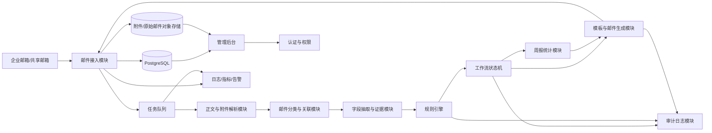

# 商务生产任务单智能体技术方案

文档版本：v0.3
创建日期：2026-04-21  
最近更新：2026-04-25
依据文档：[production-order-agent-prd-review-v0.2.md](./production-order-agent-prd-review-v0.2.md)  
适用范围：内测基线、生产试运行、后续架构演进

## 0. 当前实现基线

当前系统已经从 MVP 方案进入内测基线状态。原技术方案中 PostgreSQL、Celery、Redis、MinIO 等内容仍作为生产化演进目标保留；当前代码实现以 FastAPI 模块化单体、SQLAlchemy、本地数据库/文件存储和静态前端为主，优先满足真实邮箱闭环、后台管理和可审计操作。

### 0.1 当前技术栈

| 层级 | 当前实现 | 后续生产建议 |
| --- | --- | --- |
| 后端应用 | Python FastAPI 模块化单体 | 保持模块化单体，按规模再拆分异步 worker |
| 数据访问 | SQLAlchemy ORM | 正式生产迁移到 PostgreSQL，补齐迁移脚本和备份恢复 |
| 数据库 | 内测本地数据库 | PostgreSQL 16+ |
| 前端 | 静态管理后台，原生 JS/CSS 组件化组织 | 若复杂度继续增加，再评估 React/Vite 重构 |
| 邮件接入 | 腾讯企业邮箱 IMAP/SMTP | 保留适配器边界，后续扩展 Exchange/M365 |
| 模型服务 | OpenAI-compatible / Dify 配置 | 增加多 Provider 健康检查、限流和降级 |
| 附件存储 | 本地文件目录 | MinIO/S3 或企业对象存储 |
| 队列 | 数据库外发队列和运行时轮询 | 独立 worker + 可观测队列，必要时引入 Redis/Celery |
| 运维 | 后台运维页、审计、异常、清空能力 | 增加部署级日志、指标、告警和恢复演练 |

### 0.2 已落地模块

| 模块 | 实现要点 |
| --- | --- |
| 配置与启停 | `bot_enabled` 默认关闭；启动前后端双侧校验 Dify API、Bot 邮箱、邮箱密码、生产部门邮箱 |
| 邮件接入 | IMAP 入库、SMTP 外发、邮件正文和附件保存、邮件 ID 搜索、邮件详情弹窗 |
| 外发队列 | `Pending`、`Sent`、`Failed`、`Cancelled` 等状态；支持按筛选条件批量取消 Pending，展示 Pending 原因诊断、失败类型、死信摘要、告警阈值和 CSV 导出 |
| 流程管理 | 内置默认流程、自定义流程、流程版本、停启用、查看、编辑、删除、批量导入和查重 |
| LLM 流程生成 | 支持流程文档上传、粘贴文本、流式/阶段性反馈、JSON 预览、邮件预览、编辑已有流程 |
| 初审规则 | 系统内置只读规则、自定义规则、流程导入规则、规则查重、启停用、删除和规则列表展示 |
| 规则执行 | 必填字段、关键词、生产路由、重复提交、问答轮次、自定义规则共同参与初审 |
| 任务状态 | 支持创建、下达、生产提问、销售回复、重新下达、确认、撤回、终止、手动关闭 |
| 异常处理 | 路由未配置、初审失败、发送失败、解析异常等进入异常列表；支持管理员清空 |
| 审计与运维 | 关键人工操作、系统清空、任务关闭、配置变更写入审计；运维列表支持清空 |
| 周报 | 周报生成、预览、收件人配置、外发队列入队 |
| 系统健康检查 | `/health` 和 `/api/system/health` 输出启动就绪、系统开关、worker 状态、外发队列和入库队列摘要 |
| 真实邮箱回归 | `scripts/real_mail_regression.py` 调用后台端到端测试 API，默认至少 60 秒间隔，结果自动写入 `data/test-reports/real-mail-regression/` 的 JSON 与 Markdown 报告 |
| 外发告警通知 | `/api/outbound-mails/diagnostics/notify` 根据失败阈值和 Pending 超时阈值生成 `OutboundAlert` 外发邮件，按小时幂等 |
| 流程治理 | `/api/workflows/versions/{id}/diff` 输出版本差异，`/rollback` 回滚到指定版本，`/api/workflows/simulate` 使用真实流程逻辑做不落库模拟 |
| 任务链路追踪 | `/api/tasks/{id}/trace` 和任务工作流接口返回来源邮件、需求、任务、版本、外发、疑问、异常、证据和审计构成的链路图 |

### 0.3 与原方案差异

| 原方案 | 当前基线 | 处理意见 |
| --- | --- | --- |
| PostgreSQL + MinIO | 内测阶段使用本地数据库和本地文件 | 生产化阶段迁移，现阶段不阻塞业务验证 |
| Celery + Redis | 使用数据库队列和进程内调度 | 先补齐 pending 可观测性，再决定是否引入独立队列 |
| React + Vite | 当前为轻量静态后台 | 页面复杂度已上升，后续可逐步模块化重构 |
| 人工确认后发送为主 | 当前已支持按规则自动创建任务和邮件队列 | 保持系统总开关和配置校验作为安全阀 |
| 规则 DSL 后续实现 | 已形成流程 JSON + 初审规则组合模型 | 后续重点是版本 diff、回滚和测试模拟器 |

### 0.4 当前关键技术约束

1. 所有自动动作必须受系统总开关控制，系统默认关闭。
2. 邮件入库、任务创建、外发队列、异常和审计之间必须保持可追溯关联。
3. 外发邮件必须先进入队列，再由发送逻辑消费，避免 API 请求内直接发送造成状态不可追踪。
4. 任务创建必须具备业务幂等：同一销售一天内重复需求不得重复创建任务。
5. 生产路由未配置时禁止创建生产任务，即使初审字段完整也必须进入异常。
6. LLM 只能生成流程草稿和规则建议，启用前仍需人工保存或审核。
7. 内置流程和内置规则不得被用户删除；导入规则默认为自定义规则。

## 1. 方案目标

本技术方案面向 PRD v0.2 的 MVP 范围，目标是交付一个可审计、可人工确认、可逐步自动化的商务生产任务单智能体系统。MVP 不追求直接完全无人值守替代商务人员，而是优先实现邮件流程闭环、结构化数据沉淀、人工确认发送、异常分流和基础周报。

MVP 必须满足以下技术目标：

1. 稳定接入一个商务共享邮箱，完成邮件收取、发送、回复和转发。
2. 自动识别订单需求、生产疑问、销售答复、生产确认、变更/取消和非目标邮件。
3. 从邮件正文、HTML、Word、结构化 Excel、ZIP 内文件和可解析文本 PDF 中提取订单字段，并保留字段来源证据。
4. 用规则引擎完成初审、路由、发送策略和异常分流。
5. 按模板生成生产任务单草稿，由商务人员在后台确认后发送。
6. 支持生产疑问转销售、销售答复后重新生成任务单版本，直到生产确认排产或进入人工异常。
7. 自动生成每周统计报告，报告口径和明细可追溯。
8. 所有关键操作具备审计日志、幂等控制、失败重试和可观测性。

## 2. 非目标

MVP 阶段暂不实现以下内容：

1. 不直接对接 ERP、CRM、MES、OA 等企业核心系统。
2. 不自动承诺交期，不根据产能做自动排产判断。
3. 不对新客户、加急/特急、定制单、特殊工艺单、订单变更、订单取消、路由冲突、字段冲突、附件解析失败场景自动发送生产任务单。
4. 不支持完全自助配置复杂规则 DSL，MVP 可由管理员通过配置表或后台基础表单维护。
5. 不实现移动端审批，企业微信、钉钉、飞书通知作为后续扩展。

## 3. 已确认技术决策

| 主题 | 结论 | 方案影响 |
| --- | --- | --- |
| 企业邮箱 | 腾讯企业邮箱，已开启 IMAP/SMTP，使用账号密码 | MVP 以腾讯企业邮箱 IMAP/SMTP 接入为主，账号密码在后台加密配置 |
| 发件身份 | 允许系统使用独立邮箱代发，默认邮箱为 `bot.market@jimuyida.com` | 外发模块支持配置独立系统发件邮箱，默认显示名为“商务部小J”，默认签名为“商务部小J智能体” |
| 默认抄送 | 生产确认默认抄送 CEO `dingyong@jimuyida.com`、销售发起人、`jinlei@jimuyida.com`；生产驳回默认抄送 `jinlei@jimuyida.com` | 外发策略需支持按生产反馈类型计算抄送人；销售发起人默认使用订单需求邮件发件人 |
| 生产部门邮箱 | 由后台配置 | 路由规则和生产部门配置需支持生产邮箱维护 |
| 附件类型 | Word、Excel 为主，可能包含 ZIP；ZIP 最大 100MB、最大解压 1 级、文件类型不限、不做病毒扫描 | Word、Excel、ZIP 解包纳入 MVP P0；ZIP 只解析支持格式，不执行任何文件；扫描件 OCR 仍为 P1 |
| 主数据 | 当前没有客户、产品、销售、生产部门主数据 | MVP 使用本地配置、路由规则和人工修正；主数据对接作为 V2 扩展 |
| 模型服务 | 允许调用外部模型服务，并且运行时可配置；默认模型为 Dify deepseekV3 / DeepSeek-V3 | 增加模型 Provider 配置、密钥管理、模型调用日志和切换能力；API Key 只通过后台密钥配置或环境变量保存 |
| 数据留存 | 有效邮件默认永久保留，默认存储预算 10G；每周增量备份、半年全量备份；非目标邮件/临时文件默认 1 个月清理 | 默认不自动清理有效邮件；提供可配置清理策略、备份策略和清理作业 |
| 周报附件 | 不强制包含 Excel 附件，支持导出 PDF 版；PDF 需要公司抬头、页眉页脚、签章 | 周报支持邮件正文摘要、PDF 导出；Excel/CSV 明细作为可选导出 |
| SSO | 当前不要求，预留钉钉和企业微信接口 | MVP 使用本地账号/RBAC；认证模块保留钉钉、企业微信扩展点 |

## 4. 总体架构

MVP 建议采用模块化单体架构，内部按领域模块拆分，外部通过队列处理异步任务。该方案比一开始拆微服务更容易保证事务一致性、审计闭环和研发效率，同时保留后续拆分空间。

## 5. 推荐技术栈

| 层级 | MVP 推荐 | 说明 |
| --- | --- | --- |
| 后端应用 | Python FastAPI | 适合邮件解析、文档解析、LLM 调用和后台 API；生态成熟 |
| 异步任务 | Celery + Redis | 邮件轮询、附件解析、模型调用、周报生成、重试任务 |
| 数据库 | PostgreSQL 16+ | 强事务、JSONB、全文索引、复杂统计查询、审计留存 |
| 对象存储 | MinIO 或兼容 S3 存储 | 保存原始邮件、附件、解析产物、报告附件 |
| 前端后台 | React + Vite + TypeScript | 工作台、任务详情、异常队列、模板规则维护 |
| 邮件接入 | 腾讯企业邮箱 IMAP/SMTP 适配器优先 | 独立系统发件邮箱可配置；后续可增加其他邮箱适配器 |
| 文档解析 | email、BeautifulSoup、openpyxl、python-docx、zipfile、pypdf/pdfplumber | MVP 优先正文、HTML、Word、Excel、ZIP 解包和文本 PDF |
| OCR | PaddleOCR 或云 OCR 适配器 | P1 能力，MVP 可先设计接口，失败进异常 |
| 规则引擎 | 数据库规则配置 + Python 规则执行器 | MVP 避免引入复杂 DSL，规则版本必须落库 |
| 模型服务 | 可配置外部 LLM Provider 接口 | 用结构化 JSON Schema 输出分类、抽取、摘要和答复完整性判断，支持切换 provider/model |
| 部署 | Docker Compose | MVP 简化部署；后续可迁移 Kubernetes |
| 监控 | OpenTelemetry + Prometheus/Grafana 或轻量日志方案 | 覆盖邮件、队列、模型、发送和周报任务 |

如果企业现有技术栈偏 Java 或 Node.js，也可以替换为 Spring Boot 或 NestJS。关键不是语言，而是必须保留邮件适配器、模型适配器、规则引擎、工作流和审计模块的清晰边界。

## 6. 核心模块设计

### 6.1 邮件接入模块

职责：

1. 连接腾讯企业邮箱中的商务共享邮箱，按周期轮询新邮件。
2. 保存原始邮件、正文、HTML、附件元数据和邮件头信息。
3. 根据 Message-ID、In-Reply-To、References、主题任务编号、订单号建立邮件线程。
4. 调用腾讯企业邮箱 SMTP 发送生产任务单、疑问转发、补充请求、催办和周报。
5. 处理退信、发送失败、重试和告警。

关键设计：

1. 以 `message_id` + `mailbox_id` 作为收件幂等键，避免重复消费。
2. 所有外发邮件先写入 `outbound_mail_jobs`，发送成功后回写 `sent_mail_id` 和 SMTP/API 回执。
3. 发送任务单时额外使用 `task_id + version_no + recipient_hash` 作为业务幂等键，防止失败重试造成重复下达。
4. 每封自动生成邮件的主题中必须包含任务单编号和版本，例如 `[生产任务单][PT-20260421-0001][V1]`。
5. 系统发件邮箱独立配置；如果后续需要改为共享邮箱发件，只需切换邮箱配置，不影响业务流程。

### 6.2 正文与附件解析模块

职责：

1. 将邮件正文 HTML 转为规范文本，保留原始 HTML。
2. 解析转发链和历史回复，区分最新正文和引用内容。
3. 提取附件文本、表格内容、元数据和文件哈希。
4. 记录附件解析状态、OCR 状态、ZIP 解包状态和错误信息；病毒扫描字段预留，MVP 默认不启用。

MVP 支持优先级：

| 格式 | MVP 处理 | 失败策略 |
| --- | --- | --- |
| 邮件正文 / HTML | 必须支持 | 失败进入异常队列 |
| Excel `.xlsx` | 必须支持结构化表格读取 | 解析失败进入异常队列 |
| Word `.docx` | 必须支持段落和基础表格读取 | 复杂嵌套结构进入异常队列 |
| ZIP `.zip` | 必须支持解包 1 级并解析其中的 Word、Excel、PDF 文件；最大 100MB | 解包失败进入异常队列；不支持格式只保存元数据并标记跳过 |
| 文本 PDF | 必须支持文本提取 | 解析失败进入异常队列 |
| 扫描 PDF / 图片 | 预留 OCR 接口，P1 完善 | 标记 OCR 未处理或进入异常 |

ZIP 解析要求：

1. 保存原始 ZIP 附件，并为解包出的文件创建子附件记录。
2. 限制最大文件大小 100MB、最大解压层级 1 级、总解压大小，并防止压缩炸弹。
3. ZIP 内文件类型不限；支持格式继续解析，不支持格式记录为跳过，不阻塞可解析文件。
4. MVP 不启用病毒扫描，但禁止执行 ZIP 内任何文件。

### 6.3 邮件分类与关联模块

分类类型和 PRD 保持一致：

1. `SalesOrderRequirement`
2. `ProductionQuestion`
3. `SalesClarificationReply`
4. `ProductionScheduleConfirmation`
5. `OrderChangeRequest`
6. `OrderCancelRequest`
7. `NonTarget`

分类策略：

1. 先用确定性规则筛选发件人域、收件箱、主题关键词、任务单编号和邮件头关系。
2. 再调用模型进行业务意图分类，输出类型、置信度、证据句和关联候选。
3. 当规则和模型冲突、置信度低于阈值、无法确定任务关联时，创建异常工单。

关联策略：

1. 优先使用邮件头 `In-Reply-To`、`References` 关联原邮件。
2. 其次使用主题中的任务单编号、订单编号、客户名、产品名。
3. 再用语义匹配候选任务，匹配结果低于阈值必须转人工。

### 6.4 字段抽取与证据模块

职责：

1. 从订单需求邮件中抽取客户、销售、产品、规格、数量、交期、交付地点、包装、质量、特殊工艺、附件清单、优先级、备注。
2. 输出结构化 JSON、字段置信度、缺失字段、风险标签和来源证据。
3. 将每个字段的来源位置写入 `extraction_evidence`，支持人工核对。

抽取原则：

1. 模型只能基于邮件正文和附件解析文本抽取，不允许补全邮件中不存在的信息。
2. 未出现的信息必须输出为空，并进入缺失字段清单。
3. 数量、日期、邮箱、单位等字段需经过确定性校验。
4. 人工修改后的字段要保留修改前后值和操作者，写入审计日志。

### 6.5 模型配置与调用模块

职责：

1. 管理外部模型服务 Provider、模型名称、API 地址、密钥引用、超时和重试配置。
2. 支持按任务类型配置模型，例如邮件分类、字段抽取、问题摘要、答复完整性判断。
3. 记录每次模型调用的输入摘要、输出、耗时、token/费用估算、错误和提示词版本。
4. 支持在后台停用某个模型配置，并切换到备用配置。

安全要求：

1. API Key 不允许明文写入数据库，数据库只保存密钥引用或加密密文。
2. 模型调用日志默认不保存完整敏感原文，只保存必要摘要和对象引用。
3. 可配置是否允许向外部模型发送附件解析文本；如后续有合规要求，应支持脱敏或私有模型替换。

默认模型配置：

| 配置项 | 默认值 |
| --- | --- |
| title | `Dify deepseekV3` |
| provider | `openai` |
| model | `DeepSeek-V3` |
| apiBase | `http://192.168.10.55:5000/v1` |
| apiKey | 不写入文档和代码，通过后台密钥配置或环境变量加密保存 |

### 6.6 规则引擎

规则范围：

1. 必填字段和条件必填字段。
2. 日期、数量、单位、邮箱、客户名称格式。
3. 交期合理性。
4. 附件完整性。
5. 高风险关键词。
6. 订单变更冲突。
7. 路由命中唯一性。
8. 自动发送准入矩阵。

规则结果：

| 结果 | 含义 | 后续动作 |
| --- | --- | --- |
| `PASS` | 初审通过 | 生成任务单草稿 |
| `NEED_SALES_INFO` | 需销售补充 | 生成补充请求邮件 |
| `NEED_MANUAL_REVIEW` | 需人工审核 | 创建异常工单 |
| `REJECTED` | 拒绝处理 | 人工确认后关闭或通知销售 |

规则版本：

1. 每次规则执行必须记录 `rule_version` 和命中明细。
2. 规则更新不能影响历史任务复盘。
3. 路由规则未命中、命中多个、命中停用规则时，一律进入人工异常队列。

### 6.7 工作流状态机

工作流模块负责生产任务单生命周期，状态与 PRD v0.2 保持一致。所有状态变更必须通过工作流服务完成，不允许业务模块直接更新任务状态。

核心原则：

1. 状态流转必须有触发事件、操作者、前状态、后状态和原因。
2. 人工接管后，自动发送和自动追问暂停。
3. 变更/取消在已确认排产后必须转人工。
4. 销售答复后如果产生字段变更，必须生成新版本任务单或更正通知。

### 6.8 模板与邮件生成模块

职责：

1. 管理生产任务单、疑问转销售、补充请求、催办、周报等模板。
2. 按任务、版本、路由和规则结果渲染邮件主题、正文、附件清单。
3. 生成邮件草稿，供商务负责人预览、编辑和确认。
4. 对自动生成内容做变量完整性检查，模板变量缺失进入异常队列。

模板要求：

1. 生产任务单模板支持后台上传、在线配置和修改，模板版本必须落库。
2. 邮件正文必须包含任务编号、版本、客户、产品、交期、附件清单、原始邮件引用。
3. 重新下达邮件必须标明变更点和版本原因。

### 6.9 管理后台

MVP 页面：

1. 工作台：待确认、待补充、待生产确认、异常、超时任务。
2. 任务详情：原始邮件、提取字段、证据、初审结果、任务版本、往来邮件。
3. 发送确认页：预览生产任务单草稿，允许编辑后发送。
4. 异常队列：处理低置信、字段冲突、路由冲突、发送失败、无法关联。
5. 邮件队列：查看收取、发送、失败和重试记录。
6. 周报页面：查看本周报告、明细和发送状态。
7. 基础配置：邮箱、生产部门邮箱、路由规则、模板、统计收件人。

### 6.10 周报统计模块

职责：

1. 按配置时间生成周报。
2. 固化 PRD 10.9.1 中的统计口径。
3. 生成邮件正文摘要、PDF 报告文件，以及可选 Excel/CSV 明细附件。
4. 将报告数据、明细查询条件、指标版本和发送记录落库。

统计要求：

1. 汇总数据必须能回溯到明细任务。
2. 周报生成时记录指标定义版本，避免后续口径变化影响历史报告解释。
3. 统计失败不影响主流程，但必须告警并进入异常队列。

### 6.11 审计与可观测性

审计范围：

1. 邮件分类、字段抽取、规则命中、状态变更。
2. 人工修改字段、人工确认发送、人工关闭异常。
3. 自动生成邮件、发送成功/失败、重试。
4. 模板、规则、路由、收件人配置变更。

可观测性指标：

1. 邮件收取延迟、分类耗时、抽取耗时、模型调用耗时。
2. 队列积压数量、失败任务数、重试次数。
3. 邮件发送成功率、退信率、重复下达拦截数。
4. 异常队列新增数、解决耗时。
5. 周报生成耗时和数据一致性校验结果。

## 7. 关键业务策略

### 7.1 自动发送策略

MVP 默认不自动发送生产任务单。所有生产任务单必须由商务负责人在后台预览确认后发送。

V1 可在满足以下全部条件时灰度开启自动发送：

1. 必填字段完整。
2. 路由规则唯一命中。
3. 关键字段置信度不低于 0.95。
4. 无高风险关键词。
5. 非新客户、非加急/特急、非定制、非特殊工艺。
6. 非订单变更、非订单取消。
7. 附件解析成功且无字段冲突。
8. 命中白名单或灰度策略。

### 7.2 异常分流策略

以下场景必须进入人工异常队列：

1. 分类置信度低或分类冲突。
2. 关键字段缺失、字段冲突或来源证据不足。
3. 附件解析失败、ZIP 解包失败或附件超过大小/层级限制。
4. 路由未命中、命中多个或命中停用规则。
5. 已确认排产后的任何变更或取消。
6. 销售答复含糊、冲突或无法覆盖生产问题点。
7. 邮件发送多次失败或退信。

### 7.3 幂等与重复下达控制

1. 收件幂等：`mailbox_id + message_id`。
2. 附件幂等：`mail_id + file_hash`。
3. 任务版本幂等：`task_id + version_no`。
4. 外发任务单幂等：`task_id + version_no + mail_template_id + recipient_hash`。
5. 周报幂等：`report_type + period_start + period_end + metric_version`。

任何外发邮件在发送前必须先检查业务幂等键是否已成功发送。

### 7.4 数据留存与清理策略

1. 有效邮件、附件、订单需求、生产任务单、任务版本、周报和审计日志默认永久保留。
2. 默认存储预算为 10G，后台可配置预算告警阈值。
3. 备份策略默认每周增量备份、半年全量备份，后台可配置。
4. 清理功能只允许管理员使用，并且必须先生成清理预览，展示影响邮件、附件、任务、报告和存储空间。
5. 默认只允许清理保存超过 1 个月的非目标邮件、临时文件、解析失败且已人工关闭的无效邮件、重复附件和超过策略期限的系统日志。
6. 清理有效邮件或关联任务的数据必须二次确认，并写入审计日志。
7. 对象存储清理必须和数据库元数据保持一致，清理失败需生成异常工单。

## 8. API 草案

### 8.1 后台 API

| API | 方法 | 说明 |
| --- | --- | --- |
| `/api/tasks` | GET | 查询任务列表 |
| `/api/tasks/{id}` | GET | 查看任务详情 |
| `/api/tasks/{id}/fields` | PATCH | 人工修改提取字段 |
| `/api/tasks/{id}/draft` | POST | 重新生成任务单草稿 |
| `/api/tasks/{id}/send` | POST | 人工确认并发送任务单 |
| `/api/tasks/{id}/takeover` | POST | 人工接管任务 |
| `/api/exceptions` | GET | 查询异常队列 |
| `/api/exceptions/{id}/resolve` | POST | 解决异常 |
| `/api/routing-rules` | GET/POST/PATCH | 路由规则管理 |
| `/api/templates` | GET/POST/PATCH | 邮件模板管理 |
| `/api/model-providers` | GET/POST/PATCH | 外部模型 Provider 配置 |
| `/api/cleanup-policies` | GET/POST/PATCH | 数据清理策略管理 |
| `/api/cleanup-jobs` | GET/POST | 清理预览和执行记录 |
| `/api/reports/weekly` | GET/POST | 查询或手动生成周报 |
| `/api/reports/weekly/{id}/export.pdf` | GET | 导出周报 PDF |
| `/api/mail-messages/{id}` | GET | 查看邮件详情 |
| `/api/audit-events` | GET | 查询审计日志 |

### 8.2 内部任务接口

| 任务 | 触发 | 说明 |
| --- | --- | --- |
| `poll_mailbox` | 定时 | 拉取新邮件 |
| `parse_mail` | 新邮件入库 | 解析正文和附件 |
| `classify_mail` | 解析完成 | 分类和关联 |
| `extract_requirement` | 订单需求邮件 | 字段抽取和证据记录 |
| `run_review_rules` | 抽取完成 | 初审和路由 |
| `generate_task_draft` | 初审通过 | 生成任务单草稿 |
| `send_outbound_mail` | 人工确认或系统触发 | 发送邮件并重试 |
| `process_reply` | 生产或销售回复 | 处理疑问、答复和确认 |
| `generate_weekly_report` | 定时或手动 | 生成周报 |

## 9. 部署方案

MVP Docker Compose 组件：

1. `backend-api`：FastAPI 应用。
2. `worker`：Celery worker。
3. `scheduler`：Celery beat 或 APScheduler。
4. `frontend`：React 静态资源或 Nginx。
5. `postgres`：业务数据库。
6. `redis`：队列和短期缓存。
7. `minio`：附件、原始邮件和报告存储。
8. `prometheus/grafana`：可选监控组件。

部署原则：

1. 腾讯企业邮箱凭证、模型密钥、对象存储密钥必须通过环境变量或密钥管理注入。
2. 数据库和对象存储必须有备份策略。
3. 生产环境不允许使用开发模式和明文调试日志。

## 10. 测试策略

### 10.1 单元测试

1. 邮件头解析和线程关联。
2. 订单字段校验。
3. 规则命中结果。
4. 状态机合法流转。
5. 周报统计口径。

### 10.2 集成测试

1. 收取销售订单邮件后生成任务单草稿。
2. 字段缺失后生成补充请求。
3. 人工确认后发送生产任务单。
4. 生产疑问转销售。
5. 销售答复后生成 V2 任务单。
6. 生产确认后关闭任务。
7. 订单变更和取消进入正确分流。
8. 邮件发送失败重试不重复下达。

### 10.3 验收样本测试

按 PRD 18.2 准备样本集，重点验证：

1. 邮件分类 Macro-F1 不低于 0.90。
2. 客户、产品、规格、数量、交期准确率不低于 92%。
3. 生产疑问/销售答复关联成功率不低于 95%。
4. 重复下达数为 0。
5. 周报汇总与明细差异为 0。

## 11. 实施顺序建议

1. 基础工程、数据库、对象存储、队列、登录权限。
2. 邮件接入、原始邮件和附件入库。
3. 邮件解析、分类、线程关联。
4. 订单字段抽取、证据记录、人工修正。
5. 初审规则、路由规则、异常队列。
6. 任务单草稿生成、人工确认发送。
7. 生产疑问、销售答复、重新下达闭环。
8. 周报统计、审计日志、可观测性。
9. 验收样本集测试和灰度上线。

## 12. 主要风险

| 风险 | 技术应对 |
| --- | --- |
| 邮件格式不统一 | 规则 + 模型双层解析，低置信进入人工队列 |
| 邮件线程混乱 | 邮件头、任务编号、订单号、语义多策略关联 |
| 模型抽取错误 | 结构化 Schema、字段来源证据、人工确认、禁止无证据补全 |
| 重复下达生产 | 业务幂等键、发送前检查、发送结果回写 |
| 路由配置错误 | 未命中/多命中转人工，路由规则版本化和灰度 |
| 周报口径争议 | 指标定义版本化，报告保留明细快照或查询条件 |
| 数据泄露 | 本地账号/RBAC、SSO 预留、凭证加密、对象存储权限、审计日志 |
| ZIP 附件安全风险 | 限制解压层级和大小，不执行文件，异常分流，病毒扫描接口预留 |
| 外部模型服务不可用 | Provider 可配置，超时重试，备用模型配置，失败进异常队列 |

## 13. 后续仍需补充的信息

1. Word、Excel、ZIP 真实样例在运行期提供，用于完善字段抽取模板和验收样本集。
2. 生产部门邮箱需要后台配置；生产部确认/驳回邮件关键词需要配置。
3. 周报 PDF 的公司抬头、页眉页脚和签章素材需要在实施阶段提供。
4. 外部模型费用预算、并发限制和是否需要脱敏发送附件解析文本，需要上线前确认。
5. 10G 存储预算对应的告警阈值和超限处理策略需要配置。
