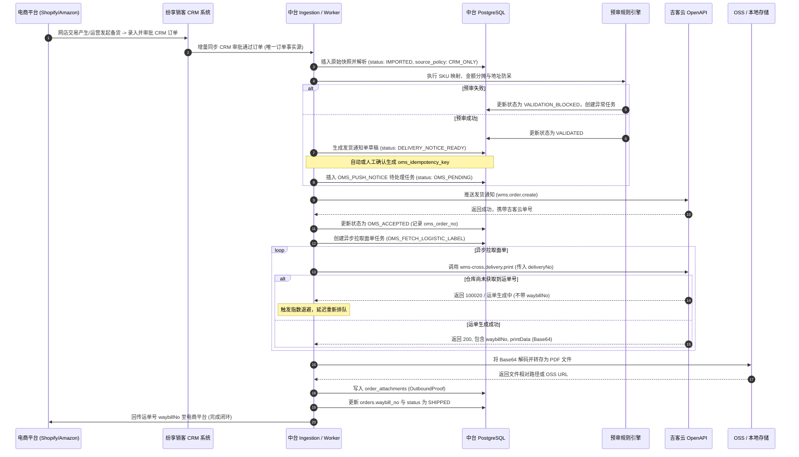

# 网商渠道订单接入与跨境物流面单打印详细设计

本设计基于 `docs/v2-order-middle-platform-design.md`（总设计母版），针对 OMS（吉客云）已对接的 15 个已授权网店（天猫、京东、Shopify、eBay、TikTok、Newegg、亚马逊 7 站点），详细规范**订单标准化接入流程**、**促销优惠与运费分摊算法**、以及**跨境物流面单打印接口 `wms-cross.delivery.print` 的异步集成方案**。

---

## 1. API 深入分析：`wms-cross.delivery.print`

跨境发货面单接口 `wms-cross.delivery.print` 用于从吉客云拉取国际承运商（如 DHL, FedEx, UPS 等）的电子面单及运单号。

### 1.1 凭证及网关信息
*   **网关 URL**：`https://open.jackyun.com/open/openapi/do`
*   **公用 Appkey**：`17563412`
*   **公用 Secret**：`ee7ead1fec2c4e26af24a0a7499ab103`
*   *配置存储*：数据同步和下推服务应从 `SystemConfig` 表（`oms_jackyun_app_key` 及 `oms_jackyun_app_secret`）中动态获取凭证，禁止硬编码。

### 1.2 报关面单打印接口规约
*   **接口方法 (method)**: `wms-cross.delivery.print`
*   **协议格式 (contenttype)**: `json`
*   **业务输入参数 (`bizcontent`)**:
    *   `deliveryNo` (String, 必填): 中台发货通知单号 `notice_no` 或吉客云系统发货单号 `oms_order_no`。
    *   `printType` (String, 选填): 格式类型，`pdf`（默认）、`zpl`（热敏标签流）、`html`、`jpg`。
    *   `needLabelCode` (Boolean, 选填): 是否需要标签条码，默认 `true`。
*   **业务输出参数 (`data` / `result`)**:
    *   `waybillNo` (String): 国际快递运单追踪号（Tracking Number）。
    *   `logisticCode` (String): 承运商渠道代码。
    *   `logisticName` (String): 承运商名称。
    *   `printData` (String): 面单文件内容。当 `printType="pdf"` 时，通常以 **Base64 编码的 PDF 二进制流** 或 **公网可下载 PDF URL** 返回。

---

## 2. 数据库详细设计

### 2.1 `delivery_notices` 表扩展

发货通知单需要记录运单号，并与下载的面单文件建立外键血缘。

```sql
ALTER TABLE delivery_notices 
    ADD COLUMN waybill_no VARCHAR(128) NULL,
    ADD COLUMN label_attachment_id BIGINT NULL,
    ADD INDEX idx_delivery_notices_waybill (waybill_no);
```

### 2.2 `order_attachments` 附件类型扩充

在 `order_attachments.attachment_type` 的 Enum 中扩充字段值：
*   `OutboundProof`：出库面单（物流电子面单）。

---

## 3. 标准化接入与履行时序设计 (Sequence Diagram)

中台对线上电商订单和备货出库单的接入**严格遵循以 CRM 为唯一订单源头的规范**。跨境自履约（FBM）模式下的完整订单流转与面单拉取时序如下：



---

## 4. 促销优惠与运费分摊算法

网商渠道订单由于含税费、优惠折减及运费，为保障财务核对与多品退货的退款校验，须严格将整单优惠与运费按行比例拆分。

### 4.1 数学公式定义

设订单明细中共有 $N$ 个商品行：
*   $P_i$：第 $i$ 行商品原始单价。
*   $Q_i$：第 $i$ 行商品数量。
*   $A_i = P_i \times Q_i$：第 $i$ 行商品原始金额。
*   $TotalRaw = \sum_{i=1}^N A_i$：订单商品总原始金额。
*   $TotalDiscount$：订单总优惠金额（商家让利 + 平台折减）。
*   $ShippingFee$：订单买家支付的实付运费。

第 $i$ 行商品的最终净实付金额 $Net\_Amount_i$ 表达式为：

\[Net\_Amount_i = A_i - \left( \frac{A_i}{TotalRaw} \times TotalDiscount \right) + \left( \frac{A_i}{TotalRaw} \times ShippingFee \right)\]

### 4.2 精度舍入与差额校准算法 (Cent-Calibration)

在保留两位小数（分币）的计算中，比例分摊可能会导致各分摊行相加不等于订单最终实付金额的尴尬。

*   **校准算法步骤**：
    1.  初始化累计分摊金额 $Sum\_Net = 0.00$。
    2.  对于前 $N-1$ 行，其分摊实付金额通过四舍五入保留两位小数：
        $$Net\_Amount_i = \text{round}\left(A_i - \frac{A_i \times TotalDiscount}{TotalRaw} + \frac{A_i \times ShippingFee}{TotalRaw}, 2\right)$$
        并累加至总数：$Sum\_Net = Sum\_Net + Net\_Amount_i$。
    3.  对于最后一行（第 $N$ 行），不使用比例公式，直接通过减法校准：
        $$Net\_Amount_N = \text{TotalPaidAmount} - Sum\_Net$$
        *（其中 $\text{TotalPaidAmount} = TotalRaw - TotalDiscount + ShippingFee$）*
    4.  这确保了 $\sum_{i=1}^N Net\_Amount_i \equiv \text{TotalPaidAmount}$。

---

## 5. 详细代码实现结构

### 5.1 吉客云客户端扩充：`JackyunClient`

在 `backend/app/services/oms/jackyun_client.py` 中，扩展面单打印方法：

```python
# [MODIFY] backend/app/services/oms/jackyun_client.py

class JackyunClient:
    # ... 已有方法 ...

    def print_cross_delivery(self, payload: dict[str, Any]) -> dict[str, Any]:
        """
        调用跨境面单打印接口获取 PDF 格式面单与物流追踪号
        API: wms-cross.delivery.print
        """
        return self.call_api("wms-cross.delivery.print", payload)
```

### 5.2 优惠分摊核心实现：`apportionment.py`

在中台计算模块中新增 `backend/app/services/oms/apportionment.py`：

```python
# [NEW] backend/app/services/oms/apportionment.py
from __future__ import annotations
from decimal import Decimal, ROUND_HALF_UP


def apportion_ecommerce_amounts(
    raw_items: list[dict[str, Any]], 
    total_discount: Decimal, 
    shipping_fee: Decimal
) -> list[Decimal]:
    """
    电商订单金额及运费、优惠分摊校准算法
    raw_items: 含有 'price' 和 'quantity' 的明细行字典列表
    returns: 分摊后的 net_amount 列表
    """
    decimals_discount = Decimal(str(total_discount))
    decimals_shipping = Decimal(str(shipping_fee))
    
    # 1. 计算原始总额
    item_raw_amounts = []
    total_raw = Decimal("0.00")
    for item in raw_items:
        price = Decimal(str(item["price"]))
        qty = Decimal(str(item["quantity"]))
        raw_amt = price * qty
        item_raw_amounts.append(raw_amt)
        total_raw += raw_amt

    if total_raw == 0:
        return [Decimal("0.00")] * len(raw_items)

    total_paid = total_raw - decimals_discount + decimals_shipping
    apportioned_amounts = []
    sum_net = Decimal("0.00")

    # 2. 前 N-1 行比例分摊并舍入
    for i in range(len(raw_items) - 1):
        raw_amt = item_raw_amounts[i]
        discount_part = (raw_amt * decimals_discount / total_raw).quantize(Decimal("0.01"), rounding=ROUND_HALF_UP)
        shipping_part = (raw_amt * decimals_shipping / total_raw).quantize(Decimal("0.01"), rounding=ROUND_HALF_UP)
        net_amt = raw_amt - discount_part + shipping_part
        apportioned_amounts.append(net_amt)
        sum_net += net_amt

    # 3. 最后一行倒挤余数校准精度
    last_net = total_paid - sum_net
    apportioned_amounts.append(last_net)

    return apportioned_amounts
```

### 5.3 异步物流打印执行服务：`logistics_print.py`

新建 `backend/app/services/oms/logistics_print.py`，负责调度吉客云 API、解析面单、持久化至本地/云端存储并生成审计附件。

```python
# [NEW] backend/app/services/oms/logistics_print.py
from __future__ import annotations
import base64
import logging
from sqlalchemy.orm import Session

from backend.app.models import MiddlePlatformOrder, DeliveryNotice, OrderAttachment, AuditEvent
from backend.app.services.oms.jackyun_client import jackyun_client_from_session
from backend.app.services.storage import save_attachment

logger = logging.getLogger(__name__)


def process_oms_fetch_logistic_label(session: Session, payload: dict[str, Any]) -> dict[str, Any]:
    """
    OMS_FETCH_LOGISTIC_LABEL 异步工作器核心实现
    """
    notice_id = payload.get("delivery_notice_id")
    notice = session.get(DeliveryNotice, notice_id)
    if not notice:
        raise ValueError(f"DeliveryNotice not found: {notice_id}")
        
    order = notice.order
    client = jackyun_client_from_session(session)
    
    # 1. 请求吉客云获取跨境面单
    api_payload = {
        "deliveryNo": notice.oms_order_no or notice.notice_no,
        "printType": "pdf",
        "needLabelCode": True
    }
    
    res = client.print_cross_delivery(api_payload)
    if not res.get("ok"):
        raise RuntimeError(f"吉客云面单获取 API 失败: {res.get('message')}")
        
    data = res.get("data", {})
    waybill_no = data.get("waybillNo")
    print_data = data.get("printData")
    
    # 若仓库仍处于排队派单，可能尚未生成运单号，此时需要抛出异常等待下一次重试
    if not waybill_no or not print_data:
        raise RuntimeError("面单或运单号在吉客云侧尚未生成，排队重试中")
        
    # 2. 二进制面单持久化与存储
    try:
        # 兼容 URL 链接或 Base64 流
        if print_data.startswith("http"):
            import httpx
            response = httpx.get(print_data, timeout=10.0)
            response.raise_for_status()
            pdf_bytes = response.content
        else:
            pdf_bytes = base64.b64decode(print_data)
    except Exception as exc:
        raise RuntimeError(f"面单 PDF 转换失败: {str(exc)}")
        
    file_name = f"LogisticsLabel-{waybill_no}.pdf"
    storage_path, file_hash = save_attachment(file_name, pdf_bytes)
    
    # 3. 记录系统附件
    attachment = OrderAttachment(
        order_id=order.id,
        crm_order_id=order.crm_order_id,
        source_system="oms_jackyun",
        source_attachment_id=f"lbl-{waybill_no}",
        file_name=file_name,
        file_type="application/pdf",
        file_size=len(pdf_bytes),
        file_hash=file_hash,
        attachment_type="OutboundProof",
        storage_ref=storage_path,
        parse_status="SKIPPED"  # 面单为最终生成凭证，无需执行 OCR 解析
    )
    session.add(attachment)
    session.flush()
    
    # 4. 更新发货单与订单运单号，流转状态
    notice.waybill_no = waybill_no
    notice.label_attachment_id = attachment.id
    order.waybill_no = waybill_no
    order.status = "SHIPPED"
    
    # 5. 写入状态变更审计日志
    session.add(AuditEvent(
        order_id=order.id,
        from_status="OMS_ACCEPTED",
        to_status="SHIPPED",
        event="FetchLogisticLabelSuccess",
        operator_type="SYSTEM",
        detail_json=f'{{"waybill_no": "{waybill_no}", "attachment_id": {attachment.id}}}'
    ))
    
    logger.info(f"发货单 {notice.notice_no} 面单获取成功，运单号 {waybill_no}")
    return {"status": "success", "waybill_no": waybill_no}
```

### 5.4 调度中心拦截：`jobs.py` 修改

在 `backend/app/services/jobs.py` 的主循环中注册此任务类别：

```python
# [MODIFY] backend/app/services/jobs.py

# ... 导入声明 ...
from backend.app.services.oms.logistics_print import process_oms_fetch_logistic_label

def run_pending_jobs(session: Session, *, limit: int = 20) -> dict:
    # ... 前置代码 ...
            elif job.job_type == "OMS_PUSH_NOTICE":
                process_oms_push_notice(session, loads(job.payload_json, {}))
            elif job.job_type == "OMS_FETCH_LOGISTIC_LABEL":
                process_oms_fetch_logistic_label(session, loads(job.payload_json, {}))
            elif job.job_type == "OMS_STATUS_SYNC":
                # ... 后置代码 ...
```

---

## 6. 异常与防呆控制细化

| 异常类别 | 触发场景 | 默认等级 | 自动重试 | 系统响应 |
| --- | --- | --- | --- | --- |
| `OMS_LOGISTICS_ERROR` | 面单 API 返回 100020 (运单号不存在或承运商获取失败) | Medium | 是 (按指数退避重试) | 持续重试 3 次，超过则转为 High 阻断并指派至物流部门核查。 |
| `CARRIER_CONFIG_INVALID` | 吉客云提示“当前店铺未绑定该承运商”或“账单欠费” | High | 否 | 冻结物流拉取，指派【主数据/IT运维】修复配置后人工重放。 |
| `WAYBILL_FEEDBACK_FAILED` | 运单号回传至 Shopify/Amazon 失败 | High | 是 (重试3次) | 超出重试次数生成 `OMS_STATUS_CONFLICT` 报警，订单在中台标记为 `SHIPPED` 但附带“回传平台挂起”标签。 |
