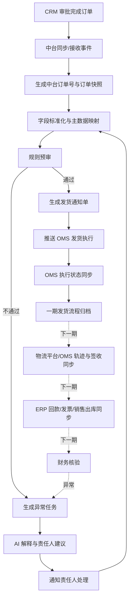
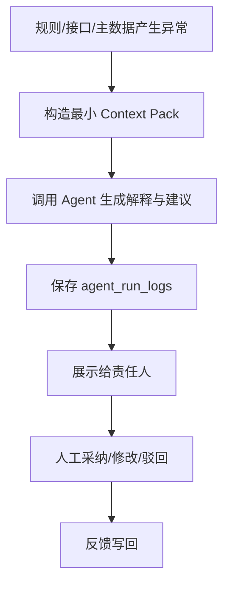

# 商务 AI Agent 中台 v2 改造设计

版本：v0.1  
日期：2026-06-11  
依据：`商务AI_Agent_系统开发需求规格说明书_v0.1.docx`、当前 `jm-sp-bot` MVP 实现

## 1. 设计目标

v2 版本将当前“邮件驱动的商务生产任务单工作台”升级为“以 CRM 审批完成订单为源头的商务 AI Agent 订单中台”。

核心目标：

- CRM 审批完成订单自动进入中台，生成中台订单号。
- 一期中台优先承接 CRM、OMS、通知渠道的数据；ERP 与物流平台集成放到下一期。
- 用规则引擎完成字段完整性、SKU、客户、金额、库存、发货条件等预审。
- 预审通过后生成发货通知单，进入 OMS 发货执行链路。
- OMS 承接发货、拆单、拣货、出库等履约执行。
- 下一期由金蝶 ERP 承接财务核算、回款、发票、销售出库等财务闭环。
- 下一期通过 OMS 或物流平台 API 获取签收、轨迹。
- 异常自动生成任务，分派、催办、关闭并保留审计。
- AI Agent 负责摘要、异常解释、建议和通知文案，不绕过规则和权限。

### 1.1 一期强制边界

一期目标不是兼容所有历史下单方式，而是先解决“订单来源不统一、下单过程依赖人工邮件流转”的核心痛点。

一期纳入范围内的业务必须遵守以下边界：

- 订单源头只认 CRM 审批完成订单，中台不接受邮件、聊天、Excel 作为订单主数据入口。
- 邮件只保留为通知、催办、沟通留痕渠道，不再承担下单、补录、传递订单字段的职责。
- 选定业务线、选定销售/渠道订单必须先在 CRM 完成标准下单与审批，再进入中台。
- 不在一期范围内的历史流程先不接入中台，不设计“过渡录入”或“并行下单”入口。
- 中台允许人工处理异常和修正映射，但人工动作必须基于 CRM 订单、OMS 执行状态和附件证据。

一期系统事实来源：

| 业务事实 | 一期数据来源 | 说明 |
| --- | --- | --- |
| 订单头、订单明细、客户、销售、金额、合同/附件 | CRM 页面接口爬取/接口同步 | 当前优先走已验证的纷享销客页面接口 replay；后续官方 API 仅替换底层 Adapter |
| 发货执行、拆单、拣货、出库 | OMS | 中台生成发货通知并驱动 OMS 执行 |
| 通知、催办、沟通留痕 | 邮件/IM/站内信 | 只做通知与留痕，不作为订单事实源 |

下一期系统事实来源：

| 业务事实 | 下一期数据来源 | 说明 |
| --- | --- | --- |
| 财务核算、回款、发票、销售出库 | ERP | 财务审查以 ERP 记录为准，并结合 CRM 附件证据 |
| 签收、运输轨迹、物流节点 | OMS 或物流平台 API | 有物流平台接口时优先取物流端 API |

## 2. 当前系统到 v2 的定位变化

| 当前模块 | v2 定位 |
| --- | --- |
| 邮件 | 通知与沟通留痕，不再作为订单主入口 |
| 任务 | 生产、补货、发货相关任务能力复用 |
| 物流任务 | 一期升级为 OMS 发货执行视图；物流轨迹下一期接入 |
| 订单管理 | v2 核心订单中台入口 |
| 物料管理 | 升级为主数据中心的一部分 |
| 初审规则 / 流程 | 升级为预审规则中心 |
| 异常 | 升级为异常任务中心 |
| 运维 | 升级为集成监控与接口日志中心 |
| AI 技能 | 升级为订单场景 Agent 能力 |

## 3. 信息架构

建议 v2 主导航：

```text
工作台
订单管理
预审中心
发货通知
异常任务
财务对账
主数据
集成监控
通知中心
AI 助手
审计日志
系统设置
```

页面优先级：

| 优先级 | 页面 | 目标 |
| --- | --- | --- |
| P0 | 订单管理列表 | 统一查看 CRM 审批订单、预审状态与 OMS 发货状态 |
| P0 | 订单详情 | 查看订单头、明细、附件、预审、发货、异常、审计 |
| P0 | 预审中心 | 管理规则、查看预审结果、执行模拟测试 |
| P0 | 异常任务 | 异常分派、处理、SLA、关闭与重开 |
| P0 | 发货通知 | 生成、推送、追踪 OMS 接收状态 |
| P2 | 财务对账 | ERP 回款、发票、销售出库核验 |
| P1 | 主数据 | SKU、客户、仓库、主体、状态映射 |
| P1 | 集成监控 | 接口日志、重试、队列、失败告警 |
| P1 | AI 助手 | 摘要、异常解释、通知文案、卡点分析 |

## 4. 核心业务流程



## 5. 订单状态机

建议中台统一订单状态：

| 状态 | 含义 | 进入条件 |
| --- | --- | --- |
| `CRM_APPROVED` | CRM 已审批 | CRM 订单达到审批完成状态 |
| `IMPORTED` | 已进入中台 | 中台创建订单镜像 |
| `VALIDATING` | 预审中 | 规则引擎执行中 |
| `VALIDATION_BLOCKED` | 预审阻断 | 存在 P0 阻断异常 |
| `VALIDATED` | 预审通过 | 字段、主数据、库存、金额等满足规则 |
| `DELIVERY_NOTICE_READY` | 发货通知已生成 | 发货通知单创建成功 |
| `OMS_PENDING` | 待推送 OMS | 进入 OMS 下推队列 |
| `OMS_ACCEPTED` | OMS 已接收 | OMS 返回成功 |
| `PICKING` | 拣货/出库中 | OMS/仓库进入执行 |
| `SHIPPED` | 已发货 | OMS 回写发货 |
| `FULFILLMENT_ARCHIVED` | 一期履约归档 | OMS 发货执行完成后归档一期流程 |
| `SIGNED` | 已签收 | 下一期：物流平台 API 或 OMS 回写签收 |
| `FINANCE_CHECKING` | 财务核验中 | 下一期：ERP 数据同步后进入核验 |
| `FINANCE_EXCEPTION` | 财务异常 | 下一期：发票、回款、出库不一致 |
| `CLOSED` | 已关闭 | 下一期：发货、签收、财务核验完成 |
| `CANCELLED` | 已取消 | CRM/人工确认取消 |

异常任务不完全替代订单状态，而是挂载在订单上。

```text
订单状态 = 当前主流程位置
异常任务 = 当前阻断原因、责任人、SLA、处理记录
```

## 6. 页面布局设计

### 6.1 工作台

面向商务主管、运营和管理层。

布局：

```text
顶部指标卡：
今日新增订单 / 待同步详情 / 待预审 / 预审异常 / 待发货 / 已发货 / 超时任务

中部：
左：订单状态漏斗
中：异常类型排行
右：接口健康与队列积压

底部：
超时订单列表 / 高风险订单列表 / 最近接口失败
```

### 6.2 订单管理列表

核心页面，作为 v2 的第一入口。

```text
标题：订单管理
副标题：CRM 审批订单、预审与 OMS 发货状态统一追踪

统计区：
订单总数 / 待同步详情 / 待预审 / 待发货 / OMS 执行中 / 已发货

Toolbar：
搜索订单号/客户/SKU/销售
业务范围
状态
异常类型
销售
客户
日期范围
同步设置
手动同步
导出列表

表格：
中台订单号 / CRM 订单号
一期纳入范围
客户 / 销售 / 部门
订单金额 / 币种 / 回款
SKU 数量 / 主商品
当前状态
异常数
OMS 状态
详情同步状态
最近更新时间
操作
```

交互：

- 点击行进入订单详情。
- 状态标签使用统一状态字典。
- 异常数可点击过滤该订单异常。
- 列表同步只作为索引，订单详情必须完成同步后才允许进入预审和发货通知。
- 若订单详情未同步或同步失败，列表行展示 `待同步详情` / `详情同步失败`，并提供单订单重试入口。
- 同步设置使用全屏 modal，风格与邮件详情弹层一致。
- 一期纳入范围外的订单不在本页面创建中台订单；如 CRM 爬取到非范围订单，仅记录为忽略日志，避免形成第二套下单入口。

### 6.3 订单详情

顶部固定订单摘要：

```text
中台订单号
CRM 订单号
客户
销售
订单金额
当前状态
异常状态
最近同步时间

操作：
重新预审 / 生成发货通知 / 同步 CRM / 查看原始数据 / 关闭订单
```

详情 Tabs：

| Tab | 内容 |
| --- | --- |
| 订单概览 | 客户、合同、收货信息、交付条款、特殊要求、附件 |
| 商品明细 | CRM 商品、匹配 SKU、规格、数量、单价、金额、仓库建议 |
| 预审结果 | 必填校验、SKU、客户、金额、库存、特殊要求、附件证据、AI 解释 |
| 发货通知 | 通知单号、OMS 引用号、仓库、物流方式、拆单、推送状态 |
| OMS 履约 | OMS 状态、发货通知、拆单、拣货、出库、发货结果 |
| 下一期：物流/签收 | 运单号、承运商、在途、签收、轨迹异常 |
| 下一期：财务对账 | ERP 单据、发票、回款、销售出库、附件凭证、核验结果 |
| 异常任务 | 异常类型、责任人、SLA、评论、附件、关闭/重开 |
| 时间线/审计 | CRM 同步、预审、OMS、人工修改、AI 建议 |

附件在订单详情中必须作为一级证据区展示：

```text
附件/证据区：
合同
盖章件
采购订单/客户 PO
特殊要求附件
回款截图/银行回单
发票/开票资料
下一期：销售出库/签收凭证
报关/清关资料
其他补充文件
```

一期预审必须能直接查看附件原件、解析文本、来源系统、上传/同步时间和关联字段；下一期财务核验复用同一附件证据能力。

### 6.4 预审中心

```text
左侧：规则分类
- 必填字段
- SKU/料号
- 客户/合同
- 金额/币种
- 库存/仓库
- 特殊要求
- 财务风险

右侧：规则列表
- 规则名称
- 阻断级别
- 适用业务类型
- 责任角色
- 是否启用
- 最近命中次数

底部/弹层：
- 规则编辑
- 历史订单模拟测试
- 影响范围预览
```

预审执行时必须同时读取结构化字段和订单附件证据：

```text
结构化字段：
客户、SKU、数量、金额、币种、收货信息、交付条款、特殊要求

附件证据：
合同、盖章件、客户 PO、特殊要求附件、报关/清关资料
```

预审结果页需要展示每条规则命中的证据来源，例如：

```text
规则：合同金额一致性
结果：通过/失败
证据：CRM订单金额、合同附件解析金额、客户PO金额
附件：合同-云南大筑.pdf
定位：第 2 页 / 金额条款
```

### 6.5 发货通知

```text
状态 Tab：
待生成 / 待确认 / 推送失败 / OMS 已接收 / 已取消

列表：
发货通知单号
中台订单号
客户
仓库
SKU 数
OMS 状态
推送次数
最近错误
操作：推送 OMS / 查看
```

发货通知的一期原则：

- 预审通过的订单才允许生成发货通知。
- 发货执行系统是 OMS，中台不提供邮件/Excel 下单入口。
- OMS 推送失败进入异常任务，由责任人修复接口、主数据或订单字段后重试。
- 如 OMS 当前接口能力不足，该问题作为一期阻断风险处理，不在中台设计平行人工导入流程。

### 6.6 异常任务中心

```text
筛选：
异常类型 / 严重级别 / 责任部门 / 责任人 / SLA / 状态

看板：
待处理 / 处理中 / 待外部反馈 / 已解决 / 已关闭

详情：
关联订单
异常来源：规则/接口/人工/AI
异常原因
AI 建议
处理动作
评论/附件
审计日志
```

### 6.7 下一期：财务对账

```text
指标：
待核验订单 / 回款不足 / 发票异常 / ERP 未匹配 / 已核验

列表：
订单号
客户
合同金额
订单金额
发票金额
回款金额
差异
ERP 单据
核验状态
```

下一期财务对账必须支持附件查看与凭证核验：

```text
合同/盖章件：核对合同主体、合同金额、币种、付款条件、盖章状态。
客户 PO：核对客户采购金额、产品、数量、交付条款。
回款截图/银行回单：核对回款金额、日期、付款方、备注。
发票/开票资料：核对发票抬头、税号、开票金额、币种。
销售出库/签收凭证：核对发货完成与收入确认依据。
```

下一期财务核验页面需要支持“结构化金额 + 附件证据 + ERP 记录”三栏对照。

### 6.8 主数据

主数据中心 Tabs：

```text
商品/SKU
客户映射
仓库映射
业务主体
物流方式
状态字典
字段映射
```

关键映射：

```text
CRM SKU -> 中台 SKU -> OMS SKU
CRM 客户 -> OMS 收货方
CRM/OMS 状态码 -> 中台统一状态
下一期：中台 SKU -> ERP 料号
下一期：CRM 客户 -> ERP 客户
下一期：ERP 状态码 -> 中台统一财务状态
```

未匹配数据进入待维护队列。

### 6.9 集成监控

接口调用日志字段：

```text
trace_id
source_system
event_type
biz_key
payload_hash
status
retry_count
error_message
request_time
response_time
```

看板：

```text
最近失败
重试中
死信队列
平均耗时
今日同步量
```

### 6.10 AI 助手

AI 助手不做通用聊天入口，聚焦订单场景。

能力：

- 解释订单异常。
- 生成订单摘要。
- 生成通知文案。
- 推荐责任人。
- 推荐 SKU/客户映射候选。
- 分析订单卡点。

必须展示：

- 输入来源。
- 规则依据。
- 置信度。
- 人工反馈：采纳、修改、驳回。

## 7. 数据模型设计

v2 建议采用“外部镜像 + 中台标准对象”的分层。

```text
crm_sales_orders      CRM 订单列表/摘要镜像
crm_order_snapshots   CRM 订单详情原始快照
orders                中台标准订单
order_items           中台订单明细
order_attachments     订单附件与证据
delivery_notices      发货通知单
shipments             发货/物流
finance_records       下一期：财务记录
exception_tasks       异常任务
integration_events    集成事件
audit_logs            审计日志
agent_run_logs        AI 运行记录
notification_logs     通知记录
```

设计原则：

- `crm_sales_orders` 保存列表接口或 webhook 摘要字段，用于发现订单、分页、排序、增量判断。
- `crm_order_snapshots` 保存每个订单详情接口的完整原始 payload、payload_hash、版本号、抓取时间和解析状态。
- `orders/order_items` 只从订单详情快照标准化生成，不直接依赖列表页摘要字段。
- `order_attachments` 一期保存合同、盖章件、客户 PO、特殊要求附件等来自 CRM 的附件元数据和解析结果；下一期扩展回款截图、发票资料、签收凭证等。
- 预审、AI 解释都必须能引用附件证据，不允许只给出无来源结论；下一期财务核验复用同一证据引用机制。
- 订单详情未同步完成时，订单不可进入自动预审和 OMS 下推。
- 同一 CRM 订单多次拉取详情时，以 `crm_order_id + detail_version/status + payload_hash` 做幂等和变更检测。

### 7.1 orders

| 字段 | 说明 |
| --- | --- |
| id | 内部主键 |
| order_no | 中台订单号 |
| crm_order_id | CRM 订单 ID |
| crm_order_no | CRM 订单编号 |
| customer_id | 中台客户 ID |
| customer_name | 客户名称 |
| sales_user_id | 销售 ID |
| sales_user_name | 销售名称 |
| department | 部门 |
| source_policy | 来源策略，一期固定为 `CRM_ONLY` |
| business_scope | 一期纳入范围，如渠道订单/大客户订单/指定销售团队 |
| fulfillment_type | 履约类型，如直发客户/渠道订单/备货，便于后续扩展 |
| contract_no | 合同号 |
| amount | 订单金额 |
| currency | 币种 |
| status | 中台统一状态 |
| crm_status | CRM 原始状态 |
| approval_time | CRM 审批完成时间 |
| validation_status | 预审状态 |
| oms_status | OMS 映射状态 |
| finance_status | 下一期：财务核验状态 |
| raw_snapshot_id | 原始快照引用 |
| created_at | 创建时间 |
| updated_at | 更新时间 |

### 7.2 crm_order_snapshots

用于保存 CRM 每个订单的详情原始数据，支撑字段追溯、变更比对和重复同步去重。

| 字段 | 说明 |
| --- | --- |
| id | 主键 |
| crm_order_id | CRM 订单 ID |
| crm_order_no | CRM 订单编号 |
| source_system | 来源系统，默认 `fxiaoke` |
| detail_version | CRM 详情版本或更新时间，无版本时使用同步批次 |
| approval_status | CRM 审批状态 |
| lifecycle_status | CRM 生命周期状态 |
| payload_hash | 原始 payload hash |
| raw_json | CRM 订单详情完整 payload |
| normalized_json | 详情解析后的中间结构 |
| parse_status | `Pending` / `Parsed` / `Failed` |
| parse_error | 解析错误 |
| fetched_at | 拉取时间 |
| created_at | 创建时间 |

### 7.3 order_items

| 字段 | 说明 |
| --- | --- |
| id | 主键 |
| order_id | 订单 ID |
| crm_item_id | CRM 明细 ID |
| sku_id | 中台 SKU |
| sku_code | SKU 编码 |
| crm_product_name | CRM 商品名称 |
| product_name | 标准商品名称 |
| specification | 规格 |
| quantity | 数量 |
| unit_price | 单价 |
| amount | 明细金额 |
| warehouse_suggested | 建议仓库 |
| match_status | SKU 匹配状态 |
| special_requirement | 特殊要求 |

### 7.4 order_attachments

用于保存订单相关附件、解析文本和证据定位。一期关键订单附件优先来自 CRM 订单详情；ERP、OMS、物流平台下一期可补充财务、出库、签收类凭证；人工上传仅用于异常补证，不能替代 CRM 下单源头。

| 字段 | 说明 |
| --- | --- |
| id | 主键 |
| order_id | 中台订单 ID |
| crm_order_id | CRM 订单 ID |
| source_system | 一期 CRM/人工；下一期扩展 OMS/ERP/物流 |
| source_attachment_id | 外部附件 ID |
| file_name | 文件名 |
| file_type | 文件类型 |
| file_size | 文件大小 |
| file_hash | 文件 hash，用于去重 |
| attachment_type | 一期合同/盖章件/客户PO/特殊要求/其他；下一期扩展回款凭证/发票资料/签收凭证/报关资料 |
| storage_ref | 对象存储或本地存储引用 |
| parse_status | Pending/Parsed/Failed/Skipped |
| extracted_text | 附件解析文本 |
| evidence_json | 金额、主体、日期、盖章、付款条件等结构化证据 |
| linked_fields_json | 该附件支持或校验的订单字段 |
| uploaded_by | 上传人或同步服务 |
| synced_at | 同步时间 |
| created_at | 创建时间 |

附件类型建议：

```text
Contract
StampedContract
CustomerPO
PaymentProof
InvoiceMaterial
OutboundProof
SignedReceipt
CustomsClearance
SpecialRequirement
Other
```

预审中的每条结论应尽量写入证据引用；下一期财务核验复用同一结构：

```json
{
  "field": "order_amount",
  "result": "matched",
  "sources": [
    {"type": "crm_field", "path": "order_amount"},
    {"type": "attachment", "attachment_id": "...", "page": 2, "text": "合同总价 1320716.80 元"}
  ]
}
```

### 7.3 delivery_notices

| 字段 | 说明 |
| --- | --- |
| id | 主键 |
| notice_no | 发货通知单号 |
| order_id | 订单 ID |
| oms_order_id | OMS 引用号 |
| warehouse_id | 发货仓 |
| logistics_method | 物流方式 |
| status | 通知单状态 |
| push_status | 推送状态 |
| push_attempt_count | 推送次数 |
| last_error | 最近错误 |
| pushed_at | 推送时间 |
| confirmed_at | 确认时间 |

### 7.4 exception_tasks

| 字段 | 说明 |
| --- | --- |
| id | 主键 |
| order_id | 订单 ID |
| type | 异常类型 |
| severity | 严重级别 |
| source | 来源：规则/接口/人工/AI |
| assignee_id | 责任人 |
| status | 状态 |
| due_at | 截止时间 |
| reason | 异常原因 |
| ai_suggestion | AI 建议 |
| resolved_at | 解决时间 |
| closed_at | 关闭时间 |

### 7.5 integration_events

| 字段 | 说明 |
| --- | --- |
| id | 主键 |
| trace_id | 链路 ID |
| source_system | CRM/OMS/ERP/物流/通知 |
| event_type | 事件类型 |
| biz_key | 业务键 |
| payload_hash | payload hash |
| status | 状态 |
| retry_count | 重试次数 |
| error_message | 错误信息 |
| request_json | 请求摘要 |
| response_json | 响应摘要 |
| created_at | 创建时间 |

## 8. 服务分层设计

当前项目建议继续保持模块化单体，按 service 边界演进。

| 服务 | 职责 |
| --- | --- |
| integration-service | 一期 CRM/OMS/通知 Adapter；下一期扩展 ERP/物流 Adapter；接口日志、重试、幂等 |
| order-service | 中台订单、状态机、订单查询、快照 |
| validation-service | 规则校验、主数据匹配、阻断判断 |
| delivery-service | 发货通知、OMS 下推、推送失败异常 |
| finance-service | 下一期：ERP 同步、回款/发票/出库核验 |
| task-service | 异常任务、SLA、评论、附件 |
| agent-service | AI 摘要、解释、建议、通知文案 |
| notification-service | 邮件/IM/站内通知 |

## 9. 同步与幂等策略

CRM 爬取/同步策略：

1. 当前一期优先使用已验证的纷享销客页面接口 replay，基于已登录会话和请求模板拉取订单列表、详情、附件。
2. 按固定频率定时轮询 CRM 审批完成订单。
3. 后续如获得官方 webhook/API 授权，仅替换 Adapter 的底层 fetch 实现，标准化输出结构不变。

CRM 订单必须采用“两段式同步”：

```text
第一段：订单列表同步
- 拉取审批完成订单列表。
- 获取 crm_order_id、crm_order_no、客户、金额、状态、更新时间等摘要。
- 写入 crm_sales_orders。
- 对新增或摘要发生变化的订单创建详情同步任务。

第二段：订单详情同步
- 按 crm_order_id 拉取每个订单详情。
- 保存完整原始 payload 到 crm_order_snapshots。
- 解析订单头、商品明细、附件、特殊要求、收货信息、合同字段；财务字段作为下一期 ERP 核验输入预留。
- 下载或登记订单附件，写入 order_attachments。
- 对合同、盖章件、客户 PO、特殊要求等关键附件进行文本解析和证据抽取；回款凭证、发票资料作为下一期财务核验附件扩展。
- 标准化写入 orders/order_items。
- 触发预审任务。
```

详情同步是 P0 要求。列表摘要字段不得作为最终业务订单字段的唯一来源，只能用于发现订单和展示同步进度。

详情同步任务建议：

| 机制 | 设计 |
| --- | --- |
| 任务类型 | `sync_crm_order_detail` |
| 任务粒度 | 一个 CRM 订单一个任务 |
| 并发控制 | 默认 2-5 并发，避免触发 CRM 限流 |
| 重试 | 网络/登录/接口失败自动重试，超过阈值进入异常任务 |
| 幂等 | `crm_order_id + payload_hash` |
| 增量判断 | 列表更新时间、审批状态、payload_hash 任一变化触发详情重拉 |
| 失败展示 | 订单列表展示详情同步失败原因，允许单条重试 |
| 阻断规则 | 详情未同步成功，不进入自动预审和发货通知 |

附件同步要求：

| 要求 | 说明 |
| --- | --- |
| 附件发现 | 从 CRM 订单详情中识别附件 ID、文件名、类型、下载地址和关联字段 |
| 附件下载 | 能下载的附件进入本地/对象存储；暂不能下载的保留外部链接和失败原因 |
| 附件去重 | 使用 `source_attachment_id` 和 `file_hash` 去重 |
| 附件解析 | PDF、Word、Excel、图片 OCR 进入解析队列 |
| 证据抽取 | 从合同/盖章件/客户 PO 中抽取金额、主体、日期、付款条件、SKU、数量等 |
| 可见性 | 一期订单详情、预审结果可查看附件原件和解析文本；下一期财务对账复用 |
| 阻断 | 需要合同/盖章件/客户 PO 作为依据的规则，在附件缺失或解析失败时生成异常任务 |

当前纷享销客页面接口一期实现路线：

```text
1. 继续复用 Chrome CDP + 已登录会话。
2. 在 CRM 销售订单列表中点击单个订单详情。
3. 捕获订单详情页触发的接口请求，包括订单头、关联对象、订单产品/明细、附件。
4. 提取最小请求配置，形成 `fxiaoke_order_detail_request` 模板。
5. 列表同步拿到 crm_order_id 后，用详情模板逐单 replay。
6. 每次 replay 保存完整 raw_json 和 payload_hash。
7. 将 raw_json 标准化为 orders/order_items/order_attachments。
8. 对附件下载地址或预览接口进行二次捕获，形成附件同步模板。
```

如果官方 API 后续授权可用，保持同一 Adapter 输出结构不变，仅替换底层 fetch 实现。

幂等键：

```text
crm_order_id + crm_version/status
crm_order_id + detail_payload_hash
delivery_notice_no
oms_order_id
erp_doc_no
payload_hash
```

外部接口统一记录：

```text
trace_id
source_system
biz_key
payload_hash
request_time
response_time
status
error_message
retry_count
```

## 10. AI Agent 设计

原则：

- 规则引擎先执行，AI 只做解释和建议。
- 财务、金额、合同、客户信用等高风险事项必须人工确认。
- AI 输出必须可追溯。
- AI 通知不得泄露未授权字段。

Agent 工作流：



Agent 输出结构建议：

```json
{
  "summary": "异常摘要",
  "risk_level": "high|medium|low",
  "likely_reason": "可能原因",
  "suggested_owner_role": "商务|销售|物流|仓库|财务|IT",
  "suggested_actions": ["动作1", "动作2"],
  "notification_draft": "通知文案",
  "confidence": 0.82,
  "evidence_refs": ["rule:SKU_NOT_FOUND", "field:sku_code"]
}
```

## 11. 权限与审计

角色：

- 销售/渠道业务。
- 商务。
- 物流/OMS。
- 仓库/生产。
- 财务。
- 系统管理员/IT。
- AI Agent。

权限原则：

- 销售只能看本人或本部门订单。
- 财务字段按财务权限展示。
- 附件按业务类型授权。
- AI 不能越权生成包含敏感字段的通知。
- 所有人工修改、自动状态变更、接口写入和 AI 建议均记录审计。

## 12. 分阶段实施计划

### 阶段 A：订单中台底座

- 一期业务范围配置：渠道订单/大客户订单/指定销售团队等。
- CRM_ONLY 来源策略，纳入范围订单必须来自 CRM 审批完成订单。
- 标准订单表 `orders/order_items`。
- CRM 列表镜像 `crm_sales_orders`。
- CRM 订单详情快照 `crm_order_snapshots`。
- 订单附件表 `order_attachments`。
- 列表同步后自动创建每单详情同步任务。
- CRM 详情快照转标准订单。
- CRM 详情附件同步、去重、解析状态记录。
- 订单状态机。
- 订单列表与详情页。
- 同步日志与幂等。

验收：

- CRM 订单可进入中台标准订单。
- 纳入一期范围的业务不能通过邮件/Excel 在中台创建订单。
- CRM 爬取到范围外订单时不会创建业务订单，仅记录忽略原因。
- 每个列表订单都能拉取详情并保存原始快照。
- 每个订单能展示从 CRM 详情同步到的合同、盖章件、客户 PO 等附件。
- 详情同步失败时订单列表可见失败原因并支持单条重试。
- 重复同步不重复建单。
- 订单详情可追溯原始 CRM 数据。

### 阶段 B：预审与异常闭环

- 必填字段校验。
- SKU/客户映射。
- 金额基础校验。
- 合同、盖章件、客户 PO 等附件证据校验。
- 异常任务中心。
- AI 异常解释。

验收：

- SKU 不匹配、缺收货信息、金额异常能阻断。
- 需要附件作为依据的预审规则能展示证据来源和附件定位。
- 异常任务可分派、处理、关闭、重开。

### 阶段 C：发货通知

- 发货通知单。
- OMS Adapter 抽象。
- OMS 发货执行推送。
- OMS 执行状态同步。

验收：

- 预审通过订单可生成发货通知。
- OMS 推送失败会进入异常任务。
- 不提供邮件/Excel 并行下单入口。

### 阶段 D：下一期物流轨迹与签收

- OMS 或物流平台轨迹 API。
- 签收状态同步。
- 运输节点展示。
- 签收异常任务。

验收：

- 已发货订单可展示轨迹节点与签收状态。
- 签收超时或轨迹异常可生成异常任务。

### 阶段 E：下一期 ERP 财务核验

- ERP 回款、发票、销售出库读取。
- 财务对账页。
- 合同、盖章件、客户 PO、回款凭证、发票资料等附件核验视图。
- 财务异常任务。

验收：

- 回款/发票金额不一致自动生成财务异常。
- 财务核验能同时查看 ERP 记录、结构化订单金额和附件证据。

### 阶段 F：Agent 增强

- 订单摘要。
- 异常解释。
- 通知文案。
- 卡点分析。
- 人工反馈闭环。

验收：

- AI 输出可追溯、可反馈、不越权。

## 13. 会议逐字稿修正后的需求补充

结合 2026-06-09 需求会议逐字稿，一期需求需要补充以下约束，避免继续沿用旧邮件下单思路：

| 主题 | 修正后的设计口径 |
| --- | --- |
| 一期目标 | 先解决订单来源和下单流程简化，不做全业务兼容平台 |
| 流程策略 | 选定一部分业务强制走 CRM 下单、审批、中台预审、OMS 执行；ERP 财务闭环和物流轨迹进入下一期 |
| 订单来源 | CRM 爬取/同步是一期订单唯一入口；邮件不再作为订单字段来源 |
| 渠道/电商 | 一期先作为渠道客户或大客户订单处理，不追踪 C 端终端订单 |
| 发货执行 | OMS 是发货执行系统，中台只生成发货通知和追踪执行状态 |
| 财务核算 | 下一期接入 ERP，作为回款、发票、销售出库和财务核验事实来源 |
| 签收轨迹 | 下一期通过 OMS 或物流平台 API 获取，不依赖人工邮件反馈 |
| SKU 规则 | CRM 下单必须选择标准商品/SKU；自由文本商品进入阻断异常 |
| 附件证据 | 合同、盖章件、客户 PO 等附件必须随 CRM 订单详情同步，一期支撑预审，下一期支撑财务审查 |
| 履约类型 | 一期优先直发客户/渠道订单闭环；备货、海外仓、多主体内部结算先保留字段与状态扩展点 |
| 通知定位 | 邮件/IM/站内信只负责通知、催办、留痕，不再搬运订单数据 |

## 14. 待确认问题

| ID | 问题 | 责任方 |
| --- | --- | --- |
| OI-001 | 一期强制纳入的业务范围：渠道订单、大客户订单、销售团队、区域、订单类型 | 业务负责人 |
| OI-002 | CRM 订单审批完成状态、详情页接口、附件接口字段字典 | CRM/IT |
| OI-003 | CRM 页面接口爬取频率、账号权限、会话失效处理和审计边界 | CRM/IT |
| OI-004 | OMS 创建/更新发货通知单接口、失败码、重试规则 | OMS/物流 |
| OI-005 | OMS 与物流平台签收/轨迹字段谁作为优先事实源 | OMS/物流 |
| OI-006 | 金蝶 ERP 回款、发票、销售出库接口权限与匹配键 | 财务/ERP |
| OI-007 | SKU、客户、仓库、主体主数据维护责任 | 业务/IT |
| OI-008 | 异常类型到责任人的分派规则 | 业务负责人 |
| OI-009 | 通知渠道使用邮件、企业微信、钉钉、飞书或站内信 | IT/业务 |
| OI-010 | 备货、海外仓、多主体内部结算是否进入二期或三期 | 业务负责人 |

## 15. 下一步拆解文档

建议后续拆成四份执行文档：

```text
docs/v2-data-model-and-migration.md
docs/v2-api-and-integration-design.md
docs/v2-page-layout-and-interaction.md
docs/v2-implementation-roadmap.md
```

本文件作为 v2 改造的总设计母版。
