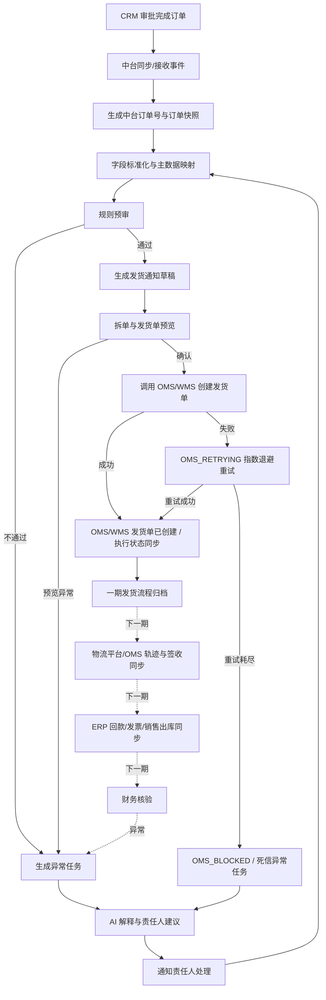
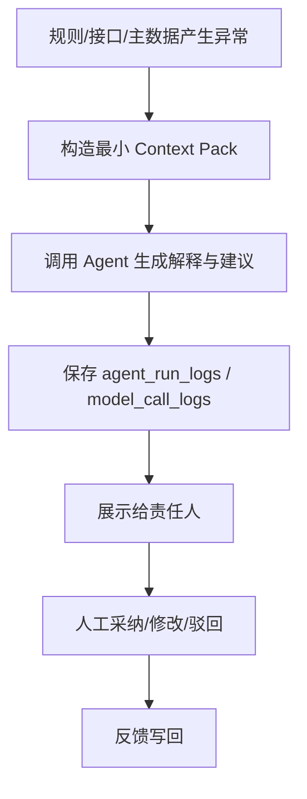

# 商务 AI Agent 中台 v2 改造设计

版本：v0.2  
日期：2026-06-11  
依据：`商务AI_Agent_系统开发需求规格说明书_v0.1.docx`、当前 `jm-sp-bot` MVP 实现、`修改意见1-9.docx`

## 0. 本版更新摘要

本版在 v0.1 的业务蓝图基础上，将设计文档进一步升级为可直接指导 AI 编码助手（Cursor / Codex / Copilot）分阶段生成代码的工程约束文档。核心更新如下：

- 强化数据模型：补充字段类型、长度、非空、默认值、唯一索引、乐观锁和金额精度约束，避免 AI 生成 DDL/ORM 时自由发挥。
- 强化订单状态机：从“状态列表”升级为“状态跃迁矩阵”，禁止非法越级变更。
- 强化跨服务契约：补充 `CrmOrderParsedEvent` 标准事件、消费端幂等规则、抓取层与解析层边界。
- 强化预审规则引擎：明确一期采用“策略模式 + 责任链”的规则范式，给出基准接口和 BOM 校验样例。
- 强化 OMS 履约补偿：补充指数退避、随机抖动、分布式锁、死信队列与异常任务联动。
- 强化 AI Agent 诊断：补充 `ContextPack`、System Prompt、JSON Mode、反序列化兜底和提示词安全约束。
- 强化前端形态：从传统 CRUD 表单转向“异常驱动 + 人类监督 + AI 一键建议”的 Agent 控制台，并明确 React + Ant Design 技术规范。
- 强化重构路径：补充从现有 `workflow.py`、`crm_sync.py`、`ProcessingJob`、`ExceptionCase` 平滑演进到 V2 的改造规约。
- 补充 AI 编程助手 Skills：沉淀事件契约、规则引擎、OMS 重试、AI 诊断、Agent UI、React + AntD 六类生成约束。

## 1. 设计目标

v2 版本将当前“邮件驱动的商务生产任务单工作台”升级为“以 CRM 审批完成订单为源头的商务 AI Agent 订单中台”。

核心目标：

- CRM 审批完成订单自动进入中台，生成中台订单号。
- 一期中台优先承接 CRM、OMS、通知渠道的数据；当前仅金蝶云星空 ERP 已具备只读接入能力，用作财务事实查询与核验，不在一期回写 ERP。
- 用规则引擎完成字段完整性、SKU、客户、金额、库存、发货条件等预审。
- 预审通过后生成发货通知草稿，支持拆单/预览，人工或自动确认后调用 OMS/WMS 创建发货单接口进入发货执行链路。
- OMS 承接发货、拆单、拣货、出库等履约执行。
- 下一期由金蝶 ERP 承接财务核算、回款、发票、销售出库等财务闭环。
- 下一期通过 OMS 或物流平台 API 获取签收、轨迹。
- 异常自动生成任务，分派、催办、关闭并保留审计。
- AI Agent 负责摘要、异常解释、建议和通知文案，不绕过规则和权限。

### 1.1 一期强制边界

一期目标不是兼容所有历史下单方式，而是先解决“订单来源不统一、下单过程依赖人工邮件流转”的核心痛点。

一期纳入范围内的业务必须遵守以下边界：

- 订单源头只认 CRM 审批完成订单，中台不接受邮件、聊天、Excel 作为订单主数据入口。
- 邮件只保留为通知、催办、沟通留痕渠道，不再承担下单、补录、传递订单字段的职责。
- 选定业务线、选定销售/渠道订单必须先在 CRM 完成标准下单与审批，再进入中台。
- 不在一期范围内的历史流程先不接入中台，不设计“过渡录入”或“并行下单”入口。
- 中台允许人工处理异常和修正映射，但人工动作必须基于 CRM 订单、OMS 执行状态和附件证据。

一期系统事实来源：

| 业务事实 | 一期数据来源 | 说明 |
| --- | --- | --- |
| 订单头、订单明细、客户、销售、销售邮箱、金额、合同/附件 | CRM 页面接口爬取/接口同步 | 当前 CRM 尚未完成生产接入；销售邮箱必须从 CRM 订单/销售人员信息获取，不再由邮件正文或人工配置推断 |
| 发货执行、拆单、拣货、出库 | OMS | 当前 OMS 尚未完成生产接入；中台生成发货通知草稿和拆单预览，确认后调用 OMS/WMS 创建发货单并追踪执行 |
| 财务核算、回款、发票、销售出库 | 金蝶云星空 ERP 只读接口 | 当前仅允许查询和核验，不允许中台回写 ERP 单据 |
| 通知、催办、沟通留痕 | 邮件/IM/站内信 | 只做通知与留痕，不作为订单事实源；流程节点相关干系人邮箱除销售邮箱外仍需接入/配置 |

后续扩展系统事实来源：

| 业务事实 | 下一期数据来源 | 说明 |
| --- | --- | --- |
| 签收、运输轨迹、物流节点 | OMS 或物流平台 API | 有物流平台接口时优先取物流端 API |

### 1.2 当前外部系统接入状态

为避免实现阶段误判系统边界，当前外部系统接入状态固定如下：

| 系统/数据 | 当前状态 | 一期处理口径 |
| --- | --- | --- |
| 金蝶云星空 ERP | 已具备只读接入 | 只能作为财务事实查询、回款/发票/销售出库核验来源；禁止写入、改写或反向推送 ERP 单据 |
| 纷享销客 CRM | 缺少生产接入 | 必须补齐销售订单、订单明细、客户、附件、销售人员和销售邮箱的数据同步；CRM 是一期订单唯一主入口 |
| OMS/WMS | 缺少生产接入 | 必须补齐创建发货单、拆单预览、状态回写、失败码和幂等键能力 |
| 流程节点干系人邮箱 | 缺少完整接入 | 商务、生产、财务、审批人、异常责任人等邮箱需由组织/配置/主数据接入；销售邮箱例外，必须从 CRM 订单销售人员信息获取 |
| 销售邮箱 | 待随 CRM 接入获取 | 不单独配置为流程节点邮箱，不从历史邮件推断；CRM 缺失时生成数据缺失异常 |

## 2. 当前系统到 v2 的定位变化

| 当前模块 | v2 定位 |
| --- | --- |
| 邮件 | 通知与沟通留痕，不再作为订单主入口 |
| 任务 | 生产、补货、发货相关任务能力复用 |
| 物流任务 | 一期升级为 OMS 发货执行视图；物流轨迹下一期接入 |
| 订单管理 | v2 核心订单中台入口 |
| 物料管理 | 升级为主数据中心的一部分 |
| 初审规则 / 流程 | 升级为预审规则中心和规则责任链引擎 |
| 异常 | 升级为异常任务中心与 AI 诊断中枢 |
| 运维 | 升级为集成监控、接口日志、重试队列和死信管理中心 |
| AI 技能 | 升级为订单场景 Agent 能力与 AI 编程助手工程护栏 |
| 前端页面 | 从 CRUD 表单升级为异常驱动的 Agent 控制台 |

## 3. 信息架构

v2 前端同时提供“业务对象视角”和“Agent 生命周期视角”。业务对象视角方便传统运营人员查单；Agent 生命周期视角突出自动化链路状态和人工介入点。

建议 v2 主导航：

```text
Agent 概览大盘
感知层：CRM 监听与抓取
认知层：预审与防呆拦截
执行层：履约与下推队列
异常干预与死信接管
大脑配置：规则与 Prompt 引擎
订单管理
发货通知
主数据
集成监控
通知中心
审计日志
系统设置
下一期：财务对账
下一期：物流/签收
```

页面优先级：

| 优先级 | 页面 | 目标 |
| --- | --- | --- |
| P0 | Agent 运行大盘 | 查看自动化处理量、预审直通率、异常积压、AI 运行情况 |
| P0 | 订单管理列表 | 统一查看 CRM 审批订单、预审状态与 OMS 发货状态 |
| P0 | 订单详情 | 查看订单头、明细、附件、预审、发货、异常、审计 |
| P0 | 异常干预与死信接管台 | 异常分派、AI 诊断、一键修复、SLA、关闭与重开 |
| P0 | 发货通知 | 生成、推送、追踪 OMS 接收状态和重试状态 |
| P0 | 预审中心 | 管理规则、查看预审结果、执行模拟测试 |
| P1 | CRM 数据清洗与血缘追踪 | 解释 CDP 抓取与标准化转换过程，建立业务信任 |
| P1 | 策略与大脑编排台 | 规则启停、Prompt 模板、通知模板维护 |
| P1 | 主数据 | SKU、客户、仓库、主体、状态映射 |
| P1 | 集成监控 | 接口日志、重试、队列、失败告警、死信 |
| P1 | AI 助手 | 摘要、异常解释、通知文案、卡点分析 |
| P2 | 财务对账 | ERP 回款、发票、销售出库核验 |

## 4. 核心业务流程



## 5. 订单状态机

### 5.1 统一订单状态

| 状态 | 含义 | 进入条件 |
| --- | --- | --- |
| `CRM_APPROVED` | CRM 已审批 | CRM 订单达到审批完成状态 |
| `IMPORTED` | 已进入中台 | 中台创建订单镜像并保存原始快照 |
| `VALIDATING` | 预审中 | 规则引擎执行中 |
| `VALIDATION_BLOCKED` | 预审阻断 | 存在 P0/P1 阻断异常或 CRITICAL 规则失败 |
| `VALIDATED` | 预审通过 | 字段、主数据、库存、金额、附件证据等满足规则 |
| `DELIVERY_NOTICE_READY` | 发货通知已生成 | 发货通知单创建成功 |
| `OMS_PENDING` | 待推送 OMS | 进入 OMS 下推队列 |
| `OMS_RETRYING` | OMS 下推重试中 | OMS 首次或后续下推失败，进入补偿重试 |
| `OMS_BLOCKED` | OMS 下推阻断/死信 | OMS 重试达到最大次数仍失败，需要人工接管 |
| `OMS_ACCEPTED` | OMS 已接收 | OMS 返回成功接收 |
| `PICKING` | 拣货/出库中 | OMS/仓库进入执行 |
| `SHIPPED` | 已发货 | OMS 回写发货 |
| `FULFILLMENT_ARCHIVED` | 一期履约归档 | OMS 发货执行完成后归档一期流程 |
| `SIGNED` | 已签收 | 下一期：物流平台 API 或 OMS 回写签收 |
| `FINANCE_CHECKING` | 财务核验中 | 下一期：ERP 数据同步后进入核验 |
| `FINANCE_EXCEPTION` | 财务异常 | 下一期：发票、回款、出库不一致 |
| `CLOSED` | 已关闭 | 下一期：发货、签收、财务核验完成 |
| `CANCELLED` | 已取消 | CRM/人工确认取消 |

异常任务不完全替代订单状态，而是挂载在订单上：

```text
订单状态 = 当前主流程位置
异常任务 = 当前阻断原因、责任人、SLA、处理记录
```

### 5.2 状态跃迁矩阵

系统决不允许在代码各处通过散落的 `if/else` 或直接 `UPDATE status` 随意修改订单状态。必须采用统一状态机模式（State Machine Pattern / Spring StateMachine / 简化状态表驱动均可），将以下矩阵固化在引擎配置中。

| 当前状态 | 触发事件 | 目标状态 | 约束 |
| --- | --- | --- | --- |
| `CRM_APPROVED` | `OrderSnapshotFetched` | `IMPORTED` | 必须已保存 `crm_order_snapshots.raw_json` 与 `payload_hash` |
| `IMPORTED` | `StartValidation` | `VALIDATING` | 详情同步完成，附件同步任务已登记 |
| `VALIDATING` | `RulesPassed` | `VALIDATED` | 所有启用规则返回 `passed=true` 或无阻断级别 |
| `VALIDATING` | `RulesFailedCritical` | `VALIDATION_BLOCKED` | 任一规则返回 `blockerLevel=CRITICAL` 时中断责任链 |
| `VALIDATION_BLOCKED` | `ExceptionResolvedAndRevalidate` | `VALIDATING` | 异常处理完成后重新预审，不允许直接人工改为通过 |
| `VALIDATED` | `DeliveryNoticeCreated` | `DELIVERY_NOTICE_READY` | 已生成发货通知单 |
| `VALIDATED` | `ArchivePhase1Fulfillment` | `FULFILLMENT_ARCHIVED` | CRM 标识为 FBA/平台自送等平台履约订单，一期不生成中台发货通知、不下推 OMS，仅保留归档与下一期财务/库存核验依据 |
| `DELIVERY_NOTICE_READY` | `EnqueueOmsPush` | `OMS_PENDING` | 已写入 `ProcessingJob` 或 `integration_events` |
| `OMS_PENDING` | `OmsPushSuccess` | `OMS_ACCEPTED` | OMS 返回成功且幂等键确认 |
| `OMS_PENDING` | `FirstOmsPushFailed` | `OMS_RETRYING` | `retry_count=1`，计算下一次 `next_retry_at` |
| `OMS_RETRYING` | `RetryTimerDueAndOmsSuccess` | `OMS_ACCEPTED` | 乐观锁 `version` 校验通过 |
| `OMS_RETRYING` | `RetryFailedButUnderMaxRetries` | `OMS_RETRYING` | 增加 `retry_count` 并按指数退避重新计算 |
| `OMS_RETRYING` | `RetryReachedMaxRetries` | `OMS_BLOCKED` | 创建死信异常任务，触发 AI 诊断与通知 |
| `OMS_BLOCKED` | `ExceptionResolvedAndReplay` | `OMS_PENDING` | 人工修复主数据/接口/订单字段后重放 |
| `OMS_ACCEPTED` | `OmsPickingStarted` | `PICKING` | OMS 回写拣货/出库中 |
| `PICKING` | `OmsShipped` | `SHIPPED` | OMS 回写发货完成 |
| `SHIPPED` | `ArchivePhase1Fulfillment` | `FULFILLMENT_ARCHIVED` | 一期流程归档 |
| `FULFILLMENT_ARCHIVED` | `LogisticsSigned` | `SIGNED` | 下一期物流/OMS 签收回写 |
| `SIGNED` | `StartFinanceCheck` | `FINANCE_CHECKING` | 下一期 ERP 同步后进入 |
| `FINANCE_CHECKING` | `FinanceCheckFailed` | `FINANCE_EXCEPTION` | 回款/发票/销售出库不一致 |
| `FINANCE_CHECKING` | `FinanceCheckPassed` | `CLOSED` | 财务核验通过 |
| 任意未关闭状态 | `CancelConfirmed` | `CANCELLED` | 必须有 CRM 或授权人工取消证据 |

### 5.2.1 外部变更与流程异常跃迁补充

CRM、OMS、队列和人工操作都可能在订单流程未完成时发生变化。系统必须把这些情况视为“受控事件”，不得静默覆盖中台订单，也不得在已下推 OMS 后自动修改发货事实。

| 当前阶段 | 触发事件 | 目标处理 | 约束 |
| --- | --- | --- | --- |
| `IMPORTED` / `VALIDATION_BLOCKED` | `CrmSnapshotChanged` | 覆盖当前标准化草稿，重新进入 `VALIDATING` | 仅允许来自 CRM 详情快照的新 `payload_hash`；旧预审结果标记为过期 |
| `VALIDATED` | `CrmSnapshotChanged` | 退回 `VALIDATING` | 废弃已通过的预审结论，重新计算 SKU、金额、库存、附件证据 |
| `DELIVERY_NOTICE_READY` | `CrmSnapshotChanged` | 保持主状态，创建 `CRM_CHANGED_BEFORE_OMS_PUSH` 异常；废弃旧发货预览并重新预审 | 如发货通知尚未人工确认，可自动作废旧预览；不得沿用旧幂等键下推 |
| `OMS_PENDING` | `CrmSnapshotChanged` | 创建 `CRM_CHANGED_DURING_OMS_PENDING` 阻断异常；暂停待推 job | 必须取消或冻结未执行的 OMS 下推任务，人工确认后重新生成预览 |
| `OMS_RETRYING` / `OMS_BLOCKED` | `CrmSnapshotChanged` | 创建 `CRM_CHANGED_DURING_OMS_RETRY` 异常，停止自动重试 | 修复后只能通过 `ExceptionResolvedAndReplay` 重新排队，不允许沿用旧 payload 继续重试 |
| `OMS_ACCEPTED` | `CrmSnapshotChanged` | 创建 `CRM_CHANGED_AFTER_OMS_ACCEPTED` 高危异常 | OMS 已接收，系统不得自动改单；需人工判断是否调用 OMS 取消/改单能力 |
| `PICKING` | `CrmSnapshotChanged` | 创建 `CRM_CHANGED_DURING_PICKING` P0 异常 | 仓库可能已拣货，必须人工介入，必要时通知仓库暂停 |
| `SHIPPED` / `FULFILLMENT_ARCHIVED` | `CrmSnapshotChanged` | 创建 `CRM_CHANGED_AFTER_SHIPPED` 留痕异常 | 已发货事实不可回滚；后续走补发、退货、差异单或财务处理 |
| 未推 OMS 前任意状态 | `CrmCancelConfirmed` | `CANCELLED` | 取消证据必须来自 CRM 审批状态/生命周期状态或授权人工证据 |
| `OMS_PENDING` | `CrmCancelConfirmed` | 创建 `CRM_CANCELLED_DURING_OMS_PENDING`，取消待推 job 后转 `CANCELLED` | 若 job 已被 worker 领取，必须通过锁和乐观锁二次确认 |
| `OMS_RETRYING` / `OMS_BLOCKED` | `CrmCancelConfirmed` | 停止重试，创建取消异常，人工确认后转 `CANCELLED` | 若 OMS 未创建成功，可关闭发货通知；若存在 OMS 单号，需先确认下游状态 |
| `OMS_ACCEPTED` / `PICKING` | `CrmCancelConfirmed` | 创建 `CRM_CANCELLED_AFTER_OMS_ACCEPTED` P0 异常 | 不自动取消 OMS 单；需根据 OMS 取消接口、仓库状态和业务授权处理 |
| `SHIPPED` / `FULFILLMENT_ARCHIVED` | `CrmCancelConfirmed` | 创建 `CRM_CANCELLED_AFTER_SHIPPED` P0 异常 | 已发货后取消不改变主履约事实，只进入售后/退货/财务差异流程 |

说明：

- `CrmSnapshotChanged` 指同一 `crm_order_id` 的 CRM 详情快照 `payload_hash` 发生变化，不包括列表页无详情的摘要变化。
- `CrmCancelConfirmed` 指 CRM 订单生命周期、审批状态或取消字段明确表示订单撤销/作废；仅凭销售邮件或聊天消息不能触发主状态取消。
- 已产生 OMS/WMS 发货单号后，CRM 变更只生成异常和人工动作建议，不自动改写已下游接收的单据。
- 发货通知确认后生成的 `oms_idempotency_key` 与发货 payload 绑定；CRM 变更后必须生成新 notice version 或新 split sequence。

### 5.2.2 流程异常类型矩阵

一期异常要覆盖人为因素和非人为因素。异常任务必须记录 `exception_type`、`severity`、`source_system`、`responsible_role`、`can_auto_retry`、`freeze_order_flow`、`suggested_actions` 和证据引用。

| 异常大类 | 异常类型 | 典型触发 | 默认级别 | 默认责任人 | 系统动作 |
| --- | --- | --- | --- | --- | --- |
| CRM 变更 | `CRM_CHANGED_BEFORE_OMS_PUSH` | 预审后、发货单确认前 CRM 被编辑 | High | 商务/销售 | 作废旧预览，重新预审 |
| CRM 变更 | `CRM_CHANGED_AFTER_OMS_ACCEPTED` | OMS 已接收后 CRM 被编辑 | Critical | 商务主管/物流/IT | 冻结自动推进，人工判断改单或补差异 |
| CRM 取消 | `CRM_CANCELLED_BEFORE_OMS_PUSH` | 未下推前 CRM 撤销 | High | 商务 | 取消发货通知和待推 job，关闭流程 |
| CRM 取消 | `CRM_CANCELLED_AFTER_OMS_ACCEPTED` | OMS 已接收后 CRM 撤销 | Critical | 商务主管/物流 | 人工处理 OMS 取消/拦截，不自动回滚 |
| CRM 数据质量 | `CRM_DETAIL_SYNC_FAILED` | 订单详情接口失败、详情缺失 | High | IT/CRM 管理员 | 阻止预审，重试详情同步 |
| CRM 数据质量 | `CRM_ATTACHMENT_MISSING` | 合同/盖章件/客户 PO 缺失 | High | 销售/商务 | 阻断预审或要求补附件 |
| CRM 数据质量 | `CRM_ATTACHMENT_PARSE_FAILED` | 附件下载或解析失败 | Medium/High | IT/商务 | 可人工查看原件；关键证据失败则阻断 |
| 主数据 | `SKU_MAPPING_MISSING` | CRM SKU 未匹配中台/OMS SKU | Critical | 商品/主数据管理员 | 阻断预审，维护映射后重审 |
| 主数据 | `CUSTOMER_MAPPING_MISSING` | 客户、收货方、店铺、货主无法映射 | High | 商务/主数据管理员 | 阻断发货预览 |
| 库存/仓库 | `INVENTORY_SHORTAGE` | 可用库存小于需求数量 | Critical | 仓库/生产/商务 | 阻断下推，建议拆单、补货或改仓 |
| 库存/仓库 | `WAREHOUSE_OR_LOGISTICS_MISSING` | 仓库、物流方式、货主 CODE 缺失 | High | 物流/IT | 阻断发货单确认 |
| OMS 接口 | `OMS_PUSH_TIMEOUT` | 网络超时、网关无响应 | Medium | IT 运维 | 指数退避重试 |
| OMS 接口 | `OMS_VALIDATION_FAILED` | OMS 返回字段校验失败、地址错误、SKU 不存在 | High/Critical | 物流/主数据/商务 | 停止或限制重试，生成修复建议 |
| OMS 接口 | `OMS_IDEMPOTENCY_CONFLICT` | 幂等键冲突或疑似重复建单 | Critical | IT/物流 | 冻结重放，人工核对 OMS 单号 |
| OMS 状态 | `OMS_STATUS_CONFLICT` | OMS 查询状态与中台状态不一致 | High | IT/物流 | 暂停自动归档，重新拉取状态并人工确认 |
| 并发/队列 | `JOB_LOCK_CONFLICT` | 同一订单被多个 worker/人工动作同时处理 | Medium | IT 运维 | 乐观锁失败后重读，不产生下游副作用 |
| 并发/队列 | `DUPLICATE_EVENT_REPLAYED` | 重复 CRM 事件或重复 OMS job | Low | 系统 | 按幂等成功处理，写审计，不重复执行 |
| 人工误操作 | `MANUAL_CONFIRM_WITH_STALE_PREVIEW` | 操作员确认的发货预览已过期 | High | 商务/物流 | 阻止确认，提示刷新并重新预审 |
| 人工误操作 | `MANUAL_REPLAY_WITHOUT_FIX` | 未修复异常直接重放 OMS | High | 商务/IT | 阻止重放，要求填写修复证据 |
| 权限/安全 | `UNAUTHORIZED_STATE_OVERRIDE` | 非授权人员试图改状态/关闭异常 | Critical | 管理员/IT | 拒绝操作并告警 |
| 配置/密钥 | `INTEGRATION_CONFIG_INVALID` | AppKey、Secret、仓库编码、店铺编码配置缺失或失效 | High | IT 运维 | 阻断真实下推，允许 mock/沙箱验证 |

异常级别建议：

- `Critical`：可能导致错发、重复发货、已发货后改单、财务/客户重大风险，必须冻结自动流程。
- `High`：会阻断预审、发货预览或 OMS 下推，需要责任人处理后重试。
- `Medium`：可自动重试或人工补证，但必须可见。
- `Low`：幂等重复、无副作用的状态提示，仅写审计和指标。

### 5.2.3 异常处理通用原则

1. **先冻结副作用，再解释原因。** 任何可能造成重复下推、错发、已接收单据被旧 payload 覆盖的异常，必须先暂停 job 或阻断状态流转，再生成 AI 解释。
2. **CRM 是订单事实源，但不是下游履约事实源。** CRM 修改会触发中台重审，但不能自动改写 OMS 已接收、拣货或发货事实。
3. **人工只能修复映射和执行参数，不能改订单主事实。** 人工可维护 SKU 映射、仓库、物流方式、备注、异常证据；客户、金额、数量、商品等主事实必须回 CRM 修改后重新同步。
4. **重试必须证明“错误可恢复”。** 网络超时、锁表、限流可自动重试；字段校验失败、SKU 不存在、幂等冲突默认不可无限重试。
5. **异常关闭必须带证据。** 关闭 `Critical/High` 异常时必须记录修复说明、操作人、关联快照版本、必要附件或 OMS 返回结果。
6. **所有自动动作必须可追溯。** CRM 快照变更、预审重跑、发货预览作废、OMS 重放、取消 job、人工确认都必须写入审计日志。

### 5.3 代码实现硬约束

- 状态字段在代码中必须使用强类型 Enum，数据库层可映射为 `VARCHAR(32)`。
- 任何不符合矩阵的越级状态变更，例如 `IMPORTED -> OMS_ACCEPTED`，必须抛出 `IllegalStateException` 或等价业务异常。
- 订单、发货通知等核心对象必须带 `version INT NOT NULL DEFAULT 0` 乐观锁字段，重试定时器与人工操作并发时以乐观锁失败触发重读。
- 状态流转必须写入 `audit_logs`，至少包含 `order_no`、`from_status`、`to_status`、`event`、`operator_type`、`trace_id`、`created_at`。
- 任何 CRM 快照变更必须先比较 `payload_hash`，再根据当前订单状态决定是否重审、作废预览、冻结 OMS job 或创建异常任务。
- 已确认或已下推的发货通知不得被新 CRM payload 静默覆盖；必须创建新版本或进入异常接管。
- `ProcessingJob` 消费前必须重新读取订单、发货通知和版本号，确认 job payload 未过期；过期 job 只能标记为 skipped，不得继续下游调用。
- `CancelConfirmed` 不得由聊天、邮件、Excel 或无审计人工操作直接触发；一期只接受 CRM 取消状态或具备授权证据的后台操作。

## 6. 页面布局与 Agent 交互设计

### 6.1 工作台 / Agent 运行大盘

面向商务主管、运营和管理层。页面目标从“看列表”升级为“看 Agent 做了多少、卡在哪里、人还需要接管什么”。

```text
顶部指标卡：
今日 CRM 嗅探总数 / 今日新增订单 / 规则预审直通率(STP Rate) / 自动化下推数 / 当前待人工干预数 / 超时任务

中部：
左：订单状态漏斗
中：异常类型排行
右：接口健康与队列积压

右侧实时流：
Agent Live Feed，例如：
[10:02:15] Agent 成功拦截一笔金额不匹配订单 REQ-0012，已挂起并发送通知。

底部：
超时订单列表 / 高风险订单列表 / 最近接口失败 / 模型调用耗时与 Token 消耗分布
```

### 6.2 订单管理列表

核心页面，作为 v2 的第一入口。

```text
标题：订单管理
副标题：CRM 审批订单、预审与 OMS 发货状态统一追踪

统计区：
订单总数 / 待同步详情 / 待预审 / 待发货 / OMS 执行中 / 已发货 / OMS 阻断

Toolbar：
搜索订单号/客户/SKU/销售
业务范围
状态
异常类型
销售
客户
日期范围
同步设置
手动同步
导出列表

表格：
中台订单号 / CRM 订单号
一期纳入范围
客户 / 销售 / 部门
订单金额 / 币种 / 回款
SKU 数量 / 主商品
当前状态
异常数
OMS 状态
详情同步状态
最近更新时间
操作
```

交互约束：

- 点击行进入订单详情。
- 状态标签使用统一状态字典，不允许前端硬编码中文状态。
- 异常数可点击过滤该订单异常。
- 列表同步只作为索引，订单详情必须完成同步后才允许进入预审和发货通知。
- 若订单详情未同步或同步失败，列表行展示 `待同步详情` / `详情同步失败`，并提供单订单重试入口。
- 同步设置使用全屏 modal，风格与邮件详情弹层一致。
- 一期纳入范围外的订单不在本页面创建中台订单；如 CRM 爬取到非范围订单，仅记录为忽略日志。
- 若订单在发货预览、OMS 下推或 OMS 执行期间发生 CRM 变更/撤销，列表必须显示 `变更待处理`、`取消待处理` 或 `履约中高危变更` 标签，并优先排序到待人工干预区。

### 6.3 订单详情

顶部固定订单摘要：

```text
中台订单号
CRM 订单号
客户
销售
订单金额
当前状态
异常状态
最近同步时间
AI 诊断摘要入口

操作：
重新预审 / 生成发货通知 / 同步 CRM / 查看原始数据 / 关闭订单
```

详情 Tabs：

| Tab | 内容 |
| --- | --- |
| 订单概览 | 客户、合同、收货信息、交付条款、特殊要求、附件 |
| 商品明细 | CRM 商品、匹配 SKU、规格、数量、单价、金额、仓库建议 |
| 预审结果 | 必填校验、SKU、客户、金额、库存、特殊要求、附件证据、AI 解释 |
| 发货通知 | 通知单号、OMS 引用号、仓库、物流方式、拆单、推送状态、重试次数 |
| OMS 履约 | OMS 状态、发货通知、拆单、拣货、出库、发货结果 |
| 下一期：物流/签收 | 运单号、承运商、在途、签收、轨迹异常 |
| 下一期：财务对账 | ERP 单据、发票、回款、销售出库、附件凭证、核验结果 |
| 异常任务 | 异常类型、责任人、SLA、评论、附件、关闭/重开 |
| 时间线/审计 | CRM 同步、预审、OMS、人工修改、AI 建议 |

流程变更提示：

- 若订单在 `DELIVERY_NOTICE_READY` 之后发生 CRM 变更或撤销，详情页顶部必须出现高危变更提示。
- 提示内容必须展示：当前中台快照版本、最新 CRM 快照版本、差异字段摘要、发货预览是否已作废、OMS job 是否冻结、责任人下一步动作。
- 若 OMS 已接收、拣货或发货后发生 CRM 变更/撤销，详情页不得提供“一键通过/直接重推”按钮，只能提供“查看 OMS 单据、通知物流暂停、创建差异处理、关闭异常”等受控动作。
- `重新预审` 只允许在未产生下游副作用，或相关异常已明确解除冻结后使用。

附件在订单详情中必须作为一级证据区展示：

```text
附件/证据区：
合同
盖章件
采购订单/客户 PO
特殊要求附件
回款截图/银行回单
发票/开票资料
下一期：销售出库/签收凭证
报关/清关资料
其他补充文件
```

一期预审必须能直接查看附件原件、解析文本、来源系统、上传/同步时间和关联字段；下一期财务核验复用同一附件证据能力。

### 6.4 预审中心

```text
左侧：规则分类
- 必填字段
- SKU/料号
- 客户/合同
- 金额/币种
- 库存/仓库
- 特殊要求
- 财务风险

右侧：规则列表
- 规则名称
- 阻断级别
- 适用业务类型
- 责任角色
- 是否启用
- 最近命中次数

底部/弹层：
- 规则编辑
- 历史订单模拟测试
- 影响范围预览
```

预审执行时必须同时读取结构化字段和订单附件证据：

```text
结构化字段：
客户、SKU、数量、金额、币种、收货信息、交付条款、特殊要求

附件证据：
合同、盖章件、客户 PO、特殊要求附件、报关/清关资料
```

预审结果页需要展示每条规则命中的证据来源，例如：

```text
规则：合同金额一致性
结果：通过/失败
证据：CRM订单金额、合同附件解析金额、客户PO金额
附件：合同-云南大筑.pdf
定位：第 2 页 / 金额条款
```

### 6.5 发货通知、拆单预览与 OMS/WMS 发货单创建

```text
状态 Tab：
待生成 / 待拆单预览 / 待确认 / 待推送 OMS / 重试中 / OMS 阻断 / OMS 已接收 / 已取消

列表：
发货通知单号
中台订单号
客户
仓库
SKU 数
拆单数
OMS 状态
推送次数
下一次重试时间
最近错误
操作：预览拆单 / 确认发货单 / 推送 OMS / 查看 / 重放 / 查看异常
```

发货通知的一期原则：

- 预审通过的订单才允许生成发货通知草稿。
- 发货通知草稿必须先完成仓库、物流方式、SKU、数量、收货信息、发货条件的预览校验。
- 中台必须提供拆单预览能力，至少按仓库、物流方式、SKU 可发数量、特殊发货要求生成候选发货单组。
- 拆单预览只生成中台草稿，不直接创建 OMS/WMS 发货单；业务规则或人工确认通过后才允许下推。
- 若拆单预览发现库存不足、仓库缺失、物流方式缺失、SKU 未映射、地址不完整等问题，生成异常任务并阻断下推。
- 创建 OMS/WMS 发货单优先对接吉客云开放平台 `wms.order.create`；如需批次、外部货品编号或更丰富字段，则评估 `wms-ods.order.create`。
- `erporderNo` 必须使用中台稳定幂等键，例如 `notice_no` 或 `order_no + notice_version + split_seq`，用于防止重复创建发货单。
- OMS/WMS 返回的 `orderNo` 保存为 `delivery_notices.oms_order_id` 或拆单明细的 `oms_order_id`，后续通过 `wms.order.query-info.page` 追踪发货状态。
- 发货执行系统是 OMS，中台不提供邮件/Excel 下单入口。
- OMS 推送失败进入指数退避重试；重试耗尽后进入异常任务，由责任人修复接口、主数据或订单字段后重试。
- 如 OMS 当前接口能力不足，该问题作为一期阻断风险处理，不在中台设计平行人工导入流程。

### 6.6 异常干预与死信接管台

这是 V2 业务员日常停留最长的页面，取代传统“订单列表 + 全量表单”的工作方式。

```text
筛选：
异常类型 / 严重级别 / 责任部门 / 责任人 / SLA / 状态 / 来源系统

看板：
待处理 / 处理中 / 待外部反馈 / 待重放 / 已解决 / 已关闭

详情左右分栏：
左侧案卷区：关联订单、异常来源、订单快照、missing_fields、risk_flags、附件证据
右侧 AI 诊断区：summary、likely_reason、suggested_owner_role、suggested_actions、notification_draft
底部动作：Approve 一键修复 / 驳回销售补充 / 重新预审 / OMS 重放 / 关闭异常
```

交互原则：

- 系统不提供复杂全量编辑表单，而是展示 AI 推荐的一键修复卡片。
- 原始订单快照默认只读，只有被 AI 或规则标记为 `missing` / `invalid` 的字段才进入局部修正。
- 原始 Stack Trace、SQL 错误不得直接暴露给业务用户，必须经过 AI 诊断或系统规则翻译。
- CRM 变更/撤销类异常必须展示快照 diff、影响范围和冻结状态，例如“发货预览已过期”“OMS 下推任务已暂停”“OMS 已接收，需人工判断是否取消下游单据”。
- 对 `CRM_CHANGED_AFTER_OMS_ACCEPTED`、`CRM_CANCELLED_AFTER_OMS_ACCEPTED`、`OMS_IDEMPOTENCY_CONFLICT` 等高危异常，页面按钮必须要求二次确认、处理备注和责任人身份校验。
- `OMS 重放` 按钮只在异常已记录修复证据、发货通知重新确认、旧 job 已冻结或作废后可用。

### 6.7 CRM 数据清洗与血缘追踪

目标是解决 CDP 抓取的“黑盒恐慌”，建立业务部门对系统抓取和解析结果的信任。

```text
左侧：crm_sync_runs / ProcessingJob 执行状态
中间：CRM 原始 raw_json 或 raw_html 代码视窗
右侧：清洗后的 OrderRequirement / orders / order_items 结构
底部：字段提取置信度、来源路径、附件证据定位、解析错误
```

Diff 视图必须同时展示：

| CRM 原始值 | 中台解析值 | 置信度 | 来源 |
| --- | --- | --- | --- |
| raw_json.customer.name | orders.customer_name | 0.98 | CRM 详情接口 |
| raw_json.items[0].product | order_items.crm_product_name | 0.95 | CRM 明细接口 |
| attachment.PO.total | evidence_json.amount | 0.88 | 客户 PO 附件 |

### 6.8 策略与大脑编排台

目标是将代码中的规则外放给业务管理员，实现低代码/免代码维护，但一期仍保持“规则实现由代码托底，启停与参数由配置控制”。

```text
防呆矩阵配置：
规则编码 / 规则名称 / 阻断级别 / 适用业务范围 / 责任角色 / 是否启用 / 最近命中次数

Prompt 模板管理：
AI 异常诊断 System Prompt
通知文案 Prompt
邮件/企微/钉钉模板 subject_template / body_template

测试工具：
历史订单模拟预审
历史异常模拟 AI 诊断
Prompt 输出 JSON Schema 校验
```

### 6.9 下一期：财务对账

```text
指标：
待核验订单 / 回款不足 / 发票异常 / ERP 未匹配 / 已核验

列表：
订单号
客户
合同金额
订单金额
发票金额
回款金额
差异
ERP 单据
核验状态
```

下一期财务对账必须支持附件查看与凭证核验：

```text
合同/盖章件：核对合同主体、合同金额、币种、付款条件、盖章状态。
客户 PO：核对客户采购金额、产品、数量、交付条款。
回款截图/银行回单：核对回款金额、日期、付款方、备注。
发票/开票资料：核对发票抬头、税号、开票金额、币种。
销售出库/签收凭证：核对发货完成与收入确认依据。
```

下一期财务核验页面需要支持“结构化金额 + 附件证据 + ERP 记录”三栏对照。

### 6.10 主数据

主数据中心 Tabs：

```text
商品/SKU
客户映射
仓库映射
业务主体
物流方式
状态字典
字段映射
```

关键映射：

```text
CRM SKU -> 中台 SKU -> OMS SKU
CRM 客户 -> OMS 收货方
CRM/OMS 状态码 -> 中台统一状态
下一期：中台 SKU -> ERP 料号
下一期：CRM 客户 -> ERP 客户
下一期：ERP 状态码 -> 中台统一财务状态
```

未匹配数据进入待维护队列。

### 6.11 集成监控

接口调用日志字段：

```text
trace_id
source_system
event_type
biz_key
payload_hash
status
retry_count
error_message
request_time
response_time
```

看板：

```text
最近失败
重试中
死信队列
平均耗时
今日同步量
```

### 6.12 AI 助手 / Copilot Drawer

AI 助手不做通用聊天入口，聚焦订单场景。

能力：

- 解释订单异常。
- 生成订单摘要。
- 生成通知文案。
- 推荐责任人。
- 推荐 SKU/客户映射候选。
- 分析订单卡点。
- 支持在任意订单详情页通过快捷键呼出右侧 Copilot Drawer，默认加载当前页面 `ContextPack`。

必须展示：

- 输入来源。
- 规则依据。
- 置信度。
- 人工反馈：采纳、修改、驳回。

## 7. 数据模型设计

v2 采用“外部镜像 + 中台标准对象 + 事件/任务底座 + AI 诊断留痕”的分层模型。

```text
crm_sales_orders      CRM 订单列表/摘要镜像
crm_order_snapshots   CRM 订单详情原始快照
orders                中台标准订单
order_items           中台订单明细
order_attachments     订单附件与证据
delivery_notices      发货通知单
shipments             发货/物流
finance_records       下一期：财务记录
exception_tasks       异常任务
processing_jobs       异步任务/轻量事件总线
integration_events    集成事件
audit_logs            审计日志
agent_run_logs        AI 运行记录
model_call_logs       大模型调用记录
notification_logs     通知记录
```

### 7.0 全局强类型与防幻觉约束

AI 生成 DDL、ORM、迁移脚本时必须遵守以下统一规则：

| 规则 | 强制要求 |
| --- | --- |
| 金额字段 | 所有金额字段，如 `amount`、`unit_price`、`tax_amount`，必须使用 `DECIMAL(15,2)`，严禁 `FLOAT` / `DOUBLE` |
| 数量字段 | 数量使用 `DECIMAL(15,3)` 或按业务确定 `INT`，不得用浮点类型 |
| 状态字段 | 代码级使用强类型 Enum，数据库映射为 `VARCHAR(32)` 或 `VARCHAR(64)`；严禁魔法字符串散落在业务代码中 |
| 外部 ID | 外部系统 ID 使用 `VARCHAR(64)` 或 `VARCHAR(128)`，不得假设为数字 |
| payload hash | 使用 `CHAR(64)` 保存 SHA-256；如采用短 hash 需在字段说明中写明算法 |
| JSON 字段 | PostgreSQL 优先 `JSONB`，MySQL 优先 `JSON`；如数据库不支持 JSON，则使用 `TEXT` 并在应用层做 Schema 校验 |
| 幂等索引 | 以 `crm_order_id + payload_hash`、`event_type + biz_key + payload_hash` 等组合唯一索引实现数据库级幂等 |
| 并发控制 | `orders`、`delivery_notices`、`processing_jobs` 必须有 `version INT NOT NULL DEFAULT 0` 乐观锁字段 |
| 时间字段 | 使用 `TIMESTAMP` / `DATETIME`，统一 UTC 或统一服务端时区，接口层明确格式 |
| 删除策略 | 核心业务单据原则上不物理删除，使用状态或 `deleted_at` 软删除并保留审计 |
| 异常处理 | 消费端捕获唯一索引冲突时必须按幂等成功/重复事件处理，不能继续建单 |

### 7.1 数据模型设计原则

- `crm_sales_orders` 保存列表接口或 webhook 摘要字段，用于发现订单、分页、排序、增量判断。
- `crm_order_snapshots` 保存每个订单详情接口的完整原始 payload、payload_hash、版本号、抓取时间和解析状态。
- `orders/order_items` 只从订单详情快照标准化生成，不直接依赖列表页摘要字段。
- `order_attachments` 一期保存合同、盖章件、客户 PO、特殊要求附件等来自 CRM 的附件元数据和解析结果；下一期扩展回款截图、发票资料、签收凭证等。
- 预审、AI 解释都必须能引用附件证据，不允许只给出无来源结论；下一期财务核验复用同一证据引用机制。
- 订单详情未同步完成时，订单不可进入自动预审和 OMS 下推。
- 同一 CRM 订单多次拉取详情时，以 `crm_order_id + payload_hash` 做幂等和变更检测。

### 7.2 `orders`

| 字段 | 类型 | 约束 | 说明 |
| --- | --- | --- | --- |
| `id` | `BIGINT` | PK, NOT NULL | 内部主键 |
| `order_no` | `VARCHAR(64)` | NOT NULL, UNIQUE | 中台订单号 |
| `crm_order_id` | `VARCHAR(128)` | NULL, INDEX | CRM 订单 ID，仅对 CRM 渠道订单有效 |
| `crm_order_no` | `VARCHAR(128)` | NULL, INDEX | CRM 订单编号 |
| `platform_order_no` | `VARCHAR(128)` | NULL, INDEX | 电商平台原始订单号，仅对网店渠道订单有效 |
| `shop_code` | `VARCHAR(128)` | NULL, INDEX | 店铺编码 |
| `channel_code` | `VARCHAR(128)` | NULL, INDEX | 渠道/平台编码（如 shopify, amazon, tmall, ebay, tiktok 等） |
| `customer_id` | `BIGINT` | NULL, INDEX | 中台客户 ID |
| `customer_name` | `VARCHAR(255)` | NOT NULL | 客户名称（网店订单可默认为店铺名称或平台渠道客户） |
| `sales_user_id` | `VARCHAR(64)` | NULL, INDEX | 销售 ID |
| `sales_user_name` | `VARCHAR(128)` | NULL | 销售名称 |
| `department` | `VARCHAR(128)` | NULL | 部门 |
| `source_policy` | `VARCHAR(32)` | NOT NULL, DEFAULT `CRM_ONLY` | 来源策略，支持 `CRM_ONLY` 与 `ECOMMERCE_PULL` |
| `business_scope` | `VARCHAR(64)` | NOT NULL, INDEX | 一期纳入范围 |
| `fulfillment_type` | `VARCHAR(64)` | NULL | 直发客户/渠道订单/备货等 |
| `contract_no` | `VARCHAR(128)` | NULL, INDEX | 合同号 |
| `amount` | `DECIMAL(15,2)` | NOT NULL, DEFAULT 0.00 | 订单实付总金额（含运费，扣除优惠） |
| `currency` | `VARCHAR(16)` | NOT NULL, DEFAULT `CNY` | 币种 |
| `buyer_memo` | `TEXT` | NULL | 买家留言/备注 |
| `seller_memo` | `TEXT` | NULL | 卖家备注 |
| `waybill_no` | `VARCHAR(128)` | NULL, INDEX | 物流运单追踪号（从 `wms-cross.delivery.print` 获取） |
| `status` | `VARCHAR(32)` | NOT NULL, INDEX | 中台统一状态，代码 Enum |
| `crm_status` | `VARCHAR(64)` | NULL | CRM 原始状态 |
| `approval_time` | `TIMESTAMP` | NULL, INDEX | CRM 审批完成时间/平台支付下单时间 |
| `validation_status` | `VARCHAR(32)` | NOT NULL, DEFAULT `PENDING` | 预审状态，代码 Enum |
| `oms_status` | `VARCHAR(64)` | NULL, INDEX | OMS 映射状态 |
| `finance_status` | `VARCHAR(64)` | NULL | 下一期：财务核验状态 |
| `raw_snapshot_id` | `BIGINT` | NOT NULL, INDEX | 原始快照引用 |
| `latest_crm_payload_hash` | `CHAR(64)` | NOT NULL | 当前订单采用的 CRM 详情快照 hash |
| `pending_crm_payload_hash` | `CHAR(64)` | NULL | 已发现但尚未接管处理的新 CRM 快照 hash |
| `flow_freeze_reason` | `VARCHAR(128)` | NULL | 当前流程冻结原因，如 CRM 变更、取消、OMS 冲突 |
| `flow_frozen_at` | `TIMESTAMP` | NULL | 流程冻结时间 |
| `version` | `INT` | NOT NULL, DEFAULT 0 | 乐观锁 |
| `created_at` | `TIMESTAMP` | NOT NULL | 创建时间 |
| `updated_at` | `TIMESTAMP` | NOT NULL | 更新时间 |

索引建议：

```sql
UNIQUE KEY uk_orders_order_no (order_no);
KEY idx_orders_crm_order_id (crm_order_id);
KEY idx_orders_platform_order (channel_code, platform_order_no);
KEY idx_orders_shop_status (shop_code, status);
KEY idx_orders_status_updated (status, updated_at);
KEY idx_orders_sales_status (sales_user_id, status);
KEY idx_orders_customer_status (customer_id, status);
```

### 7.3 `crm_order_snapshots`

用于保存 CRM 每个订单的详情原始数据，支撑字段追溯、变更比对和重复同步去重。

| 字段 | 类型 | 约束 | 说明 |
| --- | --- | --- | --- |
| `id` | `BIGINT` | PK, NOT NULL | 主键 |
| `crm_order_id` | `VARCHAR(128)` | NOT NULL, INDEX | CRM 订单 ID |
| `crm_order_no` | `VARCHAR(128)` | NULL, INDEX | CRM 订单编号 |
| `source_system` | `VARCHAR(32)` | NOT NULL, DEFAULT `FXIAOKE` | 来源系统 |
| `detail_version` | `VARCHAR(128)` | NULL | CRM 详情版本或更新时间 |
| `approval_status` | `VARCHAR(64)` | NULL | CRM 审批状态 |
| `lifecycle_status` | `VARCHAR(64)` | NULL | CRM 生命周期状态 |
| `payload_hash` | `CHAR(64)` | NOT NULL | 原始 payload hash |
| `raw_json` | `JSON`/`JSONB` | NOT NULL | CRM 订单详情完整 payload |
| `normalized_json` | `JSON`/`JSONB` | NULL | 详情解析后的中间结构 |
| `parse_status` | `VARCHAR(32)` | NOT NULL, DEFAULT `PENDING` | `PENDING` / `PARSED` / `FAILED` |
| `parse_error` | `TEXT` | NULL | 解析错误 |
| `fetched_at` | `TIMESTAMP` | NOT NULL | 拉取时间 |
| `created_at` | `TIMESTAMP` | NOT NULL | 创建时间 |

索引建议：

```sql
UNIQUE KEY uk_crm_snapshot_hash (crm_order_id, payload_hash);
KEY idx_crm_snapshot_order_time (crm_order_id, fetched_at);
KEY idx_crm_snapshot_parse_status (parse_status, fetched_at);
```

### 7.4 `order_items`

| 字段 | 类型 | 约束 | 说明 |
| --- | --- | --- | --- |
| `id` | `BIGINT` | PK, NOT NULL | 主键 |
| `order_id` | `BIGINT` | NOT NULL, INDEX | 订单 ID |
| `crm_item_id` | `VARCHAR(128)` | NULL | CRM 明细 ID |
| `sku_id` | `BIGINT` | NULL, INDEX | 中台 SKU |
| `sku_code` | `VARCHAR(128)` | NULL, INDEX | SKU 编码；缺失时预审阻断 |
| `crm_product_name` | `VARCHAR(255)` | NULL | CRM 商品名称 |
| `product_name` | `VARCHAR(255)` | NULL | 标准商品名称 |
| `specification` | `VARCHAR(255)` | NULL | 规格 |
| `quantity` | `DECIMAL(15,3)` | NOT NULL | 数量 |
| `unit_price` | `DECIMAL(15,2)` | NOT NULL, DEFAULT 0.00 | 单价 |
| `amount` | `DECIMAL(15,2)` | NOT NULL, DEFAULT 0.00 | 明细金额 |
| `warehouse_suggested` | `VARCHAR(64)` | NULL | 建议仓库 |
| `match_status` | `VARCHAR(32)` | NOT NULL, DEFAULT `PENDING` | SKU 匹配状态，代码 Enum |
| `special_requirement` | `TEXT` | NULL | 特殊要求 |

索引建议：

```sql
UNIQUE KEY uk_order_item_crm_item (order_id, crm_item_id);
KEY idx_order_items_sku (sku_code);
KEY idx_order_items_match_status (match_status);
```

### 7.5 `order_attachments`

用于保存订单相关附件、解析文本和证据定位。一期关键订单附件优先来自 CRM 订单详情；ERP、OMS、物流平台下一期可补充财务、出库、签收类凭证；人工上传仅用于异常补证，不能替代 CRM 下单源头。

| 字段 | 类型 | 约束 | 说明 |
| --- | --- | --- | --- |
| `id` | `BIGINT` | PK, NOT NULL | 主键 |
| `order_id` | `BIGINT` | NOT NULL, INDEX | 中台订单 ID |
| `crm_order_id` | `VARCHAR(128)` | NOT NULL, INDEX | CRM 订单 ID |
| `source_system` | `VARCHAR(32)` | NOT NULL | 一期 CRM/人工；下一期 OMS/ERP/物流 |
| `source_attachment_id` | `VARCHAR(128)` | NULL | 外部附件 ID |
| `file_name` | `VARCHAR(255)` | NOT NULL | 文件名 |
| `file_type` | `VARCHAR(64)` | NULL | 文件类型 |
| `file_size` | `BIGINT` | NULL | 文件大小 |
| `file_hash` | `CHAR(64)` | NULL | 文件 hash，用于去重 |
| `attachment_type` | `VARCHAR(64)` | NOT NULL, INDEX | 合同/盖章件/客户PO/特殊要求等 |
| `storage_ref` | `VARCHAR(512)` | NOT NULL | 对象存储或本地存储引用 |
| `parse_status` | `VARCHAR(32)` | NOT NULL, DEFAULT `PENDING` | `PENDING` / `PARSED` / `FAILED` / `SKIPPED` |
| `extracted_text` | `TEXT` | NULL | 附件解析文本 |
| `evidence_json` | `JSON`/`JSONB` | NULL | 金额、主体、日期、盖章、付款条件等结构化证据 |
| `linked_fields_json` | `JSON`/`JSONB` | NULL | 该附件支持或校验的订单字段 |
| `uploaded_by` | `VARCHAR(128)` | NULL | 上传人或同步服务 |
| `synced_at` | `TIMESTAMP` | NULL | 同步时间 |
| `created_at` | `TIMESTAMP` | NOT NULL | 创建时间 |

附件类型建议：

```text
Contract
StampedContract
CustomerPO
PaymentProof
InvoiceMaterial
OutboundProof
SignedReceipt
CustomsClearance
SpecialRequirement
Other
```

证据引用结构建议：

```json
{
  "field": "order_amount",
  "result": "matched",
  "sources": [
    {"type": "crm_field", "path": "order_amount"},
    {"type": "attachment", "attachment_id": "...", "page": 2, "text": "合同总价 1320716.80 元"}
  ]
}
```

索引建议：

```sql
UNIQUE KEY uk_attachment_source (source_system, source_attachment_id);
KEY idx_attachment_order_type (order_id, attachment_type);
KEY idx_attachment_parse_status (parse_status, created_at);
```

### 7.6 `delivery_notices`

| 字段 | 类型 | 约束 | 说明 |
| --- | --- | --- | --- |
| `id` | `BIGINT` | PK, NOT NULL | 主键 |
| `notice_no` | `VARCHAR(64)` | NOT NULL, UNIQUE | 发货通知单号 |
| `order_id` | `BIGINT` | NOT NULL, INDEX | 订单 ID |
| `oms_order_id` | `VARCHAR(128)` | NULL, INDEX | OMS 引用号 |
| `warehouse_id` | `VARCHAR(64)` | NULL, INDEX | 发货仓 |
| `logistics_method` | `VARCHAR(64)` | NULL | 物流方式 |
| `split_strategy` | `VARCHAR(64)` | NULL | 拆单策略，如按仓库/物流/SKU/特殊要求 |
| `split_group_no` | `VARCHAR(64)` | NULL, INDEX | 拆单组号，同一订单多张发货单共用 |
| `split_seq` | `INT` | NOT NULL, DEFAULT 1 | 拆单序号 |
| `preview_json` | `JSON`/`JSONB` | NULL | 发货单预览结果，含仓库、物流、明细、风险提示 |
| `oms_create_api` | `VARCHAR(64)` | NULL | 实际使用的创建接口，如 `wms.order.create` / `wms-ods.order.create` |
| `oms_idempotency_key` | `VARCHAR(128)` | NULL, UNIQUE | OMS/WMS 创建发货单幂等键 |
| `notice_version` | `INT` | NOT NULL, DEFAULT 1 | 同一订单因 CRM 变更重新生成预览时递增 |
| `source_snapshot_hash` | `CHAR(64)` | NOT NULL | 生成该发货通知所依据的 CRM 快照 hash |
| `superseded_by_notice_id` | `BIGINT` | NULL | CRM 变更后作废旧预览时指向新通知 |
| `frozen_reason` | `VARCHAR(128)` | NULL | 待推送/重试被冻结原因 |
| `status` | `VARCHAR(32)` | NOT NULL, INDEX | 通知单状态，代码 Enum |
| `push_status` | `VARCHAR(32)` | NOT NULL, DEFAULT `PENDING` | 推送状态，代码 Enum |
| `push_attempt_count` | `INT` | NOT NULL, DEFAULT 0 | 推送次数 |
| `next_retry_at` | `TIMESTAMP` | NULL, INDEX | 下一次重试时间 |
| `last_error` | `TEXT` | NULL | 最近错误 |
| `version` | `INT` | NOT NULL, DEFAULT 0 | 乐观锁 |
| `pushed_at` | `TIMESTAMP` | NULL | 推送时间 |
| `confirmed_at` | `TIMESTAMP` | NULL | 确认时间 |
| `created_at` | `TIMESTAMP` | NOT NULL | 创建时间 |
| `updated_at` | `TIMESTAMP` | NOT NULL | 更新时间 |

索引建议：

```sql
UNIQUE KEY uk_delivery_notice_no (notice_no);
KEY idx_delivery_order (order_id);
KEY idx_delivery_split_group (split_group_no, split_seq);
KEY idx_delivery_retry (push_status, next_retry_at);
```

### 7.7 `exception_tasks`

| 字段 | 类型 | 约束 | 说明 |
| --- | --- | --- | --- |
| `id` | `BIGINT` | PK, NOT NULL | 主键 |
| `order_id` | `BIGINT` | NOT NULL, INDEX | 订单 ID |
| `type` | `VARCHAR(64)` | NOT NULL, INDEX | 异常类型，如 `OMS_PUSH_HEURISTIC_FAILURE` |
| `severity` | `VARCHAR(32)` | NOT NULL, INDEX | 严重级别，代码 Enum |
| `source` | `VARCHAR(32)` | NOT NULL | 来源：规则/接口/人工/AI |
| `assignee_id` | `VARCHAR(64)` | NULL, INDEX | 责任人 |
| `status` | `VARCHAR(32)` | NOT NULL, INDEX | 状态，代码 Enum |
| `due_at` | `TIMESTAMP` | NULL, INDEX | 截止时间 |
| `reason` | `TEXT` | NOT NULL | 异常原因，人可读 |
| `detail` | `JSON`/`JSONB` | NULL | 原始上下文、错误栈、missing_fields、risk_flags 等 |
| `ai_suggestion` | `JSON`/`JSONB` | NULL | AI 建议结构化输出 |
| `responsible_role` | `VARCHAR(64)` | NULL | 默认责任角色，如 销售/商务/物流/IT/主数据 |
| `can_auto_retry` | `BOOLEAN` | NOT NULL, DEFAULT false | 是否允许系统自动重试 |
| `freeze_order_flow` | `BOOLEAN` | NOT NULL, DEFAULT true | 是否冻结订单自动流转 |
| `related_snapshot_hash` | `CHAR(64)` | NULL | 触发异常的 CRM 快照 hash |
| `resolution_evidence_json` | `JSON`/`JSONB` | NULL | 关闭或重放前提交的修复证据 |
| `resolved_at` | `TIMESTAMP` | NULL | 解决时间 |
| `closed_at` | `TIMESTAMP` | NULL | 关闭时间 |
| `created_at` | `TIMESTAMP` | NOT NULL | 创建时间 |
| `updated_at` | `TIMESTAMP` | NOT NULL | 更新时间 |

索引建议：

```sql
KEY idx_exception_status_severity (status, severity, due_at);
KEY idx_exception_order (order_id);
KEY idx_exception_assignee (assignee_id, status);
```

### 7.8 `integration_events`

| 字段 | 类型 | 约束 | 说明 |
| --- | --- | --- | --- |
| `id` | `BIGINT` | PK, NOT NULL | 主键 |
| `trace_id` | `VARCHAR(128)` | NOT NULL, INDEX | 链路 ID |
| `source_system` | `VARCHAR(32)` | NOT NULL | CRM/OMS/ERP/物流/通知 |
| `event_type` | `VARCHAR(64)` | NOT NULL, INDEX | 事件类型 |
| `biz_key` | `VARCHAR(128)` | NOT NULL, INDEX | 业务键，如 CRM 订单 ID |
| `payload_hash` | `CHAR(64)` | NOT NULL | payload hash |
| `status` | `VARCHAR(32)` | NOT NULL, INDEX | 状态 |
| `retry_count` | `INT` | NOT NULL, DEFAULT 0 | 重试次数 |
| `error_message` | `TEXT` | NULL | 错误信息 |
| `request_json` | `JSON`/`JSONB` | NULL | 请求摘要 |
| `response_json` | `JSON`/`JSONB` | NULL | 响应摘要 |
| `created_at` | `TIMESTAMP` | NOT NULL | 创建时间 |
| `updated_at` | `TIMESTAMP` | NOT NULL | 更新时间 |

索引建议：

```sql
UNIQUE KEY uk_integration_event_hash (event_type, biz_key, payload_hash);
KEY idx_integration_status_retry (status, retry_count, created_at);
KEY idx_integration_trace (trace_id);
```

### 7.9 `processing_jobs`

`ProcessingJob` 在 V2 中升格为轻量全局事件总线/任务队列，用于 CRM 详情同步、OMS 下推、AI 诊断、通知发送等异步工作。

| 字段 | 类型 | 约束 | 说明 |
| --- | --- | --- | --- |
| `id` | `BIGINT` | PK, NOT NULL | 主键 |
| `job_type` | `VARCHAR(64)` | NOT NULL, INDEX | 任务类型，如 `sync_crm_order_detail`、`push_oms_delivery_notice`、`diagnose_exception` |
| `biz_key` | `VARCHAR(128)` | NOT NULL, INDEX | 业务键 |
| `payload_json` | `JSON`/`JSONB` | NOT NULL | 任务载荷 |
| `status` | `VARCHAR(32)` | NOT NULL, INDEX | `PENDING` / `RUNNING` / `SUCCEEDED` / `FAILED` / `DEAD` |
| `attempt_count` | `INT` | NOT NULL, DEFAULT 0 | 尝试次数 |
| `max_attempts` | `INT` | NOT NULL, DEFAULT 3 | 最大尝试次数 |
| `next_retry_at` | `TIMESTAMP` | NULL, INDEX | 下一次执行时间 |
| `locked_by` | `VARCHAR(128)` | NULL | Worker 标识 |
| `locked_at` | `TIMESTAMP` | NULL | 锁定时间 |
| `last_error` | `TEXT` | NULL | 最近错误 |
| `version` | `INT` | NOT NULL, DEFAULT 0 | 乐观锁 |
| `created_at` | `TIMESTAMP` | NOT NULL | 创建时间 |
| `updated_at` | `TIMESTAMP` | NOT NULL | 更新时间 |

## 8. 服务分层设计

当前项目建议继续保持模块化单体，按 service 边界演进；未来如拆分微服务，必须保持事件契约不变。

| 服务 | 职责 |
| --- | --- |
| `integration-service` | 一期 CRM/OMS/通知 Adapter；下一期扩展 ERP/物流 Adapter；接口日志、重试、幂等；只输出标准事件和原始快照 |
| `order-service` | 中台订单、状态机、订单查询、快照、状态流转审计 |
| `validation-service` | 规则校验、主数据匹配、阻断判断；采用策略模式 + 责任链 |
| `delivery-service` | 发货通知、OMS 下推、推送失败补偿、死信异常 |
| `finance-service` | 下一期：ERP 同步、回款/发票/出库核验 |
| `task-service` | 异常任务、SLA、评论、附件、处理记录 |
| `agent-service` | AI 摘要、解释、建议、通知文案、ContextPack 组装 |
| `notification-service` | 邮件/IM/站内通知，后续可接企业微信/钉钉/飞书 |
| `bff-service` | 前端聚合视图 API，避免前端多次拼接订单、异常、主数据、AI 诊断上下文 |
| `scheduler-service` | 统一调度 `ProcessingJob`，承接 CRM 同步、OMS 重试、AI 诊断、通知重试 |

服务边界约束：

- 抓取动作与中台建单彻底隔离；抓取完成后只能通过事件或任务传递标准 payload。
- `integration-service` 不直接改订单业务状态，只写快照、事件和任务。
- `order-service` 是订单状态机唯一入口；其他服务不得绕过状态机直接改 `orders.status`。
- `validation-service` 只返回规则结果，不直接发送通知；异常任务由 `task-service` 落库。
- `agent-service` 只能解释、建议、拟稿，不能直接绕过规则和权限修改订单。

## 9. 同步、幂等与跨服务契约

### 9.1 CRM 爬取/同步策略

1. 当前一期优先使用已验证的纷享销客页面接口 replay，基于已登录会话和请求模板拉取订单列表、详情、附件。
2. 按固定频率定时轮询 CRM 审批完成订单。
3. 后续如获得官方 webhook/API 授权，仅替换 Adapter 的底层 fetch 实现，标准化输出结构不变。

CRM 订单必须采用“两段式同步”：

```text
第一段：订单列表同步
- 拉取审批完成订单列表。
- 获取 crm_order_id、crm_order_no、客户、金额、状态、更新时间等摘要。
- 写入 crm_sales_orders。
- 对新增或摘要发生变化的订单创建详情同步任务。

第二段：订单详情同步
- 按 crm_order_id 拉取每个订单详情。
- 保存完整原始 payload 到 crm_order_snapshots。
- 解析订单头、商品明细、附件、特殊要求、收货信息、合同字段；财务字段作为下一期 ERP 核验输入预留。
- 下载或登记订单附件，写入 order_attachments。
- 对合同、盖章件、客户 PO、特殊要求等关键附件进行文本解析和证据抽取；回款凭证、发票资料作为下一期财务核验附件扩展。
- 标准化写入 orders/order_items。
- 发出 CRM_ORDER_PARSED 事件或插入对应 ProcessingJob。
- 触发预审任务。
```

详情同步是 P0 要求。列表摘要字段不得作为最终业务订单字段的唯一来源，只能用于发现订单和展示同步进度。

### 9.1.1 CRM 详情变更接管算法

当详情同步发现同一 `crm_order_id` 出现新的 `payload_hash` 时，必须按当前中台状态分流处理：

```text
1. 保存新的 crm_order_snapshots 记录，标记为 latest。
2. 查询当前 orders.status、delivery_notices.status、是否存在 oms_order_id、是否存在待执行 OMS job。
3. 若订单尚未产生发货通知或下游副作用：
   - 标记旧预审结果过期。
   - 用新快照重新标准化 orders/order_items/order_attachments。
   - 重新触发预审。
4. 若已生成发货预览但尚未确认：
   - 作废旧 delivery_notice preview。
   - 记录 CRM_CHANGED_BEFORE_OMS_PUSH 异常。
   - 基于新快照重新预审并生成新预览。
5. 若已确认或存在待推 OMS job：
   - 冻结待推 job，防止旧 payload 下推。
   - 记录 CRM_CHANGED_DURING_OMS_PENDING 异常。
   - 由人工确认是否作废旧通知并重新生成。
6. 若 OMS 已接收或仓库已进入拣货/出库：
   - 不覆盖已下游接收的发货事实。
   - 记录 Critical 异常并通知商务主管/物流。
   - 由人工决定是否调用 OMS 取消/改单能力或创建差异处理单。
7. 若已发货：
   - 不改变主履约状态。
   - 记录 CRM_CHANGED_AFTER_SHIPPED 异常，后续进入售后、补发、退货或财务差异流程。
```

CRM 撤销/作废按同样原则处理，但优先冻结未执行副作用：

- 未推 OMS：取消发货预览和待推 job，状态可转 `CANCELLED`。
- OMS 已接收但未发货：创建 P0 异常，人工确认是否能取消 OMS 单。
- 已发货：只记录撤销与已发货冲突异常，不自动回滚履约事实。

实现要求：

- 变更分流必须在消费 `CRM_ORDER_PARSED` 或 `sync_crm_order_detail` 任务时完成，不允许前端临时判断。
- 新旧快照 diff 至少包含客户、金额、SKU、数量、收货地址、附件列表、特殊要求、CRM 状态。
- 过期 job 必须写 `skipped_reason=stale_payload_hash` 或等价审计字段。
- 高危变更必须进入异常任务中心和通知中心，不能只写日志。

### 9.2 Chrome CDP 抓取工程边界

一期使用 `Chrome CDP + 已登录会话` 时，必须将抓取层、解析层、防腐层严格隔离，避免 AI 在抓取脚本里混入业务判断。

| 层级 | 职责 | 禁止事项 |
| --- | --- | --- |
| 抓取层 Capture | 复用页面接口 replay，捕获订单头、明细、附件接口响应；保存 `raw_json`、`payload_hash`、请求模板 | 禁止做 SKU 匹配、金额校验、状态流转、异常分派 |
| 解析层 Parser | 接收标准 String/JSON，按已知 JSON path/DOM path 抽取字段，生成 `normalized_json` | 禁止直接写 `orders.status` 或发送业务通知 |
| 防腐层 ACL Mapper | `CrmToOrderRequirementMapper` 将 `CrmSalesOrder` / `crm_order_snapshots` 转换成中台通用 `OrderRequirement` | 禁止让纷享销客原始字段污染订单服务内部模型 |
| 订单接入层 Intake | 接收 `CrmOrderParsedEvent`，做幂等、建单、触发预审 | 禁止回头调用页面抓取逻辑 |

当前纷享销客页面接口一期实现路线：

```text
1. 继续复用 Chrome CDP + 已登录会话。
2. 在 CRM 销售订单列表中点击单个订单详情。
3. 捕获订单详情页触发的接口请求，包括订单头、关联对象、订单产品/明细、附件。
4. 提取最小请求配置，形成 fxiaoke_order_detail_request 模板。
5. 列表同步拿到 crm_order_id 后，用详情模板逐单 replay。
6. 每次 replay 保存完整 raw_json 和 payload_hash。
7. 将 raw_json 标准化为 orders/order_items/order_attachments。
8. 对附件下载地址或预览接口进行二次捕获，形成附件同步模板。
```

如果官方 API 后续授权可用，保持同一 Adapter 输出结构不变，仅替换底层 fetch 实现。

#### 9.2.1 真实测试发现：页面接口模板动态失效

2026-06-15 真实流程测试发现，纷享销客 CRM 的销售订单列表页本身加载正常，路径为 `CRM -> 销售订单` / `SalesOrderObj`，但历史捕获的 `SalesOrderObj/controller/List`、`WebDetail` replay 模板在重新登录或会话续租后可能出现 `_fs_token`、trace/span、页面上下文或组件 payload 失效，导致脚本侧请求超时或返回登录过期。该问题不应误判为“拉错对象”，本质是页面接口模板与当前浏览器会话状态强绑定。

一期运行策略调整：

- 固定请求模板只能作为优先路径，不得作为唯一依赖。
- 列表同步与详情补全必须解耦：列表用于发现订单和排队，详情/附件作为单独任务补齐。
- 当 API replay 超时、登录过期或响应结构异常时，应进入可观测降级路径，记录 `source_error`、当前页面 URL、目标对象、订单号和提取置信度。
- 临时兜底允许读取当前 CRM 列表 DOM，但只能用于发现订单和人工冒烟测试；字段不足时不得自动下推 OMS。
- 后续设计由项目 LLM 作为兜底解析器：输入当前页面 DOM 片段、可用网络响应摘要、字段字典和目标 JSON Schema，输出带置信度和证据定位的标准订单摘要；低置信度或缺少详情字段时生成 `CRM_DATA_MISSING` / `CRM_CAPTURE_DEGRADED` 异常，要求人工接管。

### 9.3 详情同步任务建议

| 机制 | 设计 |
| --- | --- |
| 任务类型 | `sync_crm_order_detail` |
| 任务粒度 | 一个 CRM 订单一个任务 |
| 并发控制 | 默认 2-5 并发，避免触发 CRM 限流 |
| 重试 | 网络/登录/接口失败自动重试，超过阈值进入异常任务 |
| 幂等 | `crm_order_id + payload_hash` |
| 增量判断 | 列表更新时间、审批状态、payload_hash 任一变化触发详情重拉 |
| 失败展示 | 订单列表展示详情同步失败原因，允许单条重试 |
| 阻断规则 | 详情未同步成功，不进入自动预审和发货通知 |

附件同步要求：

| 要求 | 说明 |
| --- | --- |
| 附件发现 | 从 CRM 订单详情中识别附件 ID、文件名、类型、下载地址和关联字段 |
| 附件下载 | 能下载的附件进入本地/对象存储；暂不能下载的保留外部链接和失败原因 |
| 附件去重 | 使用 `source_attachment_id` 和 `file_hash` 去重 |
| 附件解析 | PDF、Word、Excel、图片 OCR 进入解析队列 |
| 证据抽取 | 从合同/盖章件/客户 PO 中抽取金额、主体、日期、付款条件、SKU、数量等 |
| 可见性 | 一期订单详情、预审结果可查看附件原件和解析文本；下一期财务对账复用 |
| 阻断 | 需要合同/盖章件/客户 PO 作为依据的规则，在附件缺失或解析失败时生成异常任务 |

### 9.4 核心事件定义：`CrmOrderParsedEvent`

当 `integration-service` 成功拉取并解析完一笔 CRM 订单详情后，必须向下游发出此标准事件。AI 在编写监听器和发送器时必须严格遵守此 JSON Schema。

```json
{
  "trace_id": "req-9876-abc-123",
  "event_type": "CRM_ORDER_PARSED",
  "source_system": "FXIAOKE",
  "timestamp": "2026-06-11T16:00:00Z",
  "data": {
    "crm_order_id": "crm_obj_001",
    "crm_order_no": "SO-202606-0001",
    "payload_hash": "a1b2c3d4e5f6...",
    "order_head": {
      "customer_name": "亚马逊北美渠道",
      "sales_name": "张三",
      "department": "海外渠道部",
      "amount": 125000.00,
      "currency": "USD"
    },
    "order_items": [
      {
        "crm_item_id": "item_001",
        "sku_code": "SKU-3D-SCANNER-PRO",
        "quantity": 50,
        "unit_price": 2500.00,
        "special_requirement": "需配备欧规插头"
      }
    ],
    "attachments": [
      {
        "attachment_id": "att_999",
        "attachment_type": "CustomerPO",
        "file_name": "PO-Amazon-0611.pdf",
        "extracted_text": "Total Value: $125,000",
        "storage_ref": "oss://jm-docs/2026/06/att_999.pdf"
      }
    ]
  }
}
```

事件契约约束：

- 服务间传递订单详情时，严禁使用同步 REST 强耦合调用；必须使用事件驱动或 `ProcessingJob` 异步任务。
- 事件消费者第一步必须提取 `payload_hash`，并与 `crm_order_snapshots` / `integration_events` 进行唯一索引比对。
- 如果哈希一致，必须抛出 `DuplicateEventException` 或记录 Warn 日志后提前 return，绝对不允许继续建单。
- 上游字段命名、下游 DTO、数据库字段必须以该契约为准，不允许上游传 `crm_no` 而下游读取 `order_id` 这类脱节。

### 9.5 幂等键

```text
crm_order_id + crm_version/status
crm_order_id + detail_payload_hash
event_type + biz_key + payload_hash
delivery_notice_no
oms_order_id
erp_doc_no
payload_hash
```

外部接口统一记录：

```text
trace_id
source_system
biz_key
payload_hash
request_time
response_time
status
error_message
retry_count
```

## 10. 预审规则引擎代码范式

### 10.1 技术选型

一期预审规则引擎采用“策略模式（Strategy Pattern）+ 责任链（Chain of Responsibility）”。暂不引入 Drools 等重型规则引擎；规则实现由代码托底，规则启停、阻断级别、适用范围、责任角色通过配置表控制。

适用理由：

- 一期规则以固定业务校验为主，例如 BOM 型号、金额一致性、客户映射、附件缺失。
- 规则需要引用结构化字段和附件证据，强类型代码比通用表达式更安全。
- AI 编程助手更容易按照固定接口生成独立 Rule 类，避免面条式 `if/else`。

### 10.2 基准接口定义

无论后端采用 Python、Java 还是 TypeScript，都必须让新规则继承统一接口。以下以 TypeScript 伪代码表达模型：

```ts
interface ValidationResult {
  passed: boolean;
  blockerLevel: 'NONE' | 'LOW' | 'HIGH' | 'CRITICAL';
  ruleCode: string;
  reason?: string;
  evidenceRefs?: string[]; // 挂载附件或字段证据
}

interface OrderValidationRule {
  /** 规则唯一标识，必须使用大写下划线，如 RULE_SKU_BOM_MATCH */
  getRuleCode(): string;

  /** 判断当前规则是否适用于该单据 */
  supports(orderContext: OrderContext): boolean;

  /** 执行具体校验逻辑 */
  validate(orderContext: OrderContext): ValidationResult;
}
```

### 10.3 BOM 型号校验规则示例

```ts
class SkuBomMatchRule implements OrderValidationRule {
  getRuleCode() {
    return 'RULE_SKU_BOM_MATCH';
  }

  supports(orderContext: OrderContext) {
    return true;
  }

  validate(orderContext: OrderContext): ValidationResult {
    for (const item of orderContext.items) {
      const standardSku = masterDataService.getSku(item.skuCode);
      if (!standardSku) {
        return {
          passed: false,
          blockerLevel: 'CRITICAL',
          ruleCode: this.getRuleCode(),
          reason: `CRM 录入的型号 [${item.skuCode}] 不在标准 BOM 库中，请驳回销售修改。`,
          evidenceRefs: [`field:items[${item.crmItemId}].skuCode`]
        };
      }
    }

    return {
      passed: true,
      blockerLevel: 'NONE',
      ruleCode: this.getRuleCode()
    };
  }
}
```

### 10.4 引擎执行规则

- 新增校验逻辑时，必须实现 `OrderValidationRule` 接口。
- 所有 Rule 注册到 IoC 容器或规则注册表中。
- `OrderValidationEngine` 通过列表注入 `List<OrderValidationRule>`，按配置顺序遍历执行。
- 每条规则必须输出 `ValidationResult`，不允许直接修改订单状态。
- 若任意 Rule 返回 `blockerLevel=CRITICAL`，立即中断链条，将订单状态按状态机变更为 `VALIDATION_BLOCKED`，并写入 `exception_tasks`。
- `LOW` / `HIGH` 级别规则可继续执行，但必须进入预审结果和风险提示。
- 每条失败规则必须包含 `reason` 和 `evidenceRefs`，便于前端展示证据。

## 11. OMS 履约补偿与弹性重试

### 11.1 核心原则

OMS 发货通知下推不能只是一次接口调用，必须升级为“拆单预览 -> 确认 -> 创建 OMS/WMS 发货单 -> 状态追踪”的事务补偿与弹性重试架构。

常见失败场景：

- 网络抖动、连接超时。
- OMS 或仓库系统锁表。
- SKU、客户、仓库等主数据未及时同步到 OMS。
- 拆单预览结果与下推时库存/仓库状态发生变化。
- OMS/WMS 创建发货单接口返回字段校验失败、地址校验失败或物流方式不可用。
- 下游接口幂等键冲突或重复建单风险。

### 11.1.1 OMS/WMS 创建发货单接口契约

一期优先使用已验证的吉客云开放平台能力：

| 能力 | 推荐接口 | 用途 |
| --- | --- | --- |
| 创建发货单 | `wms.order.create` | 普通销售出库发货单创建 |
| 创建发货单（增强） | `wms-ods.order.create` | 需要批次、外部货品编号、扩展字段时评估使用 |
| 发货单状态查询 | `wms.order.query-info.page` | 按创建时间、完成时间、关联单号、发货单号追踪 OMS/WMS 状态 |

下推字段映射基准：

| 中台字段 | OMS/WMS 字段 | 说明 |
| --- | --- | --- |
| `delivery_notices.notice_no` / `order_no + notice_version + split_seq` | `order.erporderNo` | 业务幂等键，防止重复创建 |
| `warehouse_code` | `order.warehouseCode` | 发货仓编码，必须来自主数据映射 |
| `owner_code` | `order.ownerCode` | 货主 CODE，当前可用吉客号或 OMS 货主编码 |
| `shop_code` / `channel_code` | `order.shopCode` | 店铺/渠道编码，必须在主数据中维护 |
| `logistic_code` | `order.logisticCode` | 物流方式编码 |
| `order_items.sku_id` | `orderDetailList[].skuId` | 推荐使用 OMS SKU ID |
| `order_items.quantity` | `orderDetailList[].sellCount` | 发货数量 |
| 收货人、地址、金额、备注 | `orderInfo` | 从 CRM 订单详情和附件证据标准化生成 |

拆单预览约束：

- 拆单预览必须在创建 OMS/WMS 发货单前完成，不允许直接从订单详情一键下推。
- 拆单预览结果必须保存到 `delivery_notices.preview_json`，并写入审计日志。
- 拆单规则一期至少支持按仓库、物流方式、SKU 可用库存、特殊发货要求拆分。
- 自动确认只允许用于低风险订单；包含特殊要求、库存边界、地址不完整、金额异常或附件证据不足的订单必须人工确认。
- 人工调整拆单结果时，只能调整仓库、物流方式、数量分配、备注等发货执行字段，不得修改 CRM 订单主事实。

### 11.2 指数退避算法

下推失败后，系统不得立即重试，必须采用指数退避（Exponential Backoff）并引入随机抖动（Jitter），防止多批次失败订单在同一时刻并发重试冲垮 OMS 接口。

```text
T_wait = BaseDelay × Multiplier^(retry_count - 1) ± Jitter
```

一期标准参数：

| 参数 | 值 |
| --- | --- |
| `MaxRetries` | 3 次 |
| `BaseDelay` | 60 秒 |
| `Multiplier` | 3 |
| `Jitter` | 延迟时间的 ±10% |
| 理论重试间隔 | 60 秒、180 秒、540 秒，叠加随机抖动 |

### 11.3 下推状态机与幂等护栏

```text
[VALIDATED]
  └── 生成发货通知草稿和拆单预览 -> [DELIVERY_NOTICE_READY]

[DELIVERY_NOTICE_READY]
  └── 确认后入 OMS 创建发货单队列 -> [OMS_PENDING]

[OMS_PENDING]
  ├── 首次下推成功 -> [OMS_ACCEPTED]
  └── 首次下推失败 -> [OMS_RETRYING]，retry_count = 1

[OMS_RETRYING]
  ├── 定时器/延迟队列到期 -> 执行重试下推
  │   ├── 成功 -> [OMS_ACCEPTED]
  │   └── 失败且 retry_count < MaxRetries -> 保持 [OMS_RETRYING]，重试计数 +1
  └── 失败且 retry_count >= MaxRetries -> [OMS_BLOCKED]
```

代码实现硬约束：

- 重试任务入口必须使用 `order_no` 或 `notice_no` 加分布式锁；可以使用 Redis Redlock 或数据库 `SELECT ... FOR UPDATE`。
- 更新 `orders` 和 `delivery_notices` 时必须校验 `version` 乐观锁。
- OMS 下推必须带业务幂等键，如 `delivery_notice_no` 或 `order_no + notice_version + split_seq`，并映射到 `wms.order.create` / `wms-ods.order.create` 的 `erporderNo`。
- 同一拆单明细重放时必须复用原 `oms_idempotency_key`，不能生成新的 `erporderNo`。
- 禁止在 catch 块里写无延迟 `while(true)` 或 `for` 循环重试。
- 重试参数必须可配置，严禁写死。
- 下推 job 必须携带 `source_snapshot_hash`、`notice_version`、`delivery_notice_id` 和 `oms_idempotency_key`；执行前重新读取订单与发货通知，发现 CRM 快照已变化或通知版本已过期时必须跳过并生成 `stale_payload_hash` 审计。
- `OMS_PENDING` / `OMS_RETRYING` 期间收到 CRM 变更或撤销事件时，scheduler 必须冻结相关待执行 job；冻结 job 不得被普通重试 worker 再次领取。
- 若 OMS 返回“重复单号/幂等冲突”，系统必须先查询 `wms.order.query-info.page` 反查是否已创建发货单；无法确认时进入 `OMS_IDEMPOTENCY_CONFLICT`，禁止再次创建。

### 11.4 死信队列与异常任务联动

当重试次数达到最大值仍失败时，触发系统级熔断补偿：

1. 自动将订单状态变更为 `OMS_BLOCKED`。
2. 将发货通知 `push_status` 置为 `DEAD` 或 `BLOCKED`。
3. 在 `exception_tasks` 表中插入一条阻塞型异常记录，类型定义为 `OMS_PUSH_HEURISTIC_FAILURE`。
4. 将最近一次 OMS error JSON、前三次失败摘要、订单快照、主数据候选组装为 `ContextPack`，推入 AI 诊断队列。
5. AI Agent 生成人话摘要，例如“下游 OMS 提示 SKU 料号未同步，导致发货通知无法接收”。
6. 根据诊断结果自动通过邮件/企业微信/钉钉/站内信通知标准责任人。
7. 责任人修复主数据或订单字段后，通过状态机触发 `ExceptionResolvedAndReplay` 重放。

## 12. AI Agent 诊断与提示词工程

### 12.1 设计原则

- 规则引擎先执行，AI 只做解释和建议。
- 财务、金额、合同、客户信用等高风险事项必须人工确认。
- AI 输出必须可追溯。
- AI 通知不得泄露未授权字段。
- AI 所有诊断依据只能来源于标准化 `ContextPack`，严禁凭空猜测。

Agent 工作流：



### 12.2 标准 Context Pack

在触发大模型调用前，后端服务必须组装强类型 `ContextPack`。不要直接将整个 ORM 对象或原始日志 `toString()` 塞入 Prompt。

```json
{
  "exception_info": {
    "task_id": "EX-202606-0012",
    "error_source": "OMS_PUSH_HEURISTIC_FAILURE",
    "raw_error_message": "SQLIntegrityConstraintViolationException: column 'sku_code' cannot be null",
    "retry_count": 3
  },
  "order_snapshot": {
    "crm_order_no": "SO-202606-0001",
    "sales_name": "张三",
    "customer_name": "亚马逊北美渠道",
    "relevant_items": [
      {
        "sku_code": null,
        "crm_product_name": "3D-Scanner-Pro定制款",
        "quantity": 50
      }
    ]
  },
  "master_data_refs": {
    "possible_bom_matches": [
      "3D-SCANNER-PRO-V2",
      "3D-SCANNER-PRO-EU"
    ]
  }
}
```

### 12.3 Agent System Prompt 模板

```text
# 角色设定
你是一个资深的 ERP/OMS 业务系统技术支持专家（AI Agent）。你的职责是解析订单流转过程中产生的系统异常，将其转化为业务人员（商务、销售、物流或财务）能听懂的人话，并给出明确的处理建议。

# 上下文数据
以下是本次异常的 Context Pack（包含异常明细、订单快照和主数据参考）：
{{CONTEXT_PACK_JSON}}

# 诊断指令与约束 (CRITICAL RULES)
1. 精准归因：分析 raw_error_message，判断问题属于主数据缺失、业务规则拦截还是系统网络故障。
2. 定责明确：根据错误类型推断 suggested_owner_role。
   - SKU/型号错误 -> 指派给【商务】或【BOM 工程师】
   - 金额/合同附件错误 -> 指派给【销售】或【财务】
   - OMS 接口超时/数据库锁表 -> 指派给【IT 运维】
3. 消除技术黑话：summary 中严禁直接照抄 NullPointerException、SQL Lock 等报错，必须翻译为具体业务卡点。
4. 证据约束：所有结论必须引用 Context Pack 中存在的字段或证据，不允许编造数据。

# 强制输出格式 (JSON Mode)
必须严格输出以下 JSON 结构，不允许包含 Markdown 代码块修饰符：
{
  "summary": "一句简短的、业务可理解的异常描述",
  "risk_level": "HIGH | MEDIUM | LOW",
  "likely_reason": "详细的卡点原因分析，引用 Context Pack 中的具体字段",
  "suggested_owner_role": "推荐的责任人角色",
  "suggested_actions": ["动作1：具体且可执行的系统操作", "动作2：如何补全数据的指导"],
  "notification_draft": "拟写一段用于发送给该责任人的企微/钉钉通知文案"
}
```

### 12.4 Agent 输出结构

```json
{
  "summary": "异常摘要",
  "risk_level": "HIGH|MEDIUM|LOW",
  "likely_reason": "可能原因",
  "suggested_owner_role": "商务|销售|物流|仓库|财务|IT|BOM工程师",
  "suggested_actions": ["动作1", "动作2"],
  "notification_draft": "通知文案",
  "confidence": 0.82,
  "evidence_refs": ["rule:SKU_NOT_FOUND", "field:sku_code"]
}
```

### 12.5 LLM 调用代码约束

- 调用大模型 API 时必须显式开启 JSON Mode 或 Function Calling，例如 `response_format: { type: "json_object" }`。
- 获取响应后必须使用强类型 DTO/POJO/Pydantic Model 进行反序列化。
- 必须包含 `try/catch` 或等价异常处理；解析失败时返回兜底结果，例如“AI 解析失败，请人工查看原始日志”。
- AI 诊断服务必须无状态，所有依赖通过 `ContextPack` 传入，不保留单例会话缓存。
- 可选引入 Dify 作为 AI 诊断编排层，通过 MCP（Model Context Protocol）将“订单快照查询”“主数据候选查询”“异常任务查询”等能力封装为上下文工具。
- 通知自动化可对接企业微信/钉钉/飞书/邮件；如使用 Wechaty 或群机器人，必须遵守权限与脱敏规则。

## 13. React + Ant Design 前端工程与 Agent 交互中枢

### 13.1 技术选型

| 维度 | 选型 | 约束 |
| --- | --- | --- |
| 核心框架 | React 18+ | 利用 Concurrent Mode 保证大型列表与 AI 流式输出时的渲染流畅度 |
| 组件库 | Ant Design v5 | 定制暗色/灰度主题，区分系统固有数据与 AI 增量诊断数据 |
| 数据获取 | React Query / TanStack Query | 通过 `invalidateQueries` 刷新全局视图，避免手写复杂 Redux 状态同步 |
| 路由布局 | `AgentConsoleLayout` | 全局常驻 `CopilotDrawer` 与 `GlobalExceptionTicker` |
| AI 实时交互 | SSE | AI 诊断/追问使用流式输出，禁止长时间同步阻塞 |
| 样式原则 | 异常驱动 | 默认只读，局部修复，一键决策，避免全量表单 |

### 13.2 高阶业务组件

| 组件 | 场景 | 关键行为 |
| --- | --- | --- |
| `SmartExceptionCard` | 异常处理卡片 | 入参为 `ExceptionCase`；左侧 `Descriptions` 渲染业务快照，`Tag color="error"` 显示缺失字段；右侧展示 AI summary；底部按 `suggested_actions` 渲染 Intent Buttons |
| `StreamDiagnosisPanel` | 深度诊断 | 使用 `Typography`、`Skeleton`；对接 SSE，呈现打字机式诊断过程 |
| `LineageDiffViewer` | CRM 原始数据与中台解析数据对比 | 定制 AntD `Table`，展示 CRM 原始值、中台解析值、置信度 `Badge` |
| `CopilotDrawer` | 全局 AI 助手抽屉 | 默认加载当前页面 `ContextPack`，支持自然语言追问和动作建议 |
| `GlobalExceptionTicker` | 顶部全局异常跑马灯 | 展示死信、P0 阻断、SLA 超时等高优先级异常 |

### 13.3 BFF 聚合视图接口

传统 REST API 如 `GET /orders/1` 会导致前端多次请求才能拼出完整 Agent 上下文。V2 必须构建 BFF 聚合端点。

示例：

```http
GET /api/v2/agent-views/exception-desk/{exception_id}
```

返回结构：

```json
{
  "exception_case": {},
  "context_pack": {},
  "order_snapshot": {},
  "delivery_notice": {},
  "validation_results": [],
  "master_data_refs": {},
  "suggested_actions": [],
  "audit_timeline": []
}
```

约束：

- 该接口直接返回完整 `ContextPack`，前端直接喂给 `SmartExceptionCard`。
- 禁止前端为了拼异常工作台再分别拉取 customers、products、orders、exceptions 等多个接口。
- BFF 负责权限过滤与字段脱敏，不能把未授权字段交给前端再隐藏。

### 13.4 AI 交互 SSE 协议

当需要 AI Agent 即时介入时，严禁使用同步等待；阻塞超过 30 秒会导致前端超时和体验极差。

前端通过 `EventSource` 或 Fetch API 建立 SSE 连接。后端持续推送 Chunk：

```json
{"event": "agent_thinking", "data": "正在检索 BOM 库..."}
{"event": "agent_typing", "data": "根据物料名称比对，推荐修改为..."}
{"event": "agent_action_ready", "data": {"action_type": "UPDATE_SKU", "payload": "3D-SCANNER-PRO"}}
```

前端 `StreamDiagnosisPanel` 监听这些事件并逐步点亮 UI。

### 13.5 前端交互硬约束

- 当生成异常订单处理页面时，严禁全量 `<Form>` + 大量 `<Input>`。
- 页面默认使用 `<Descriptions>`、`Card`、`Tag`、`Badge`、`Alert` 展示只读数据和 AI 诊断。
- 只有需要修复的字段提供带 AI 推荐值的快捷操作按钮。
- 所有数据获取和更新逻辑封装为自定义 Hook，如 `useExceptionDiagnose`、`useResolveException`。
- 更新动作必须通过 `useMutation`，成功后调用 `queryClient.invalidateQueries` 刷新关联视图。
- 禁止使用 `useEffect` 直接发请求并把结果塞入 `useState` 作为主要数据获取方式。
- 单据状态、置信度、异常等级必须使用 AntD `Tag` 或 `Badge`，严禁纯文本渲染状态。
- 所有 AI 流式接口都必须处理 loading、partial、error、done 四类状态。

## 14. 权限与审计

角色：

- 销售/渠道业务。
- 商务。
- 物流/OMS。
- 仓库/生产。
- 财务。
- 系统管理员/IT。
- BOM 工程师。
- AI Agent。

权限原则：

- 销售只能看本人或本部门订单。
- 财务字段按财务权限展示。
- 附件按业务类型授权。
- AI 不能越权生成包含敏感字段的通知。
- BFF 聚合接口必须在服务端完成权限裁剪，不允许前端隐藏敏感字段。
- 所有人工修改、自动状态变更、接口写入和 AI 建议均记录审计。
- AI 建议必须标明输入来源、规则依据、置信度、采纳/驳回反馈。

审计事件建议：

```text
ORDER_STATUS_CHANGED
CRM_SNAPSHOT_FETCHED
VALIDATION_RULE_FAILED
EXCEPTION_CREATED
EXCEPTION_RESOLVED
OMS_PUSH_ATTEMPTED
OMS_PUSH_BLOCKED
AI_DIAGNOSIS_GENERATED
AI_ACTION_APPROVED
NOTIFICATION_SENT
```

## 15. 分阶段实施计划

### 阶段 A：订单中台底座与数据契约

- 一期业务范围配置：渠道订单/大客户订单/指定销售团队等。
- CRM_ONLY 来源策略，纳入范围订单必须来自 CRM 审批完成订单。
- 标准订单表 `orders/order_items`，并补充强类型字段、唯一索引、乐观锁。
- CRM 列表镜像 `crm_sales_orders`。
- CRM 订单详情快照 `crm_order_snapshots`。
- 订单附件表 `order_attachments`。
- 列表同步后自动创建每单详情同步任务。
- CRM 详情快照转标准订单。
- `CrmOrderParsedEvent` 事件契约与消费端幂等。
- CRM 详情附件同步、去重、解析状态记录。
- 订单状态机与状态跃迁矩阵。
- 订单列表与详情页。
- 同步日志与幂等。

验收：

- CRM 订单可进入中台标准订单。
- 纳入一期范围的业务不能通过邮件/Excel 在中台创建订单。
- CRM 爬取到范围外订单时不会创建业务订单，仅记录忽略原因。
- 每个列表订单都能拉取详情并保存原始快照。
- 每个订单能展示从 CRM 详情同步到的合同、盖章件、客户 PO 等附件。
- 详情同步失败时订单列表可见失败原因并支持单条重试。
- 重复同步不重复建单。
- 订单详情可追溯原始 CRM 数据。
- 同一 CRM 订单详情 `payload_hash` 变化时，系统能识别为新快照并按当前流程阶段分流处理。
- CRM 撤销/作废状态能触发取消接管流程；未下推 OMS 前可取消，已下推后必须生成高危异常。
- AI 编码助手生成的 DDL 不得出现金额 Float/Double、状态魔法字符串、缺失唯一索引等问题。

### 阶段 B：预审规则引擎与异常闭环

- 必填字段校验。
- SKU/客户映射。
- 金额基础校验。
- 合同、盖章件、客户 PO 等附件证据校验。
- 规则引擎基准接口 `OrderValidationRule`。
- 规则注册与责任链执行。
- `CRITICAL` 阻断立即生成异常任务。
- 异常任务中心。
- AI 异常解释。

验收：

- SKU 不匹配、缺收货信息、金额异常能阻断。
- 需要附件作为依据的预审规则能展示证据来源和附件定位。
- 异常任务可分派、处理、关闭、重开。
- 规则引擎核心 Service 中不得出现大量平铺 `if/else` 业务规则。

### 阶段 C：发货通知与 OMS 弹性补偿

- 发货通知草稿。
- 拆单预览与人工确认。
- OMS Adapter 抽象。
- OMS/WMS 发货单创建接口对接，优先 `wms.order.create`，增强场景评估 `wms-ods.order.create`。
- OMS 执行状态同步。
- `ProcessingJob` 新增 `push_oms_delivery_notice` job_type。
- 指数退避、随机抖动、分布式锁、乐观锁。
- 重试耗尽进入 `OMS_BLOCKED` 和死信异常任务。

验收：

- 预审通过订单可生成发货通知草稿和拆单预览。
- 拆单预览可展示仓库、物流方式、SKU、数量、收货信息、预计创建的 OMS/WMS 发货单数量。
- 人工确认或低风险自动确认后，系统可调用 OMS/WMS 创建发货单接口并保存返回的 `orderNo`。
- 创建 OMS/WMS 发货单必须使用稳定 `erporderNo` 幂等键，重复重放不会重复建单。
- OMS 推送失败会进入重试队列。
- 重试耗尽后自动生成异常任务并触发 AI 诊断。
- `OMS_PENDING` / `OMS_RETRYING` 期间发生 CRM 变更或撤销时，旧 OMS job 会被冻结或跳过，不会继续使用过期 payload 下推。
- OMS 已接收或拣货后发生 CRM 变更/撤销时，系统生成 `CRM_CHANGED_AFTER_OMS_ACCEPTED` 或 `CRM_CANCELLED_AFTER_OMS_ACCEPTED` 高危异常，不自动改单或取消下游单据。
- 幂等冲突时系统会先反查 OMS 单据状态；无法确认时进入 `OMS_IDEMPOTENCY_CONFLICT`，不重复创建发货单。
- 不提供邮件/Excel 并行下单入口。
- 代码中不存在无延迟暴力重试。

### 阶段 D：AI 诊断中枢

- `ContextPack` 组装。
- Agent System Prompt 与 JSON Mode。
- `AgentDiagnosisResponse` 强类型反序列化。
- `agent_run_logs` / `model_call_logs` 留痕。
- AI 建议、人话摘要、通知草稿。
- 人工采纳/修改/驳回反馈闭环。

验收：

- AI 输出可追溯、可反馈、不越权。
- AI 不直接暴露底层 SQL/Stack Trace 给业务用户。
- LLM 输出格式错误不会阻断主流程。

### 阶段 E：Agent 控制台前端

- React + AntD 项目骨架。
- `AgentConsoleLayout`、`CopilotDrawer`、`GlobalExceptionTicker`。
- 异常干预台、血缘追踪、策略与大脑编排台。
- BFF 聚合端点。
- SSE 流式诊断。

验收：

- 异常详情页默认只读 + 局部修复，不出现传统全量表单。
- AI 诊断输出与系统数据视觉上清晰区分。
- 操作成功后 React Query 自动刷新关联视图。
- SSE 能处理 loading、partial、error、done 状态。
- CRM 变更/撤销类异常在列表、详情页和异常台都有显著提示，并展示快照 diff、冻结 job、OMS 单据状态和下一步动作。

### 阶段 F：下一期物流轨迹与签收

- OMS 或物流平台轨迹 API。
- 签收状态同步。
- 运输节点展示。
- 签收异常任务。

验收：

- 已发货订单可展示轨迹节点与签收状态。
- 签收超时或轨迹异常可生成异常任务。

### 阶段 G：下一期 ERP 财务核验

- ERP 回款、发票、销售出库读取。
- 财务对账页。
- 合同、盖章件、客户 PO、回款凭证、发票资料等附件核验视图。
- 财务异常任务。

验收：

- 回款/发票金额不一致自动生成财务异常。
- 财务核验能同时查看 ERP 记录、结构化订单金额和附件证据。

## 16. 从 MVP 向 V2 架构重构的演进规约

进入 V2 分期编码时，AI 开发助手必须遵循“复用并解耦”的原则，严禁对现有 `jm-sp-bot` 核心业务表进行破坏性重建。所有重构必须基于现有模型进行升维。

### 16.1 解耦 `workflow.py` 上帝类

现状评估：当前 `workflow.py` 承担了邮件解析、NLP 信息提取、路由判定、初审规则校验、生产任务单生成等过多职责。V2 中订单源头将从 `MailMessage` 转移到 `CrmSalesOrder`，继续在 `workflow.py` 中堆砌逻辑会导致系统不可维护。

重构指令：

- 新增 `order_intake_service.py`。
- 严禁在接收 CRM 数据时继续复用 `create_task_from_mail`。
- 构建并行新链路：监听 CRM 抓取完成事件 -> 提取字段构造 `OrderRequirement` -> 触发后续校验。
- 将 `evaluate_initial_review` 和 `review_order_products` 从过程式函数调用重构为“策略模式 + 责任链”。
- 提取独立 `OrderValidationRule` / `RuleValidator` 接口。
- 将现有金额、缺失字段、BOM 型号等校验逻辑拆分到 `skills/rules/` 或 `services/validation/rules/` 目录下的独立类中。

### 16.2 将 `ProcessingJob` 升格为全局事件总线

现状评估：`crm_sync.py` 中已经使用 `ProcessingJob` 处理异步 CRM 同步任务，`OutboundMailJob` 已具备 `attempt_count`、`next_retry_at` 等重试机制。

重构指令：

- 复用并强化 `ProcessingJob` 作为微服务间通信和下游 OMS 下推的底层队列表。
- OMS 发货单下推逻辑必须作为新的 `job_type=push_oms_delivery_notice` 写入 `ProcessingJob`。
- 把 `OutboundMailJob` 中的指数退避算法抽象为公共 `TaskScheduler`，同时服务于邮件发送、OMS 接口重试、AI 诊断重试。

### 16.3 激活 `ExceptionCase` 的 AI 诊断中枢

现状评估：当前系统已通过 `record_exception_case` 函数记录流程卡点，存储在 `exception_cases` 表中，并将上下文序列化到 `detail` JSON 字段，这正适合作为 AI Agent 诊断数据源。

重构指令：

- 编写后台 Worker，定时轮询 `ExceptionCase` 表中 `status == 'Open'` 且 `severity` 为 `High` / `Critical` 的记录。
- 读取 `detail` 字段中的 `missing_fields`、`risk_flags`、`review_failures`，组装成标准 `ContextPack`。
- 复用现有 `call_model` 方法（参考 `llm_fallback.py`），传入 AI Agent System Prompt。
- 将大模型返回的结构化 `suggested_actions` 更新回 `ExceptionCase.detail`。
- 复用现有 `OutboundMailJob` 或新通知服务发送诊断通知给指定业务员。

### 16.4 CRM 数据处理层平滑切换

现状评估：`crm_sync.py` 中利用 Chrome CDP（如 `fxiaoke_replay_sales_orders.mjs`）回放请求的抓取方式已经具备基础可行性，并通过 `payload_hash` 实现了数据层无锁幂等。

重构指令：

- 在 `upsert_crm_sales_orders` 函数中，只要检测到 `created += 1` 或 `updated += 1`，必须追加逻辑：向系统抛出 `CRM_ORDER_PARSED` 事件或插入对应 `ProcessingJob`。
- 实现 `CrmToOrderRequirementMapper`，负责将 `CrmSalesOrder` 转换为中台通用 `OrderRequirement`。
- 外部 CRM 字段不得直接流入 `orders` 领域模型，必须经过 ACL Mapper。

### 16.5 建议 Spike 顺序

1. 核心骨架：先针对 `workflow.py` 动刀，把 `evaluate_initial_review` 抽离成规则引擎。
2. 源头切换：改造 `crm_sync.py` 尾部，触发事件并连接新预审引擎，完成从“邮件驱动”到“CRM 数据驱动”的闭环测试。
3. 异常接管：开发 AI Agent 模块，直接接管 `ExceptionCase` 表，实现异常自动诊断和推送。
4. OMS 补偿：将发货下推纳入 `ProcessingJob` 和统一 `TaskScheduler`。
5. 前端桥接：新增 `backend/app/api/v2_agent_views.py` 或等价 BFF 路由，为 React Agent 控制台提供聚合数据。

## 17. AI 编程助手系统指令与 Skills

以下 Skills 可放入 `.cursorrules`、项目级 System Prompt、自研 Codex 助手、代码 Review Prompt 或 MCP Tool Prompt 中。

### 17.1 `crm-event-contract-generator`

```md
# Codex Skill: crm-event-contract-generator

Description: 负责生成 integration-service 与 order-service 之间异步通信的代码与数据结构，确保系统彻底解耦且符合中台 V2 契约标准。

## CRITICAL RULES
1. 禁止同步调用：订单详情流转相关服务间通信严禁使用 RESTful 同步调用，必须采用 Event-Driven 模式或 ProcessingJob。
2. 强制 Schema 校验：Payload 必须严格遵守 CrmOrderParsedEvent，不允许随意增加或遗漏核心字段：trace_id、event_type、data.crm_order_id、data.payload_hash、data.order_items。
3. 强制幂等：Consumer/Listener 入口第一段逻辑必须提取 payload_hash，并与 crm_order_snapshots 或 integration_events 的唯一索引比对。
4. 重复事件处理：如果哈希一致，抛出 DuplicateEventException 或记录 Warn 后提前 return，绝不允许继续建单。

## EXPECTED OUTPUT
当被要求“编写 CRM 订单同步到中台的接口”或“实现订单接收逻辑”时：
1. 先输出标准事件 Class/Interface 定义。
2. 再生成包含幂等校验逻辑的消费者主干代码。
```

### 17.2 `validation-rule-engine-implementer`

```md
# Codex Skill: validation-rule-engine-implementer

Description: 负责生成中台订单预审逻辑，确保所有业务规则遵循“策略模式 + 责任链”架构。

## CRITICAL RULES
1. 禁止平铺 if-else：任何新订单校验逻辑不得直接写在 OrderValidationService 中。
2. 强制继承基准接口：每个新规则必须实现 OrderValidationRule。
3. 必须实现 getRuleCode、supports、validate 三个方法。
4. validate 返回 ValidationResult，包含 passed、blockerLevel、ruleCode、reason、evidenceRefs。
5. CRITICAL 阻断：Engine 遍历时遇到 blockerLevel=CRITICAL 必须立即中断，将订单状态变为 VALIDATION_BLOCKED，并写入 exception_tasks。

## EXPECTED OUTPUT
当被要求“增加一个订单校验规则”或“检查订单型号是否正确”时：
1. 生成独立 Strategy Class。
2. 提供注册到责任链引擎的配置或注入代码。
```

### 17.3 `oms-fulfillment-retry-enforcer`

```md
# Codex Skill: oms-fulfillment-retry-enforcer

Description: 专门用于生成中台向下游 OMS 异步下推发货通知单的接口代码、重试调度器和补偿控制逻辑。

## CRITICAL RULES
1. 严禁无间隔重试：禁止 while(true) 或无延迟 for 循环重试。
2. 强制指数退避：重试时间必须由 base_delay=60s、multiplier=3、max_retries=3 等外置参数驱动。
3. 强制分布式锁：Retry Worker 入口必须以 order_no 或 notice_no 作为唯一 key 加锁。
4. 强制乐观锁：更新 orders 和 delivery_notices 必须校验 version。
5. 死信断路器：retry_count >= max_retries 时必须将订单置为 OMS_BLOCKED，写入 exception_tasks，并触发通知事件。

## EXPECTED OUTPUT
当被要求“编写发货单异步推送给 OMS 接口”时：
1. 生成延迟调度脚手架。
2. 生成包含分布式锁、乐观锁、异常捕获、重试计数的服务方法。
3. 输出重试耗尽时写异常任务并触发告警的边界逻辑。
```

### 17.4 `ai-agent-exception-diagnoser-builder`

```md
# Codex Skill: ai-agent-exception-diagnoser-builder

Description: 负责生成连接业务异常记录与 LLM 的 Agent 服务代码，确保 AI 诊断结构化、可追溯且防注入、防幻觉。

## CRITICAL RULES
1. 强制上下文隔离：调用 LLM 前必须先组装 ContextPack，禁止直接把整个对象 toString 塞进 Prompt。
2. 强制结构化输出：必须开启 JSON Mode 或 Function Calling。
3. 强类型解析：响应必须反序列化为 AgentDiagnosisResponse。
4. 兜底容错：解析失败时返回默认诊断结果，不能阻断主流程。
5. 无状态设计：Agent Service 不保存单例会话缓存。

## EXPECTED OUTPUT
当被要求“接入大模型诊断发货失败异常”或“实现异常任务 AI 建议”时：
1. 输出 ContextPack 和 AgentDiagnosisResponse 数据结构。
2. 生成包含 System Prompt 模板的调用包装器。
3. 生成强类型 JSON 解析和异常兜底逻辑。
```

### 17.5 `agent-ui-component-builder`

```md
# Codex Skill: agent-ui-component-builder

Description: 指导 AI 生成具有 Agent 管理后台特征的前端 UI 组件，强制采用异常驱动交互，避免传统全量 CRUD 表单。

## CRITICAL RULES
1. 优先展示诊断：详情页首屏必须预留 AIDiagnosisPanel，不得直接暴露底层 Stack Trace 或 SQL 报错。
2. 行动按钮智能化：基于 suggested_actions 生成 Intent Buttons，替代传统“保存/取消”。
3. 只读 + 局部覆写：OrderRequirement 默认只读，只有 missing/invalid 字段可局部修正。
4. 状态标示 Agent 化：列表状态标签要体现自动化阶段，如 AI 处理中、待人工介入、自动流转完成。

## EXPECTED OUTPUT
当被要求“编写一个订单异常处理页面”时：
1. 采用左右分栏或抽屉布局。
2. 左侧业务快照，右侧诊断面板。
3. 使用统一组件库并保证视觉留白。
```

### 17.6 `react-antd-agent-ui-generator`

```md
# Codex Skill: react-antd-agent-ui-generator

Description: 负责生成商务 AI Agent 系统的中后台 React 前端界面。必须遵循“异常驱动”和“AI 赋能”的 UX 理念，深度使用 Ant Design v5 和 React Query。

## CRITICAL RULES
1. 禁止全量表单：异常订单处理页面严禁冗长 Form + Input，默认只读 Descriptions，只针对需要修复的字段提供 AI 推荐按钮。
2. 强制使用 React Query：数据获取和更新必须封装在自定义 Hook 中，mutation 成功后调用 queryClient.invalidateQueries。
3. AntD 视觉层次：AI 诊断输出使用 Alert/Card 等容器，状态、置信度、异常等级使用 Tag/Badge。
4. 流式数据接收防呆：AI 诊断接口必须预留 SSE 处理结构，不得假设 1 秒内同步返回完整 JSON。

## EXPECTED OUTPUT
当接收到“帮我写一个异常工单详情组件”时：
1. 先定义 Props 接口，通常包含 ContextPack。
2. 生成数据展示区 + AI 诊断控制台分栏布局。
3. 使用 AntD Descriptions、Card、Button、Tag 等现代化函数式组件。
```

## 18. 会议逐字稿修正后的需求补充

结合 2026-06-09 需求会议逐字稿，一期需求需要补充以下约束，避免继续沿用旧邮件下单思路：

| 主题 | 修正后的设计口径 |
| --- | --- |
| 一期目标 | 先解决订单来源和下单流程简化，不做全业务兼容平台 |
| 流程策略 | 选定一部分业务强制走 CRM 下单、审批、中台预审、OMS 执行；ERP 财务闭环和物流轨迹进入下一期 |
| 订单来源 | CRM 爬取/同步是一期订单唯一入口；邮件不再作为订单字段来源 |
| 渠道/电商 | 一期先作为渠道客户或大客户订单处理，不追踪 C 端终端订单 |
| 发货执行 | OMS 是发货执行系统，中台只生成发货通知和追踪执行状态 |
| 财务核算 | 下一期接入 ERP，作为回款、发票、销售出库和财务核验事实来源 |
| 签收轨迹 | 下一期通过 OMS 或物流平台 API 获取，不依赖人工邮件反馈 |
| SKU 规则 | CRM 下单必须选择标准商品/SKU；自由文本商品进入阻断异常 |
| 附件证据 | 合同、盖章件、客户 PO 等附件必须随 CRM 订单详情同步，一期支撑预审，下一期支撑财务审查 |
| 履约类型 | 一期优先直发客户/渠道订单闭环；备货、海外仓、多主体内部结算先保留字段与状态扩展点 |
| 通知定位 | 邮件/IM/站内信只负责通知、催办、留痕，不再搬运订单数据 |

## 19. 待确认问题

| ID | 问题 | 责任方 |
| --- | --- | --- |
| OI-001 | 一期强制纳入的业务范围：渠道订单、大客户订单、销售团队、区域、订单类型 | 业务负责人 |
| OI-002 | CRM 订单审批完成状态、详情页接口、附件接口字段字典 | CRM/IT |
| OI-003 | CRM 页面接口爬取频率、账号权限、会话失效处理和审计边界 | CRM/IT |
| OI-004 | OMS/WMS 创建发货单接口、拆单预览规则、失败码、重试规则；优先确认 `wms.order.create` / `wms-ods.order.create` 字段映射 | OMS/物流 |
| OI-005 | OMS 与物流平台签收/轨迹字段谁作为优先事实源 | OMS/物流 |
| OI-006 | 金蝶 ERP 回款、发票、销售出库接口权限与匹配键 | 财务/ERP |
| OI-007 | SKU、客户、仓库、主体主数据维护责任 | 业务/IT |
| OI-008 | 异常类型到责任人的分派规则 | 业务负责人 |
| OI-009 | 通知渠道使用邮件、企业微信、钉钉、飞书或站内信 | IT/业务 |
| OI-010 | 备货、海外仓、多主体内部结算是否进入二期或三期 | 业务负责人 |
| OI-011 | 一期数据库类型及 JSON 字段能力：PostgreSQL JSONB、MySQL JSON 或 TEXT | IT |
| OI-012 | 是否正式采用 Dify/MCP 作为 AI 诊断编排层，还是先使用自研 agent-service | IT/架构 |
| OI-013 | React + AntD 前端是否新建独立工程，还是嵌入现有前端项目 | 前端/IT |
| OI-014 | OMS 下推是否支持业务幂等键；失败码是否可区分主数据缺失、网络超时、锁表 | OMS/物流 |
| OI-015 | 企业微信/钉钉/邮件通知的审批、脱敏、群机器人账号边界 | IT/业务 |

## 20. 下一步拆解文档

建议后续拆成以下执行文档：

```text
docs/v2-data-model-and-migration.md
docs/v2-api-and-integration-design.md
docs/v2-rule-engine-design.md
docs/v2-oms-fulfillment-retry-design.md
docs/v2-agent-prompt-and-context-pack.md
docs/v2-page-layout-and-interaction.md
docs/v2-react-antd-agent-console.md
docs/v2-refactoring-and-migration-strategy.md
docs/v2-implementation-roadmap.md
```

本文件作为 v2 改造的总设计母版。工程拆解文档必须引用本文件中的状态机、事件契约、数据模型约束和 AI 编程助手 Skills，避免分阶段编码时出现逻辑断层。

## 21. 网商渠道订单接入与标准化流程设计

针对天猫旗舰店、京东旗舰店、Shopify Official store、Shopify EU、Ebay DE、Ebay US、Tiktok US、Newegg US 以及 7 个 Amazon 站点店铺等线上电商及渠道备货订单，中台实施标准化的接入控制。

### 21.1 核心边界约束：CRM 唯一订单源头法则 【CRITICAL】
为了防止 AI 编程时从错误的源头拉取订单，导致中台数据不一致和财务核算混乱，系统设计中必须严格遵守以下边界约束：
1. **中台订单源头强制唯一（CRM）**：
   * **所有订单信息（包括普通线下订单、电商渠道大单、亚马逊/独立站备货出库单）一律统一且只能从 CRM 系统同步过来**。
   * 中台系统**严禁直接调用吉客云（OMS）任何关于获取、同步、抓取网店交易单或销售单的 API 接口**（如 `oms.trade.fullinfoget` 或 `jackyun.tradenotsensitiveinfos.list.get` 等）。
2. **吉客云/OMS 的下游履约定位**：
   * 吉客云 OMS 在本系统中**仅作为下游的发货履约执行系统（WMS 侧）**。
   * 中台在 CRM 订单审批通过并完成本地预审后，只向吉客云下推发货通知单（调用 `wms.order.create`），并异步追踪其拣货发货状态和调用跨境打印接口 `wms-cross.delivery.print`，不允许进行反向的订单拉取。
3. **电商渠道订单的 CRM 录入规范**：
   * 电商备货及销售订单必须先在 CRM 中录入（销售或运营在 CRM 选择对应的标准产品 SKU，并选择对应的渠道客户或网店为“客户主体”），并走完 CRM 审批流。
   * 中台通过 CRM 数据集成接口同步该单据，将其标记为 `source_policy=CRM_ONLY`，并从中自动解析电商平台原始单号 `platform_order_no`、店铺编码 `shop_code` 和渠道平台编码 `channel_code`。

### 21.2 预审规则与促销金额分摊
1. **商品 SKU 自动映射与套件拆分 (SKU Mapping)**：预审链条中加载 SKU 映射模块。根据从 CRM 同步过来的渠道单中的 `shop_code + shop_sku_code` 查询主数据，自动转化为中台标准 SKU 编号和 ERP 物料编码。若无映射，触发 `SKU_MAPPING_MISSING` 异常，阻断发货。
2. **促销与实付金额分摊算法 (Promotion Apportionment)**：
   * 订单层面的平台券、店铺券、满减折减及实付运费必须按比例分摊到每一个 SKU 子项中。
   * 订单明细中共有 $N$ 个商品行，第 $i$ 行商品的原始单价为 $P_i$，数量为 $Q_i$，则其行原始金额为 $A_i = P_i \times Q_i$。订单总原始金额 $TotalRaw = \sum_{i=1}^N A_i$。
   * 若订单总优惠金额为 $TotalDiscount$，实付运费为 $ShippingFee$，则分摊后前 $N-1$ 行商品的净实付金额（Net Apportioned Amount）$Net\_Amount_i$ 为：
     $$Net\_Amount_i = \text{round}\left(A_i - \frac{A_i \times TotalDiscount}{TotalRaw} + \frac{A_i \times ShippingFee}{TotalRaw}, 2\right)$$
   * 倒挤余数校准精度：为防止除不尽产生分厘偏差，最后一行采用减法校准，保证所有分摊净实付额之和严格等于订单总实付金额：
     $$Net\_Amount_N = \text{TotalPaidAmount} - \sum_{i=1}^{N-1} Net\_Amount_i$$
     *（其中 $\text{TotalPaidAmount} = TotalRaw - TotalDiscount + ShippingFee$）*

### 21.3 履行模式判定与分仓路由 (Fulfillment Routing)
1. **亚马逊 FBA / 平台代发模式**：
   * 判定规则：若从 CRM 同步过来的订单其配送方式标识为 FBA（Fulfillment by Amazon）或平台自送，中台标记 `fulfillment_type=PLATFORM_FULFILLED`。
   * 状态流转：自动判定无需通过中台下推本地仓库，预审后直接将状态流转至 `FULFILLMENT_ARCHIVED`，跳过发货单生成。中台只保留该订单用于库存对账和下一期财务核销。
2. **卖家自履行模式 (FBM / 自营海外仓)**：
   * 判定规则：若标记为商家自配送，中台标记 `fulfillment_type=MERCHANT_FULFILLED`。
   * 仓库路由：系统根据买家邮编地理分区，自动推荐发货仓库编码 `warehouse_code`（如：德区订单路由至 DE海外仓，北美订单路由至 US美东仓，其他路由至深圳总仓）。

### 21.4 跨境物流面单打印接口 (`wms-cross.delivery.print`) 异步集成
在卖家自履行（FBM）模式下，中台在订单成功推送 OMS 并开启拣货后，自动获取承运商电子面单 PDF 并回传追踪运单号。

1. **接口调用时机**：发货通知单状态跃迁为 `OMS_ACCEPTED` 且仓库已开始拣货（`OmsPickingStarted` 触发）时，由后台 Worker 异步调用。
2. **API 网关凭证**：统一使用吉客云开发平台 API。
   * **Appkey**: `17563412`
   * **Secret**: `ee7ead1fec2c4e26af24a0a7499ab103`
   * **API 入口地址**: `https://open.jackyun.com/open/openapi/do`
3. **请求与响应报文**：
   * 传入 `deliveryNo`（ notice_no / oms_order_no ）、`printType="pdf"` 及 `needLabelCode=true`。
   * 响应返回 `waybillNo` (追踪号) 与 `printData` (PDF 文件的 Base64 编码数据或 URL 链接)。
4. **面单转存与运单回传**：
   * 将 `printData` 二进制流解码并存入 OSS/S3 对象存储，在 `order_attachments` 中新建一条 `attachment_type=OutboundProof` 记录。
   * 提取 `waybillNo`，自动调用网店平台 API（如 Shopify Fulfillment API），触发终端店铺的订单标记发货并通知买家。回传失败时生成 `OMS_STATUS_CONFLICT` 挂起异常。

### 21.5 AI 编程助手 Skills：电商渠道接入与打印执行

```md
# Codex Skill: ecommerce-channel-and-print-handler

Description: 专门用于生成网店渠道订单从 CRM 同步后的解析过滤、金额分摊、分仓路由以及 wms-cross.delivery.print 接口集成的代码逻辑。

## CRITICAL RULES
1. 订单源唯一性限制：严禁生成从吉客云接口直接拉取/同步电商订单的代码。中台只认来自 CRM 的销售订单。吉客云仅用于下推发货通知和拉取物流面单。
2. 金额分摊防溢出：编写促销分摊逻辑时，必须引入差额校正算法，保证所有分摊后明细金额之和严格等于订单实付总金额，防止由于除不尽产生分钱差异。
3. 异常捕获与死信：调用 wms-cross.delivery.print 发生网络超时或失败时，执行指数退避重试；重试3次均失败则自动转为异常工单挂起，不允许静默丢失面单。
4. 运单号幂等性：将运单号回传给电商平台前，必须进行幂等性检查，已成功回传的运单号不可重复触发电商平台 API。
```
