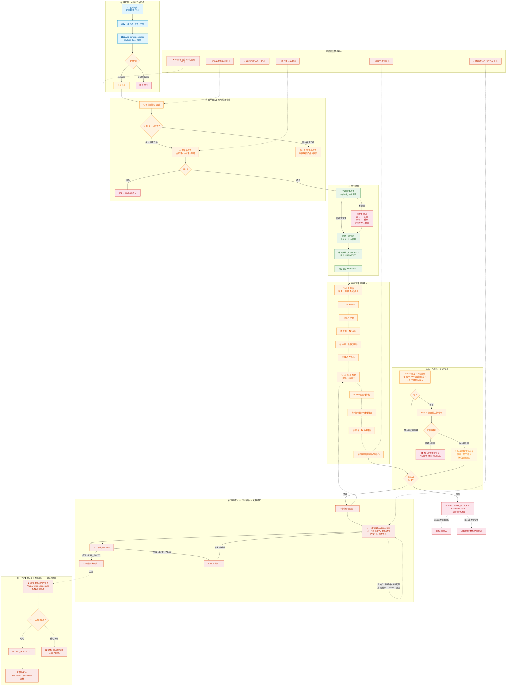

# 商务 AI Agent 订单中台 — 主流程总图（最终版）

> **基于 2026-06-09 会议 + 2026-06-27 商务部调研 + CFO讲话**
> 完整覆盖一期核心链路

## 图例

| 颜色 | 含义 |
|------|------|
| 💙 | CRM/外部系统 |
| 💚 | 中台处理 |
| 🧡 | 规则引擎/决策 |
| ❤️ | 异常/阻断 |
| 💜 | OMS/履约 |
| 🤍 | 金蝶ERP |
| 💛 | 通知/邮件 |
| 💙(深) | 完结 |
| 🔶 | 已明确纳入一期的调研新增 |
| 🔷 | 一期建议/二期优先 |
