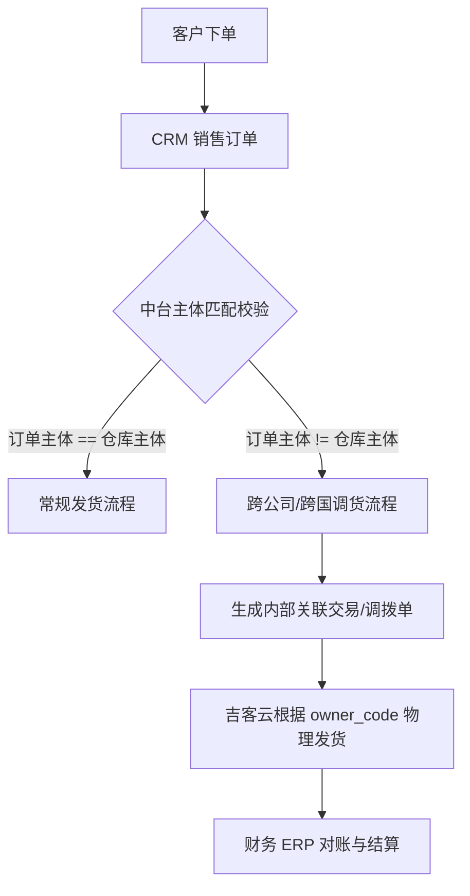

# 二期：多公司财务主体与供应链调货架构设计

本文档作为 `docs/v2-order-middle-platform-design.md` 的二期专项设计，承接 `docs/流程对话20260617.docx` 中 CEO、CFO、CRM、ERP 与 CTO 对订单主体、发货主体、调货、海外仓库存和财务对账的讨论。

二期要解决的核心痛点是：**吉客云（OMS）单主体运营与集团多独立税务/财务核算主体的冲突**、**跨国/跨公司调货（关联交易）导致的数据统计和对账困难**，以及**商务、物流、仓库、生产之间仍依赖邮件协同**。

本文档不改变一期边界。一期继续聚焦 `CRM -> 中台预审 -> 发货预览 -> OMS 下推` 的操作闭环；二期在一期稳定运行后，扩展为 `CRM 订单主体 -> OMS 实际发货主体 -> ERP 财务核算主体` 的多主体财务与供应链闭环。

---

## 0. 二期范围与一期边界

### 0.1 二期目标

二期目标不是重新设计订单入口，而是在一期 CRM 唯一订单源的基础上，补齐以下能力：

1. **主体识别**：从 CRM 订单详情中结构化识别订单主体、收款主体、开票主体、业务类型和 PI 主体。
2. **发货主体识别**：从 OMS 实际出库/发货事实中识别物理仓库、货主 `owner_code` 和仓库所属财务主体。
3. **跨主体判断**：当订单主体与发货主体不一致时，自动生成跨公司/跨国调货记录。
4. **财务对账底账**：沉淀内部调拨、关联交易、外部销售与存货归属记录，供 CFO 月结、税务和审计使用。
5. **库存预警与补货建议**：汇聚 OMS、海外仓库存表和 ERP 可读数据，形成安全库存、缺货和补货任务建议。
6. **协同去邮件化**：把商务、物流、仓库、生产的确认动作从邮件迁移到中台任务/移动端/企业微信或飞书微应用。

### 0.2 明确不纳入一期

以下内容均作为二期或二期以后内容，不阻塞一期真实流程测试：

| 能力 | 一期处理 | 二期处理 |
| --- | --- | --- |
| 多公司财务主体 | 仅保留字段扩展点 | 正式识别订单主体、收款主体、开票主体 |
| 发货主体与货权归属 | 使用 OMS 仓库/货主配置完成发货 | 建仓库主体映射，判定库存归属 |
| 跨公司/跨国调货 | 不自动生成内部交易 | 生成 `IntercompanyTransferRecord` |
| ERP 财务核验 | 金蝶只读/预留 | 关联 ERP 回款、发票、销售出库和调拨单 |
| 海外仓库存 | 可导入/查询，但不作为财务事实闭环 | 纳入库存主体、可用量、安全库存和补货建议 |
| 生产补货任务 | 保留旧生产任务能力 | 根据库存阈值和销售预测生成补货建议/任务 |
| 小程序/移动端协同 | Web 管理台 + 邮件通知 | 企业微信/飞书/小程序任务化确认 |

---

## 1. 业务痛点与痛点拆解



CFO 与 CEO 的对话揭示了当前运营中的四大合规与核算痛点：
1. **多税务主体混淆**：吉客云只有一个主体租户，但发货涉及内部不同公司（如中国公司、海外各子公司），各公司是独立的税务和财务核算主体。混在同一个系统发货导致**收入确认**和**存货归属**不准。
2. **跨国/跨公司调货（关联交易）缺失记录**：A 公司签单，由 B 公司的仓库发货。在财务上这属于**跨国/跨公司销售**（Company B -> Company A -> Customer），涉及转移定价、关税、跨境增值税申报。目前依赖线下或邮件沟通，对账极度繁琐。
3. **信息滞后与对账差异**：因信息流（CRM 订单、吉客云出库、实际收款）不协同，导致财务在月结对账时必须逐笔人工拉账单找差异。
4. **邮件工作流不可追溯**：商务、物流、仓库、生产之间依赖邮件沟通调货和发货，无法形成结构化数据，统计极其困难。

---

## 2. 核心架构设计目标

为了满足财务对账及税务合规要求，中台在架构上应实现**“四流合一”**的追踪：
*   **信息流 (Information Flow)**：CRM 销售订单与中台订单的同步。
*   **物流 (Logistics Flow)**：吉客云物理仓库的实际出库。
*   **资金流 (Cash Flow)**：客户实收账款与内部公司关联交易的结算。
*   **商流/所有权流 (Title Flow)**：货品所有权从“发货公司”向“订单销售公司”再向“外部客户”的转移。

---

## 3. 第一阶段：必要的数据收集规范 (Data Schema Extensibility)

为了在当前阶段不影响开发，但能“做好必要的数据收集”，我们必须在当前 `CrmSalesOrder`、`MiddlePlatformOrder` 和 `DeliveryNotice` 的数据模型中**预留或开始收集以下核心字段**：

### 3.1 CRM 订单源头数据收集 (CrmSalesOrder)
当从纷享销客 CRM 同步订单时，必须抓取以下财务与法务主体字段：

| 字段名 | 类型 | 说明 | 示例值 |
| :--- | :--- | :--- | :--- |
| `order_subject_entity` | `VARCHAR(128)` | **订单主体**：与客户签约的集团内公司主体 | 積木易搭（深圳）/ JM Singapore Pte. Ltd. |
| `payment_subject_entity` | `VARCHAR(128)` | **收款主体**：实际收取客户资金的银行账户所属公司 | JM US LLC |
| `billing_subject_entity` | `VARCHAR(128)` | **开票主体**：为客户开具发票的公司 | 積木易搭（深圳） |
| `currency` | `VARCHAR(16)` | **交易币种**：订单成交币种 | USD / EUR / CNY |
| `exchange_rate` | `Numeric(10, 6)` | **汇率**：下单当天的汇率基准 | 7.2345 |

### 3.2 中台履约单与出库数据收集 (MiddlePlatformOrder & DeliveryNotice)
在生成中台履约和下推吉客云（OMS）时，必须收集和映射以下字段：

| 字段名 | 类型 | 说明 | 示例值 |
| :--- | :--- | :--- | :--- |
| `warehouse_subject_entity` | `VARCHAR(128)` | **发货主体**：发货仓库所属的集团内公司主体 | 积木香港仓 (JM HK Ltd.) |
| `owner_code` | `VARCHAR(128)` | **货主代码**：吉客云中的货主标识，对应发货主体 | `OWNER_HK_01` |
| `is_intercompany_transfer` | `BOOLEAN` | **是否跨公司调货**：系统根据订单主体与发货主体自动判定 | `True` |
| `intercompany_transfer_status` | `VARCHAR(32)` | **调拨核算状态**：NotStarted / Pending / SyncedToERP / Error | `Pending` |
| `intercompany_price_json` | `TEXT` | **关联结算明细**：存储内部转移定价（Company B 卖给 Company A 的价格） | `{"sku01": {"transfer_price": 5.0, "currency": "USD"}}` |

---

## 4. 第二阶段：系统架构设计方案 (System Architecture)

### 4.1 核心逻辑：跨公司调货（关联交易）路由引擎

中台的预审规则引擎中，增加一个**“财务核算与主体路由”**插件。其逻辑流程如下：

```text
               +-----------------------------+
               |      CRM 审批订单同步       |
               +--------------+--------------+
                              |
                              v
               +-----------------------------+
               |  识别：订单主体 (Company A)  |
               |  识别：目标仓库 (Warehouse W)|
               +--------------+--------------+
                              |
                              v
               +-----------------------------+
               | 查询主数据：                 |
               | Warehouse W 归属于 Company B |
               +--------------+--------------+
                              |
                    Is A == B ?
                    /        \
                 Yes          No
                 /              \
                v                v
      +------------------+     +-----------------------------------+
      |   常规单公司发货  |     | 触发【跨公司/跨国关联交易流程】   |
      |   (Direct Ship)  |     | 1. 自动标记 is_intercompany=True  |
      +--------+---------+     | 2. 匹配内部转移价格 (Transfer Price)|
               |               | 3. 生成内部采购/销售对账单        |
               |               +-----------------+-----------------+
               |                                 |
               +----------------+----------------+
                                |
                                v
               +----------------+----------------+
               | 生成 DeliveryNotice，回传吉客云  |
               | 传入正确 owner_code = Company B |
               +---------------------------------+
```

### 4.2 消除邮件：基于小程序的实时协同网络
针对 CEO 提出的“把商务、物流、仓库、生产的邮件工作砍掉，加一个小程序/移动端”：

1. **统一通知中枢**：中台作为唯一事件源，当出现调货需求、库存不足、异常拦截时，不再发送邮件，而是触发 **Webhook/消息推送**。
2. **移动端小程序（或飞书/企微微应用）**：
   * **物流与仓库视角**：提供“待发货/调拨确认”列表。仓库人员通过手机端查看调拨指令（从 B 仓调拨到 A 公司发货），直接确认，数据自动回写中台。
   * **生产反馈**：生产车间直接在小程序端反馈进度、提交质检报告，取代过去“生产做完 -> 发邮件通知商务 -> 商务手动改状态”的流转。
   * **商务确认**：跨境调货因税差或限额拦截时，商务在手机上收到异常推送，一键“批准调货”或“更换仓库”。

---

## 5. 数据库模型演进设计 (Database Model Schema Extension)

为便于后期无缝升级，以下是 `models.py` 的架构演进设计（DDL 预览）：

### 5.1 修改 `MiddlePlatformOrder` 增加主体字段
```python
# 建议在未来开发阶段加入以下字段
class MiddlePlatformOrder(Base):
    # ... 现有字段 ...
    
    # 财务与法务主体字段
    order_subject_entity: Mapped[str | None] = mapped_column(String(128), comment="订单签约主体公司")
    payment_subject_entity: Mapped[str | None] = mapped_column(String(128), comment="客户付款接收主体公司")
    billing_subject_entity: Mapped[str | None] = mapped_column(String(128), comment="发票开具主体公司")
    
    # 关联交易标识
    is_intercompany_transfer: Mapped[bool] = mapped_column(Boolean, default=False, nullable=False, comment="是否属于跨公司/跨国调货")
    intercompany_transfer_status: Mapped[str | None] = mapped_column(String(32), default="NotRequired", comment="内部关联交易结算状态")
```

### 5.2 建立 `WarehouseEntityMapping`（新主数据表）
用于维护物理仓库与独立核算主体的映射关系：
```python
class WarehouseEntityMapping(Base):
    __tablename__ = "warehouse_entity_mappings"
    
    id: Mapped[str] = mapped_column(String(36), primary_key=True, default=new_id)
    warehouse_code: Mapped[str] = mapped_column(String(128), unique=True, nullable=False, comment="吉客云仓库代码")
    warehouse_name: Mapped[str | None] = mapped_column(String(255))
    belonging_company_entity: Mapped[str] = mapped_column(String(128), nullable=False, comment="归属的集团独立税务主体公司")
    owner_code: Mapped[str] = mapped_column(String(128), nullable=False, comment="对应的吉客云货主代码")
    country: Mapped[str] = mapped_column(String(64), default="China", comment="国家（用于跨境识别）")
    
    created_at: Mapped[datetime] = mapped_column(DateTime(timezone=True), default=now_utc)
```

### 5.3 建立 `IntercompanyTransferRecord`（新财务对账表）
一旦判定为跨公司调货，自动在此表存底，供财务月结时一键导出或自动对接 ERP：
```python
class IntercompanyTransferRecord(Base):
    __tablename__ = "intercompany_transfer_records"
    
    id: Mapped[str] = mapped_column(String(36), primary_key=True, default=new_id)
    order_id: Mapped[str] = mapped_column(String(36), ForeignKey("middle_platform_orders.id"), nullable=False)
    delivery_notice_id: Mapped[str] = mapped_column(String(36), ForeignKey("delivery_notices.id"), nullable=False)
    
    selling_company: Mapped[str] = mapped_column(String(128), nullable=False, comment="卖方公司(发货主体/库存拥有方)")
    buying_company: Mapped[str] = mapped_column(String(128), nullable=False, comment="买方公司(订单签约方)")
    
    sku_code: Mapped[str] = mapped_column(String(128), nullable=False)
    quantity: Mapped[float] = mapped_column(Numeric(15, 2), nullable=False)
    
    # 财务核算结算价格
    transfer_unit_price: Mapped[float] = mapped_column(Numeric(15, 2), nullable=False, comment="内部转移结算单价")
    transfer_amount: Mapped[float] = mapped_column(Numeric(15, 2), nullable=False, comment="内部结算总金额")
    currency: Mapped[str] = mapped_column(String(16), default="USD")
    
    # 状态与对账审计
    settlement_status: Mapped[str] = mapped_column(String(32), default="Unsettled")  # Unsettled, Settled, Excluded
    erp_sync_job_id: Mapped[str | None] = mapped_column(String(128), comment="ERP（金蝶）关联调拨单号")
    
    created_at: Mapped[datetime] = mapped_column(DateTime(timezone=True), default=now_utc)
```

---

## 6. 第三阶段：CTO “数据汇聚”与财务报表统计方案 (CTO Data Aggregation & Analytics)

针对 CTO 提出的 **“先把各系统的数据都拉到，汇聚，然后你们再看要做什么流程的统计”**：

在中台数仓（SQLite/PostgreSQL）中设计**“全视图对账物化查询”**（Materialized View / Query），将 CRM (商流)、吉客云 (物流)、ERP (财务账/发票) 的数据拉通：

```sql
-- 跨国/跨公司对账核验核心 SQL 模板
CREATE VIEW view_cfo_intercompany_reconciliation AS
SELECT 
    mpo.order_no AS "中台订单号",
    mpo.crm_order_no AS "CRM订单号",
    mpo.order_subject_entity AS "订单销售主体 (Company A)",
    dn.warehouse_code AS "发货仓库",
    wem.belonging_company_entity AS "发货库存主体 (Company B)",
    
    -- 核心逻辑判定：是否跨公司
    CASE 
        WHEN mpo.order_subject_entity != wem.belonging_company_entity THEN '跨公司调货(跨国销售)'
        ELSE '常规同主体发货'
    END AS "流向判定",
    
    mpoi.sku_code AS "货品SKU",
    mpoi.quantity AS "销售数量",
    mpoi.unit_price AS "对外销售单价",
    mpoi.line_amount AS "对外销售额",
    
    -- 内部对账基准
    COALESCE(itr.transfer_unit_price, 0) AS "内部结算单价",
    COALESCE(itr.transfer_amount, 0) AS "内部结算总额",
    
    -- 履约状态
    dn.oms_order_no AS "吉客云出库单号",
    dn.status AS "物流出库状态",
    dn.waybill_no AS "物流运单号",
    
    -- 支付与资金流状态
    mpo.order_amount AS "买方应付",
    mpo.status AS "订单状态"
FROM middle_platform_orders mpo
JOIN middle_platform_order_items mpoi ON mpo.id = mpoi.order_id
LEFT JOIN delivery_notices dn ON mpo.id = dn.order_id
LEFT JOIN warehouse_entity_mappings wem ON dn.warehouse_code = wem.warehouse_code
LEFT JOIN intercompany_transfer_records itr ON mpo.id = itr.order_id AND mpoi.sku_code = itr.sku_code;
```

---

## 7. 针对“订单无仓库信息且 OMS 底层单主体”的专项设计

针对您提到的两个核心技术制约：
1. **订单信息中无法获得目标仓库信息**，只有 OMS 系统在订单推入后才能通过分仓算法确定；
2. **OMS 系统中所有物理仓库均在同一个技术主体（Tenant）下**，系统本身不区分仓库的法人归属。

中台通过**“中台托管映射 + 异步事后核对”**的架构模式来解决这两个问题：

### 7.1 核心逻辑：中台“事后异步审计”机制 (Post-Fulfillment Audit)
因为中台在订单下推前无法获知最终发货仓，我们**将主体核算和调货判定逻辑向后延伸**，从“事前拦截”转为“事后自动对账”：

```text
  1. 客户下单 --> CRM (订单主体 Company A) 
      |
      v
  2. 订单进入中台 (暂无仓库信息，标记为常规单) 
      |
      v [下推订单]
  3. OMS 吉客云 (根据 OMS 自身规则/人工分配发货仓: Warehouse W)
      |
      v [物理出库/发货]
  4. OMS 实际发货 (产生运单与实际出库事实)
      |
      v [异步同步: Webhook 或定时拉取]
  5. 中台获取履约详情 (拉取到 Warehouse W 代码)
      |
      v [中台托管解析]
  6. 中台查询映射表 (Warehouse W -> 货权归属 Company B)
      |
      +-----> Is Company A == Company B ?
                 |
                 +--> No --> 自动标记为【跨公司/跨国调货】
                              --> 补录生成 IntercompanyTransferRecord
```

1. **先下推、后同步**：中台在收到 CRM 订单后，以不带仓库信息的方式将订单下推至 OMS。
2. **OMS 决定发货仓**：由 OMS 完成分仓路由（无论是按就近原则、库存多寡还是人工指定），生成出库单并发货。
3. **中台异步抓取发货事实**：中台通过订阅 OMS 的发货事件 Webhook，或者通过定时任务调用吉客云 `wms.order.query-info.page` 接口，异步同步已发货订单的详情，从而**抓取到最终实际发货的物理仓库代码 (`warehouse_code`)**。
4. **回溯匹配与调拨单自动生成**：中台一旦抓取到实际 `warehouse_code`，立即通过中台本地的映射关系，将发货仓库主体与订单主体进行比对。若不一致，**在出库时点回溯触发关联交易流程**，补录生成 `IntercompanyTransferRecord`（内部调拨与对账凭证），为财务提供精准的关联销售数据。

### 7.2 核心逻辑：中台“虚拟货权所有权托管” (Virtual Inventory Ownership)
既然 OMS 系统底层所有的物理仓库在技术上都绑在一个主体下、无法在 OMS 内部做法人隔离，中台就必须充当**虚拟货权管家**：

1. **中台配置物理仓与主体的虚拟映射**：在中台维护一张 [WarehouseEntityMapping](file:///Users/kaimao/.gemini/antigravity/brain/1cf71188-3562-4231-8334-2236267966f6/cfo_multi_entity_architecture.md#L146) 映射表，对 OMS 中的每个物理仓库指定其**财务所有权公司**。例如：
   * 物理仓 `JACKYUN_WH_US` (美国仓) $\rightarrow$ 货权实际归属 `JM US LLC`（美国子公司）
   * 物理仓 `JACKYUN_WH_CN` (深圳仓) $\rightarrow$ 货权实际归属 `积木易搭（深圳）`（国内母公司）
2. **库存多主体折算**：中台调用 OMS 查询可用库存 (`query_sku_stock`) 时，通过该映射表将物理库存数据自动分摊。例如：查询 SKU-A，OMS 返回总库存 100 件（其中 `JACKYUN_WH_US` 有 40 件，`JACKYUN_WH_CN` 有 60 件）。中台展现给财务的库存账目会自动折算为：`JM US LLC` 拥有 40 件存货，`积木国内母公司` 拥有 60 件存货。
3. **收入与存货归属确认**：
   * 即使 OMS 底层在同一个主体下扣减了库存，中台在财务核算层面上判定：这是一次由 `Company B` 的物理仓为 `Company A` 的销售订单做出的发货。
   * 中台将这一笔物理出库事实，在数据汇聚层自动拆分为：
     * **外部销售事实**：`Company A` 对客户确认销售收入，结转应收账款。
     * **内部关联交易事实**：`Company B` 向 `Company A` 销售该货品（按内部结算价），`Company B` 减少存货账面价值并确认关联销售收入；`Company A` 增加对应的关联采购成本。

---

## 8. 架构收益总结

1. **财务合规无死角**：通过**订单主体**与**发货主体**的自动事后对碰，将混在吉客云单主体中的“影子交易”显性化，自动生成内部调拨与跨国销售事实，满足 CFO 审计和独立税务核算需求。
2. **对 OMS 零侵入、对业务零阻碍**：OMS 依然保持单主体运行，分仓路由依然由 OMS 系统自主完成，物理仓库也无需在系统层面拆分法人。财务多主体核算的复杂度**完全被中台中和与托管**。
3. **消除数据孤岛与邮件流转**：通过中台事件流与协同小程序，原先依赖邮件流转的商务、物流、仓库、生产被串联在同一个状态机中，统计和报表完全由系统自动化生成，实现了 CFO “好统计、没差错” 的最终诉求。

---

## 9. 二期业务对象与状态设计

二期在一期订单、发货通知、异常任务的基础上新增以下业务对象。所有展示时间仍统一使用北京时间，数据库可继续保存 UTC。

| 对象 | 说明 | 关键字段 |
| --- | --- | --- |
| `CompanyEntity` | 集团内独立核算主体主数据 | `entity_code`、`entity_name`、`country`、`currency`、`tax_id`、`erp_account_set`、`status` |
| `WarehouseEntityMapping` | OMS 物理仓库与财务主体映射 | `warehouse_code`、`warehouse_name`、`owner_code`、`belonging_company_entity`、`country`、`source_system`、`status` |
| `OrderEntitySnapshot` | CRM 订单主体快照 | `crm_order_no`、`order_subject_entity`、`payment_subject_entity`、`billing_subject_entity`、`pi_subject_entity`、`business_type`、`evidence_refs` |
| `InventoryOwnershipSnapshot` | 按仓库、货主、主体折算后的库存归属快照 | `sku_code`、`warehouse_code`、`owner_code`、`company_entity`、`quantity`、`available_quantity`、`source_system` |
| `IntercompanyTransferRecord` | 跨主体调货/关联交易记录 | `order_no`、`notice_no`、`selling_company_entity`、`buying_company_entity`、`sku_code`、`quantity`、`transfer_price`、`currency`、`settlement_status` |
| `ReplenishmentSuggestion` | 安全库存和生产补货建议 | `sku_code`、`warehouse_code`、`company_entity`、`threshold_qty`、`shortage_qty`、`suggested_qty`、`status` |
| `CollaborationTask` | 替代邮件的协同确认任务 | `task_type`、`biz_ref_no`、`assignee_role`、`assignee_user`、`status`、`due_at`、`completed_at` |

二期关键状态：

| 状态 | 含义 | 进入条件 |
| --- | --- | --- |
| `ENTITY_SNAPSHOT_READY` | CRM 主体快照已生成 | 订单主体、业务类型、收款/开票/PI 主体完成识别 |
| `WAREHOUSE_ENTITY_READY` | 实际发货仓主体已识别 | OMS 发货事实回传后匹配到仓库主体映射 |
| `DIRECT_SHIP_RECONCILED` | 订单主体与发货主体一致 | 订单主体等于仓库主体 |
| `INTERCOMPANY_TRANSFER_PENDING` | 需要生成内部调货/关联交易记录 | 订单主体与发货主体不一致 |
| `INTERCOMPANY_TRANSFER_READY` | 内部结算记录已生成 | SKU、数量、内部结算价齐全 |
| `ERP_RECONCILING` | 正在进行 ERP 财务核验 | 关联 ERP 回款、发票、销售出库或调拨记录 |
| `ERP_RECONCILED` | 财务核验通过 | ERP 与中台底账一致 |
| `REPLENISHMENT_REQUIRED` | 需要补货或生产 | 可用库存低于安全库存或预测需求 |

---

## 10. 二期流程设计

### 10.1 CRM 主体字段同步

CRM 仍是订单唯一入口。二期同步订单时，除一期订单头、订单产品、附件、负责人、客户信息外，额外采集：

1. `业务类型`：用于判断深圳主体、武汉主体、海外主体或渠道备货类型。
2. `订单主体/乙方主体`：优先来自 CRM 结构化字段；没有结构化字段时，从合同/PO/PI 附件解析为候选证据。
3. `收款主体`：从收款账号、币种、PI 或附件中识别。
4. `开票主体`：从 CRM 发票资料或客户财务信息中识别。
5. `PI 主体`：海外订单优先从 PI/Proforma Invoice 中识别。

字段缺失时生成 `ENTITY_DATA_MISSING` 异常，但二期默认不回退到邮件取数，也不改变一期预审口径。是否阻断发货由二期规则开关配置。

### 10.2 OMS 发货事实回传

一期下推 OMS 后，二期通过 OMS Webhook 或定时查询接口回收实际履约事实：

1. 通过 `wms.order.query-info.page` 获取实际仓库、货主、出库状态、运单号和发货时间。
2. 将 `warehouse_code + owner_code` 匹配到 `WarehouseEntityMapping`。
3. 匹配失败时生成 `WAREHOUSE_ENTITY_MAPPING_MISSING`，由运维或财务主数据管理员补齐。

### 10.3 主体判定与跨主体调货

中台以 `OrderEntitySnapshot.order_subject_entity` 和 `WarehouseEntityMapping.belonging_company_entity` 做主体判定：

| 判定结果 | 处理 |
| --- | --- |
| 相同主体 | 标记 `DIRECT_SHIP_RECONCILED`，进入常规财务核验 |
| 不同主体 | 标记 `INTERCOMPANY_TRANSFER_PENDING`，生成 `IntercompanyTransferRecord` 草稿 |
| 任一主体缺失 | 生成主数据异常，进入人工补全 |

跨主体记录生成后，必须补齐内部结算价、币种、数量和汇率。缺少内部结算价时生成 `INTERCOMPANY_PRICE_MISSING`，不自动进入 ERP 对账通过态。

### 10.4 ERP 财务对账

金蝶 ERP 在二期仍以只读核验为主，除非另行完成 ERP 写入权限审批。对账对象包括：

1. 外部销售：订单主体、客户、币种、订单金额、回款、发票、销售出库。
2. 内部交易：发货主体向订单主体的内部销售/调拨记录、内部结算价、数量、成本。
3. 库存归属：OMS 出库仓库与中台虚拟货权主体是否一致。

任一核验不一致时生成 `ERP_RECONCILIATION_MISMATCH`，保留 CRM、OMS、ERP、附件证据链，供财务关闭或退回修正。

### 10.5 库存预警与补货建议

二期将库存视角从“OMS 单租户库存”升级为“SKU + 仓库 + 货主 + 主体”的库存归属视图：

1. 国内仓优先同步 OMS 库存。
2. 海外仓若暂时没有 API，允许导入标准库存表，但必须记录来源、上传人和北京时间。
3. ERP 物料库存只读接入后，作为财务库存余额核验来源。
4. 当可用库存低于安全库存或未来订单预测需求时，生成 `ReplenishmentSuggestion`。
5. 补货建议经商务/生产确认后转为生产或采购协同任务。

### 10.6 协同去邮件化

二期目标不是彻底取消通知邮件，而是取消“用邮件搬运订单字段和推进流程”的方式：

| 场景 | 一期方式 | 二期方式 |
| --- | --- | --- |
| 预审异常 | 邮件通知销售负责人 | 中台异常任务 + 邮件/IM 提醒 |
| 物流确认 | 人工查看邮件或系统 | 协同任务中确认发货策略、仓库、拆单 |
| 仓库确认 | OMS 内执行 | 中台接收 OMS 状态，异常时任务化处理 |
| 生产补货 | 邮件沟通 | `ReplenishmentSuggestion` 转生产任务 |
| 财务核验 | 财务手工拉账 | 财务对账台基于证据链处理差异 |

邮件、企业微信、飞书或站内信在二期只做提醒和留痕，流程事实仍以中台任务状态为准。

---

## 11. 二期异常类型

| 异常类型 | 触发条件 | 负责人 |
| --- | --- | --- |
| `ENTITY_DATA_MISSING` | CRM 订单主体、收款主体、开票主体、PI 主体等必要字段缺失 | 商务/财务主数据 |
| `WAREHOUSE_ENTITY_MAPPING_MISSING` | OMS 实际仓库或货主无法匹配财务主体 | 运维/财务主数据 |
| `INTERCOMPANY_TRANSFER_REQUIRED` | 订单主体与发货主体不一致，需要生成内部调货记录 | 财务 |
| `INTERCOMPANY_PRICE_MISSING` | 跨主体调货缺少内部结算价或币种 | 财务 |
| `ERP_RECONCILIATION_MISMATCH` | ERP 回款、发票、销售出库、调拨与中台底账不一致 | 财务/ERP |
| `OVERSEAS_STOCK_SOURCE_MISSING` | 海外仓库存缺少 API 或标准导入数据 | 仓库/运维 |
| `REPLENISHMENT_REQUIRED` | 库存低于安全库存或预测缺口 | 生产/供应链 |
| `COLLABORATION_TASK_OVERDUE` | 协同任务超过 SLA 未处理 | 对应任务负责人 |

---

## 12. 二期页面设计

二期前端在一期 Agent 控制台基础上新增以下页面：

| 页面 | 使用者 | 主要能力 |
| --- | --- | --- |
| 主体主数据 | 财务/运维 | 维护集团公司主体、税号、币种、ERP 账套、启停状态 |
| 仓库主体映射 | 财务/仓库/运维 | 维护 OMS 仓库、货主与财务主体的映射 |
| 跨主体调货台 | 财务/供应链 | 查看需要内部结算的订单，补齐内部结算价，导出对账底账 |
| 财务对账台 | 财务 | 三栏对照 CRM/OMS/ERP/附件证据，处理差异 |
| 库存归属看板 | CFO/供应链 | 按主体、仓库、SKU 查看库存归属和可用量 |
| 补货建议 | 生产/供应链 | 查看缺口、确认补货、生成生产或采购任务 |
| 协同任务中心 | 商务/物流/仓库/生产 | 替代邮件推进确认、补资料、审批和异常闭环 |

---

## 13. 二期里程碑与验收标准

### 13.1 里程碑

| 阶段 | 目标 | 说明 |
| --- | --- | --- |
| Phase2-A 数据采集 | 只采集不阻断 | 补齐 CRM 主体字段、OMS 发货事实、海外仓库存导入、ERP 只读字段 |
| Phase2-B 主体映射 | 事后核对 | 建立主体主数据和仓库主体映射，自动识别跨主体订单 |
| Phase2-C 调货与财务底账 | 可审计 | 自动生成 `IntercompanyTransferRecord`，提供 CFO 对账导出 |
| Phase2-D 库存与协同 | 去邮件化试点 | 库存预警、补货建议、协同任务在选定业务线试点 |

### 13.2 验收标准

1. 每张二期试点 CRM 订单都能生成 `OrderEntitySnapshot`，且证据来源可追溯。
2. 每张已发货订单都能从 OMS 回收实际仓库、货主、发货时间和运单信息。
3. 每个 OMS 仓库和货主都能映射到一个明确财务主体；缺失时自动生成异常。
4. 订单主体与发货主体不一致时，系统自动生成跨主体调货记录草稿。
5. CFO 可按月导出订单、发货、内部结算、回款、发票、库存归属的对账底账。
6. 试点业务线的补货建议不再依赖邮件作为事实来源。
7. 商务、物流、仓库、生产的试点协同动作可在中台任务中查看状态、负责人、处理时间和审计记录。
